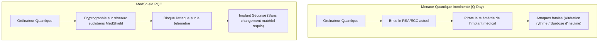
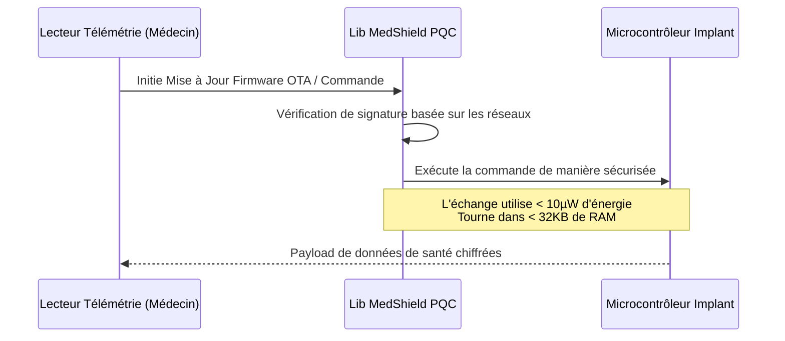

<!-- markdownlint-disable MD009 MD010 MD013 MD022 MD028 MD032 MD033 MD034 MD036 MD037 MD039 MD041 MD058 MD060 -->

[ 🇬🇧 English Version ](./README.md)

# MedShield PQC

> **Résumé exécutif :** Une bibliothèque de cryptographie post-quantique (PQC) ultra-légère conçue pour les dispositifs médicaux implantables actifs, les sécurisant contre les attaques d'ordinateurs quantiques sans épuiser leur batterie.

---

## 1. Aperçu visuel & Effet Wahou

## 2. La thèse contrariante (Peter Thiel Style)

**La croyance populaire :** La cryptographie post-quantique est un problème pour les grandes banques et la défense nationale, nécessitant des serveurs massifs pour exécuter de nouveaux algorithmes lourds.

**La vérité cachée :** Les systèmes les plus vulnérables et critiques aux attaques quantiques sont les implants médicaux actifs (pacemakers, pompes à insuline) actuellement à l'intérieur de millions de personnes. Comme on ne peut pas retirer et mettre à jour le matériel chirurgicalement en masse, la véritable percée PQC doit être une mise à jour logicielle : un algorithme mathématiquement assez rigoureux pour arrêter un ordinateur quantique, mais assez léger pour fonctionner sur une batterie de pacemaker consommant des micro-watts.

## 3. Le problème & La cible

**Modèle économique :** B2B

**Cible précise :** Fabricants de dispositifs médicaux implantables actifs (pacemakers, pompes à insuline, neurostimulateurs) comme Medtronic, Abbott, Boston Scientific.

**La douleur urgente :** Avec l'avènement imminent de l'informatique quantique (Q-Day), les algorithmes cryptographiques asymétriques actuels (RSA, ECC) protégeant les communications télémétriques des implants médicaux deviendront obsolètes. Une faille permettrait des attaques fatales (altération du rythme cardiaque, surdose d'insuline). Le remplacement matériel post-implantation étant impossible, une solution logicielle ultra-légère est urgente.

## 4. Architecture technique & Plomberie

## 5. Modèle économique & Viabilité financière

| Métrique                    | Valeur                                                                       |
| :-------------------------- | :--------------------------------------------------------------------------- |
| Structure de prix           | Frais de licence OEM par appareil + Consulting d'implémentation              |
| Objectif 12 mois            | 1 pilote d'intégration avec un fabricant de dispositifs médicaux de niveau 1 |
| Calcul du CA (Target 100k€) | 1 contrat Pilote = 100k€ ARR                                                 |
| Marge brute estimée         | 90% (Propriété intellectuelle logicielle)                                    |

## 6. Moteur de distribution & Fossé défensif (Moat)

**Stratégie d'acquisition :** Ventes techniques directes et partenariats avec les RSSI (Responsables de la Sécurité des Systèmes d'Information) des principaux fabricants de dispositifs médicaux. Co-rédaction d'articles dans des revues de cybersécurité médicale pour établir le standard.

**Moat (Barrière à l'entrée) :** Les bibliothèques PQC standards (comme celles du NIST) sont trop lourdes en termes d'empreinte mémoire et de consommation énergétique pour fonctionner sur l'architecture minimale d'un pacemaker. Un SaaS cloud est inutile car le calcul cryptographique doit se faire en local sur la puce de l'implant. Le fossé réside dans l'optimisation extrême en assembleur bas niveau des mathématiques complexes basées sur les réseaux pour des environnements embarqués fortement contraints.

## 7. Grille d'évaluation détaillée

| Critère                           | Score VC (/100) | Score Terrain (/100) |
| :-------------------------------- | :-------------- | :------------------- |
| Thèse & Monopole / Urgence        | 25 / 25         | -- / 25              |
| Moat / Résistance aux LLM natifs  | 25 / 25         | -- / 25              |
| Scalability / Friction d'adoption | 22 / 25         | -- / 25              |
| Unit Economics / ROI direct       | 21 / 25         | -- / 25              |
| **TOTAL**                         | **93 / 100**    | **-- / 100**         |

> **Verdict VC :** Une niche très spécifique avec zéro marge d'erreur, exactement là où naissent les monopoles. L'intégration de la PQC au niveau de l'appareil crée un verrouillage ultime en raison des obstacles réglementaires (FDA) et du cycle de vie du matériel. C'est une police d'assurance essentielle contre les futures menaces quantiques.
> **Verdict Terrain :** En attente d'évaluation.
