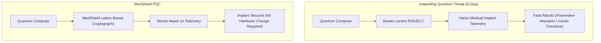
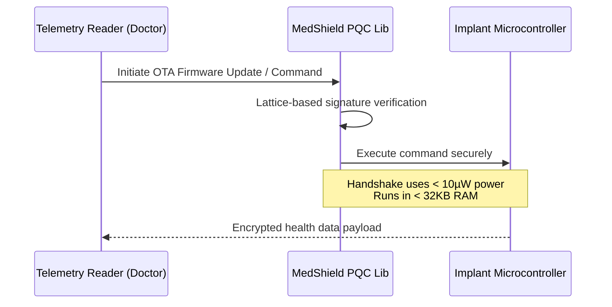

<!-- markdownlint-disable MD009 MD010 MD013 MD022 MD028 MD032 MD033 MD034 MD036 MD037 MD039 MD041 MD058 MD060 -->

[ 🇫🇷 Version Française ](./README.fr.md)

# MedShield PQC

> **Executive Summary:** An ultra-lightweight Post-Quantum Cryptography (PQC) library designed for active implantable medical devices, securing them against quantum computer attacks without draining battery life.

---

## 1. Visual Overview & Wow Effect

## 2. Contrarian Thesis (Peter Thiel Style)

**Popular Belief:** Post-Quantum Cryptography is a problem for big banks and national defense, requiring massive servers to run heavy new algorithms.

**Hidden Truth:** The most vulnerable and critical systems to quantum attacks are active medical implants (pacemakers, insulin pumps) currently inside millions of people. Since you cannot surgically remove and upgrade hardware en masse, the true PQC breakthrough must be a software update: an algorithm mathematically rigorous enough to stop a quantum computer, yet lightweight enough to run on a micro-watt pacemaker battery.

## 3. Problem & Target Market

**Business Model:** B2B

**Target Audience:** Manufacturers of active implantable medical devices (e.g., Medtronic, Abbott, Boston Scientific).

**Urgent Pain Point:** With the imminent arrival of quantum computing (Q-Day), current asymmetric cryptographic algorithms (RSA, ECC) protecting the telemetry communications of medical implants will become obsolete. A breach would allow fatal attacks (altering heart rhythms, causing insulin overdoses). Because hardware replacement post-implantation is practically impossible, an ultra-lightweight software solution is urgently needed.

## 4. Technical Architecture & Infrastructure

## 5. Business Model & Financial Viability

| Metric                 | Value                                                         |
| :--------------------- | :------------------------------------------------------------ |
| Pricing Structure      | Per-device OEM Licensing Fee + Implementation Consulting      |
| 12-Month Target        | 1 integration pilot with a Tier-1 medical device manufacturer |
| Revenue Formula        | 1 Pilot contract = €100k ARR                                  |
| Estimated Gross Margin | 90% (Software licensing IP)                                   |

## 6. Distribution Engine & Moat

**Acquisition Strategy:** Direct technical sales and partnerships with Chief Information Security Officers (CISOs) at top medical device manufacturers. Co-authoring papers in medical cybersecurity journals to establish the standard.

**Moat (Defensibility):** Standard PQC libraries (like those standardized by NIST) are too heavy in memory footprint and energy consumption to run on a pacemaker's minimal architecture. A SaaS cloud is useless because the cryptographic calculation must happen locally on the implant's chip. The moat is the extreme low-level assembly optimization of complex lattice math for highly constrained embedded environments.

## 7. Detailed Evaluation Grid

| Criterion                   | VC Score (/100) | Market Score (/100) |
| :-------------------------- | :-------------- | :------------------ |
| Thesis & Monopoly / Urgency | 25 / 25         | -- / 25             |
| Moat / LLM Immunity         | 25 / 25         | -- / 25             |
| Scalability / UX Friction   | 22 / 25         | -- / 25             |
| Unit Economics / ROI        | 21 / 25         | -- / 25             |
| **TOTAL**                   | **93 / 100**    | **-- / 100**        |

> **VC Verdict:** A highly specific niche with zero margin for error, exactly where monopolies are born. Imbedding PQC at the device level creates ultimate lock-in due to FDA regulatory hurdles and hardware lifecycle. It's an essential insurance policy against future quantum threats.
> **Market Verdict:** Pending evaluation.
