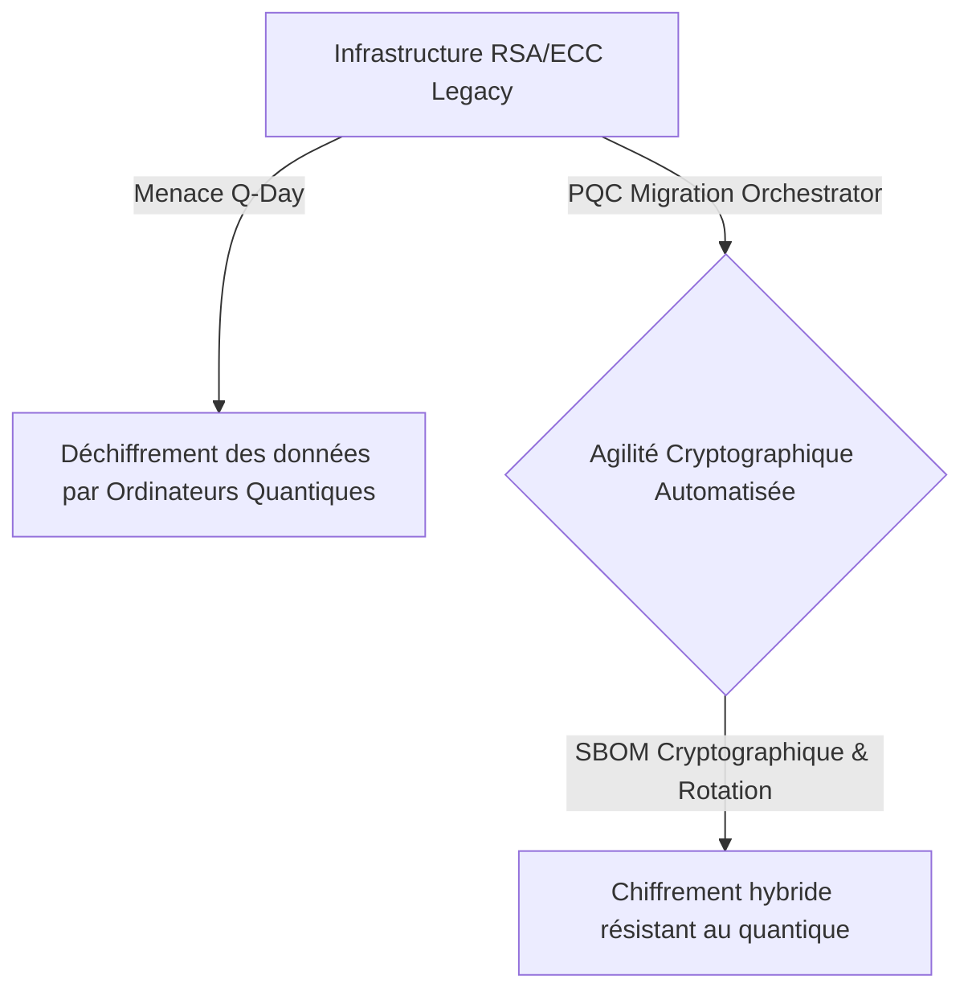
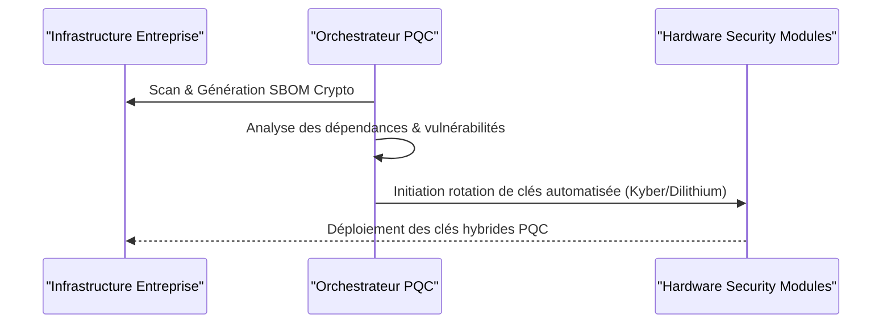

<!-- markdownlint-disable MD009 MD010 MD013 MD022 MD028 MD032 MD033 MD034 MD036 MD037 MD039 MD041 MD058 MD060 -->

[🇬🇧 English Version](./README.md)

# Post-Quantum Cryptography (PQC) Migration Orchestrator

> **Résumé exécutif :** Une plateforme d'orchestration de l'agilité cryptographique, automatisant la cartographie et la rotation des clés vers des algorithmes résistants au quantique.

---

## 1. Aperçu visuel & Effet Wahou

## 2. La thèse contrariante (Peter Thiel Style)

La croyance populaire : La mise à niveau vers la cryptographie post-quantique (PQC) se résume à de simples mises à jour logicielles une fois les standards du NIST finalisés.
La vérité cachée : Remplacer un algorithme cryptographique au sein d'une infrastructure implique de modifier le code source, de re-certifier des modules HSM et de gérer l'augmentation massive de la taille des clés qui cassent les protocoles réseau standards. Une simple mise à jour logicielle classique ne suffit pas, il faut un moteur d'orchestration spécialisé.

## 3. Le problème & La cible

Modèle économique : B2B
Cible précise : Banques, institutions financières, gouvernements, défense, et grandes entreprises SaaS.
La douleur urgente : L'arrivée imminente des ordinateurs quantiques fault-tolerant (Q-Day) menace de casser instantanément les chiffrements RSA et ECC actuels. La stratégie de "Store now, decrypt later" implique que les données critiques volées aujourd'hui seront lisibles demain. La migration vers les standards PQC sur des infrastructures massives est un cauchemar logistique et technique.

## 4. Architecture technique & Plomberie

## 5. Modèle économique & Viabilité financière

| Métrique                    | Valeur                                            |
| --------------------------- | ------------------------------------------------- |
| Structure de prix           | Abonnement annuel basé sur le nombre de nœuds/HSM |
| Objectif 12 mois            | 2 à 3 gros contrats (finance ou gouvernement)     |
| Calcul du CA (Target 100k€) | 2 \* 50k = 100k                                   |
| Marge brute estimée         | 85%                                               |

## 6. Moteur de distribution & Fossé défensif (Moat)

Stratégie d'acquisition : Ventes directes aux entreprises, partenariats avec des cabinets d'audit en cybersécurité et des fabricants de HSM.
Moat (Barrière à l'entrée) : L'intégration profonde requise avec les architectures legacy et les HSM, combinée à la tolérance zéro pour les bugs d'implémentation en cryptographie, crée un fossé massif. Générer un SBOM cryptographique dynamique sur des réseaux complexes et air-gapped ne peut pas être facilement répliqué par des plateformes SaaS standards.

## 7. Grille d'évaluation détaillée

| Critère                           | Score VC (/100) | Score Terrain (/100) |
| --------------------------------- | --------------- | -------------------- |
| Thèse & Monopole / Urgence        | 18 / 25         | -- / 25              |
| Moat / Résistance aux LLM natifs  | 23 / 25         | -- / 25              |
| Scalabilité / Friction d'adoption | 21 / 25         | -- / 25              |
| Unit Economics / ROI direct       | 20 / 25         | -- / 25              |
| **TOTAL**                         | **82 / 100**    | **-- / 100**         |

> **Verdict VC :** Ce projet présente une thèse fortement contrariante avec un véritable potentiel de monopole (18/25). Le fossé technologique profond et les exigences d'ingénierie rendent la solution quasi-impossible à répliquer par de simples concurrents SaaS (23/25). Associée à une évolutivité massive (21/25) et d'excellents unit economics (20/25), il s'agit d'une proposition hautement finançable.
>
> **Verdict Terrain :** En attente d'évaluation.
