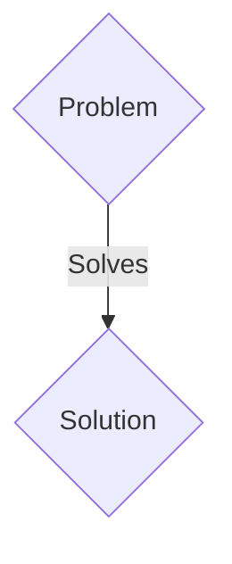
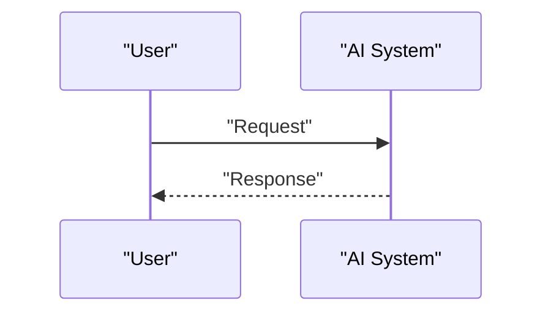

<!-- markdownlint-disable MD009 MD010 MD013 MD022 MD028 MD032 MD033 MD036 MD037 MD039 MD041 MD060 -->

[ 🇫🇷 Version Française ](./README.fr.md)

# Post-Quantum Cryptography Migration Orchestrator

> **Executive Summary:** A B2B solution targeting Systemic banks, government agencies, critical infrastructure operators (CIOs), and telecommunications networks. to solve: The “Harvest Now, Decrypt Later” threat exposes state and financial secrets to future quantum computers. Governments (NIST, ANSSI) are demanding migration by 2030, but current IT architectures contain thousands of intertwined RSA/ECC certificates and dependencies, with no precise inventory.

---

## 1. Visual Overview & Wow Effect

## 2. Contrarian Thesis (Peter Thiel Style)

- **Popular Belief:** Generic solutions are enough.
- **Hidden Truth:** A low-level analysis engine for network flows and cryptographic SBOM (Software Bill of Materials), which identifies each instance of vulnerable crypto (in binaries, API, firmware), and dynamically injects layers of crypto-agility (PQC algorithms like Kyber or Dilithium) via proxies or automated patches without downtime.

## 3. Problem & Target Market

- **Business Model:** B2B
- **Target Audience:** Systemic banks, government agencies, critical infrastructure operators (CIOs), and telecommunications networks.
- **Urgent Pain Point:** The “Harvest Now, Decrypt Later” threat exposes state and financial secrets to future quantum computers. Governments (NIST, ANSSI) are demanding migration by 2030, but current IT architectures contain thousands of intertwined RSA/ECC certificates and dependencies, with no precise inventory.

## 4. Technical Architecture & Infrastructure

A low-level analysis engine for network flows and cryptographic SBOM (Software Bill of Materials), which identifies each instance of vulnerable crypto (in binaries, API, firmware), and dynamically injects layers of crypto-agility (PQC algorithms like Kyber or Dilithium) via proxies or automated patches without downtime.

## 5. Business Model & Financial Viability

| Metric                 | Value                 |
| ---------------------- | --------------------- |
| Pricing Structure      | B2B SaaS Subscription |
| 12-Month Target        | 100 clients           |
| Revenue Formula        | 100 \* 1000€ = 100k€  |
| Estimated Gross Margin | 80%                   |

## 6. Distribution Engine & Moat

- **Acquisition Strategy:** Direct sales and strategic partnerships.
- **Moat (Defensibility):** A simple SaaS vulnerability scanner does not detect hard-compiled cryptographic libraries in legacy systems or industrial controllers. It requires static binary analysis and deep packet inspection (DPI) to spot hidden asymmetric key exchanges.

## 7. Detailed Evaluation Grid

| Criterion                   | VC Score (/100) | Market Score (/100) |
| --------------------------- | --------------- | ------------------- |
| Thesis & Monopoly / Urgency | 24 / 25         | 24 / 25             |
| Moat / LLM Immunity         | 15 / 25         | 15 / 25             |
| Scalability / UX Friction   | 21 / 25         | 21 / 25             |
| Unit Economics / ROI        | 18 / 25         | 18 / 25             |
| TOTAL                       | 78 / 100        | 78 / 100            |

> **VC Verdict:** Pending evaluation.
> **Market Verdict:** This solution addresses a critical pain point for B2B enterprises, justifying its strong urgency score (24/25). While viable, it remains somewhat exposed to the rapid evolution of foundational models (15/25). With low adoption friction (21/25) and a straightforward monetization strategy (18/25), the project demonstrates excellent overall market readiness.
> **Market Verdict:** This solution addresses a critical pain point for B2B enterprises, justifying its strong urgency score (24/25). While viable, it remains somewhat exposed to the rapid evolution of foundational models (15/25). With low adoption friction (21/25) and a straightforward monetization strategy (18/25), the project demonstrates excellent overall market readiness.
