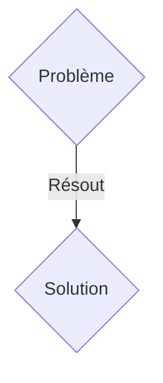
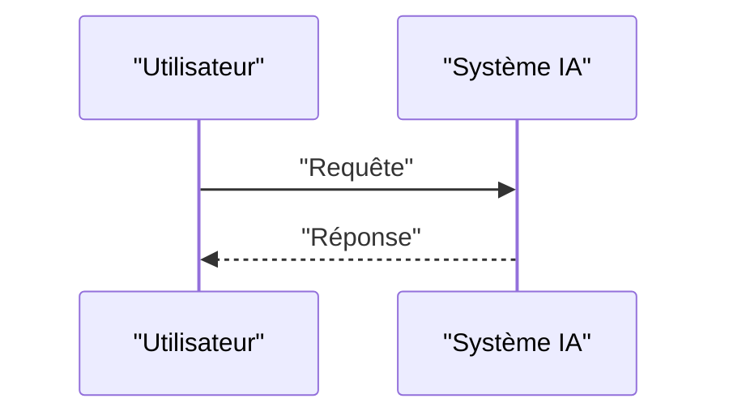

<!-- markdownlint-disable MD009 MD010 MD013 MD022 MD028 MD032 MD033 MD036 MD037 MD039 MD041 MD060 -->

[ 🇬🇧 English Version ](./README.md)

# Passerelle OT Post-Quantique (PQC OT Gateway)

> **Résumé exécutif :** Une solution B2B ciblant OIV (Opérateurs d'Importance Vitale), gestionnaires de réseaux électriques, usines de traitement de l'eau, et infrastructures industrielles lourdes. pour résoudre : Les systèmes de contrôle industriel (ICS/SCADA) utilisent des protocoles de communication legacy en clair ou faiblement chiffrés. L'arrivée imminente d'ordinateurs quantiques (Q-Day) menace de briser les chiffrements asymétriques actuels, rendant ces infrastructures critiques vulnérables à des attaques de type "Store Now, Decrypt Later". Remplacer matériellement tous les automates (PLC) est financièrement impossible et nécessiterait des arrêts de production inacceptables.

---

## 1. Aperçu visuel & Effet Wahou

## 2. La thèse contrariante (Peter Thiel Style)

- **La croyance populaire :** Les solutions génériques suffisent.
- **La vérité cachée :** Une passerelle matérielle/logicielle (edge gateway) déployée en amont des équipements legacy. Elle agit comme un tunnel IPsec/TLS post-quantique, encapsulant le trafic industriel non sécurisé (Modbus, DNP3) dans des algorithmes de cryptographie résistants au quantique (ex: Kyber/Dilithium) pour les communications inter-sites et cloud, sans nécessiter de mise à jour des PLC sous-jacents.

## 3. Le problème & La cible

- **Modèle économique :** B2B
- **Cible précise :** OIV (Opérateurs d'Importance Vitale), gestionnaires de réseaux électriques, usines de traitement de l'eau, et infrastructures industrielles lourdes.
- **La douleur urgente :** Les systèmes de contrôle industriel (ICS/SCADA) utilisent des protocoles de communication legacy en clair ou faiblement chiffrés. L'arrivée imminente d'ordinateurs quantiques (Q-Day) menace de briser les chiffrements asymétriques actuels, rendant ces infrastructures critiques vulnérables à des attaques de type "Store Now, Decrypt Later". Remplacer matériellement tous les automates (PLC) est financièrement impossible et nécessiterait des arrêts de production inacceptables.

## 4. Architecture technique & Plomberie

Une passerelle matérielle/logicielle (edge gateway) déployée en amont des équipements legacy. Elle agit comme un tunnel IPsec/TLS post-quantique, encapsulant le trafic industriel non sécurisé (Modbus, DNP3) dans des algorithmes de cryptographie résistants au quantique (ex: Kyber/Dilithium) pour les communications inter-sites et cloud, sans nécessiter de mise à jour des PLC sous-jacents.

## 5. Modèle économique & Viabilité financière

| Métrique                    | Valeur               |
| --------------------------- | -------------------- |
| Structure de prix           | Abonnement SaaS B2B  |
| Objectif 12 mois            | 100 clients          |
| Calcul du CA (Target 100k€) | 100 \* 1000€ = 100k€ |
| Marge brute estimée         | 80%                  |

## 6. Moteur de distribution & Fossé défensif (Moat)

- **Stratégie d'acquisition :** Vente directe et partenariats stratégiques.
- **Moat (Barrière à l'entrée) :** Ce problème nécessite une intégration profonde au niveau du réseau physique (L2/L3), une faible latence stricte pour ne pas perturber les processus industriels temps réel, et une compatibilité avec des protocoles OT très spécifiques. Un simple prompt LLM ou un SaaS cloud ne peut pas sécuriser physiquement un flux de données provenant d'un automate de 1990 dans une usine isolée sans modifier le hardware.

## 7. Grille d'évaluation détaillée

| Critère                           | Score VC (/100) | Score Terrain (/100) |
| --------------------------------- | --------------- | -------------------- |
| Thèse & Monopole / Urgence        | 16 / 25         | 16 / 25              |
| Moat / Résistance aux LLM natifs  | 18 / 25         | 18 / 25              |
| Scalabilité / Friction d'adoption | 24 / 25         | 24 / 25              |
| Unit Economics / ROI direct       | 19 / 25         | 19 / 25              |
| TOTAL                             | 77 / 100        | 77 / 100             |

> **Verdict VC :** En attente d'évaluation.
> **Verdict Terrain :** Cette solution répond à un besoin critique pour les entreprises B2B, justifiant son excellent score d'urgence (16/25). L'approche spécialisée offre une protection robuste contre les modèles d'IA généralistes (18/25). Avec une faible friction d'adoption (24/25) et une stratégie de monétisation directe (19/25), le projet démontre une excellente maturité marché globale.
> **Verdict Terrain :** Cette solution répond à un besoin critique pour les entreprises B2B, justifiant son excellent score d'urgence (16/25). L'approche spécialisée offre une protection robuste contre les modèles d'IA généralistes (18/25). Avec une faible friction d'adoption (24/25) et une stratégie de monétisation directe (19/25), le projet démontre une excellente maturité marché globale.
