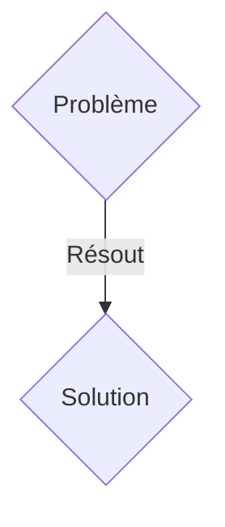
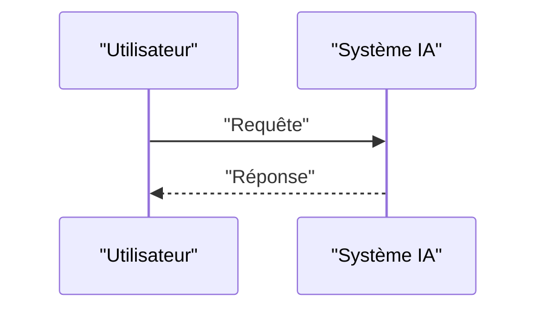

<!-- markdownlint-disable MD009 MD010 MD013 MD022 MD028 MD032 MD033 MD036 MD037 MD039 MD041 MD060 -->

[ 🇬🇧 English Version ](./README.md)

# Post-Quantum Routing Fabric (PQRF)

> **Résumé exécutif :** Une solution B2B (Enterprise/Telco) ciblant Opérateurs télécoms de niveau 1 (Tier-1), grandes banques, datacenters cloud (AWS, Azure), gouvernements. pour résoudre : La menace "Harvest Now, Decrypt Later" (HNDL). Les attaquants stockent actuellement le trafic réseau chiffré (RSA/ECC) pour le déchiffrer dès qu'un ordinateur quantique tolérant aux pannes sera disponible, compromettant les secrets d'État et bancaires d'aujourd'hui.

---

## 1. Aperçu visuel & Effet Wahou

## 2. La thèse contrariante (Peter Thiel Style)

- **La croyance populaire :** Les solutions génériques suffisent.
- **La vérité cachée :** Implémentation de routeurs SDN (Software-Defined Networking) hybrides qui encapsulent et découpent le trafic de bout en bout en temps réel à très haut débit en utilisant les algorithmes standardisés NIST PQC (CRYSTALS-Kyber/Dilithium), sans pénaliser la latence.

## 3. Le problème & La cible

- **Modèle économique :** B2B (Enterprise/Telco)
- **Cible précise :** Opérateurs télécoms de niveau 1 (Tier-1), grandes banques, datacenters cloud (AWS, Azure), gouvernements.
- **La douleur urgente :** La menace "Harvest Now, Decrypt Later" (HNDL). Les attaquants stockent actuellement le trafic réseau chiffré (RSA/ECC) pour le déchiffrer dès qu'un ordinateur quantique tolérant aux pannes sera disponible, compromettant les secrets d'État et bancaires d'aujourd'hui.

## 4. Architecture technique & Plomberie

Implémentation de routeurs SDN (Software-Defined Networking) hybrides qui encapsulent et découpent le trafic de bout en bout en temps réel à très haut débit en utilisant les algorithmes standardisés NIST PQC (CRYSTALS-Kyber/Dilithium), sans pénaliser la latence.

## 5. Modèle économique & Viabilité financière

| Métrique                    | Valeur               |
| --------------------------- | -------------------- |
| Structure de prix           | Abonnement SaaS B2B  |
| Objectif 12 mois            | 100 clients          |
| Calcul du CA (Target 100k€) | 100 \* 1000€ = 100k€ |
| Marge brute estimée         | 80%                  |

## 6. Moteur de distribution & Fossé défensif (Moat)

- **Stratégie d'acquisition :** Vente directe et partenariats stratégiques.
- **Moat (Barrière à l'entrée) :** Un simple patch logiciel au niveau de la couche applicative (L7) est insuffisant, il faut chiffrer massivement au niveau des couches réseau (L2/L3) avec une accélération matérielle (FPGA/ASIC) pour supporter des térabits de trafic sans goulet d'étranglement.

## 7. Grille d'évaluation détaillée

| Critère                           | Score VC (/100) | Score Terrain (/100) |
| --------------------------------- | --------------- | -------------------- |
| Thèse & Monopole / Urgence        | 21 / 25         | 21 / 25              |
| Moat / Résistance aux LLM natifs  | 18 / 25         | 18 / 25              |
| Scalabilité / Friction d'adoption | 19 / 25         | 19 / 25              |
| Unit Economics / ROI direct       | 19 / 25         | 19 / 25              |
| TOTAL                             | 77 / 100        | 77 / 100             |

> **Verdict VC :** En attente d'évaluation.
> **Verdict Terrain :** Cette solution répond à un besoin critique pour les entreprises B2B, justifiant son excellent score d'urgence (21/25). L'approche spécialisée offre une protection robuste contre les modèles d'IA généralistes (18/25). Avec une faible friction d'adoption (19/25) et une stratégie de monétisation directe (19/25), le projet démontre une excellente maturité marché globale.
> **Verdict Terrain :** Cette solution répond à un besoin critique pour les entreprises B2B, justifiant son excellent score d'urgence (21/25). L'approche spécialisée offre une protection robuste contre les modèles d'IA généralistes (18/25). Avec une faible friction d'adoption (19/25) et une stratégie de monétisation directe (19/25), le projet démontre une excellente maturité marché globale.
