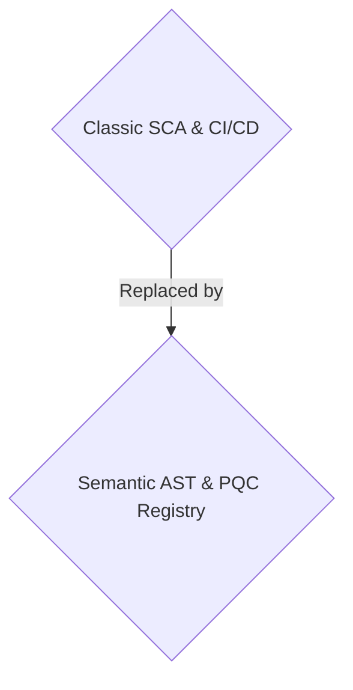
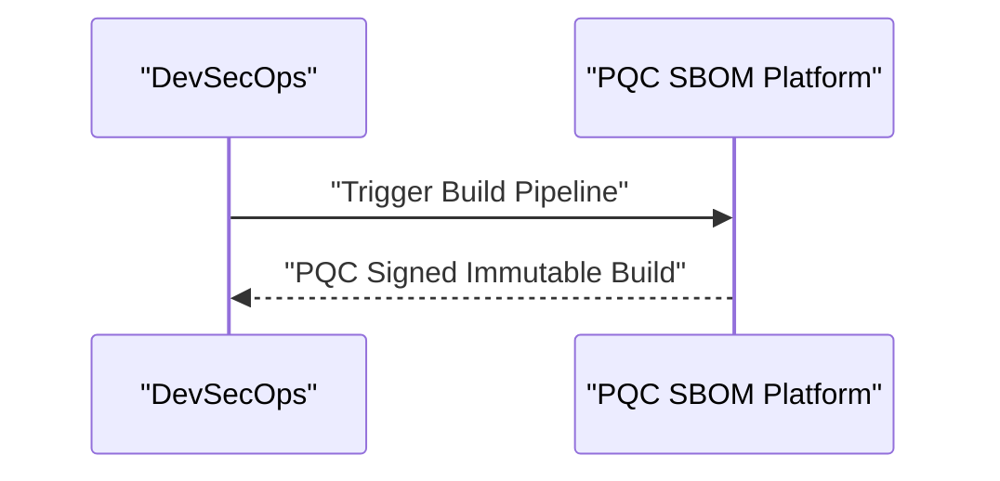

<!-- markdownlint-disable MD009 MD010 MD013 MD022 MD028 MD032 MD033 MD034 MD036 MD037 MD039 MD041 MD058 MD060 -->

[ 🇫🇷 Version Française ](./README.fr.md)

# Quantum Safe SBOM

> **Executive Summary:** A B2B solution targeting government software vendors and defense contractors to provide post-quantum cryptographic validation of software supply chains.

---

## 1. Visual Overview & Wow Effect

## 2. Contrarian Thesis (Peter Thiel Style)

- **Popular Belief:** Standard SCA tools and basic CVE matching are enough to secure software supply chains.
- **Hidden Truth:** Standard Software Composition Analysis (SCA) scanners merely compare package versions against known CVE databases without understanding code structure or detecting zero-day malware inserted during compilation.

## 3. Problem & Target Market

- **Business Model:** B2B
- **Target Audience:** Government software vendors, defense contractors, financial institutions (DevSecOps, CISO).
- **Urgent Pain Point:** It is impossible to guarantee that a third-party open-source library inserted into a CI/CD pipeline does not contain backdoors, or that its cryptographic signature hasn't been compromised by future quantum threats.

## 4. Technical Architecture & Infrastructure

A semantic Abstract Syntax Tree (AST) analysis platform that traces source code provenance to the final binary, immutably signing each compilation step via a distributed ledger using Post-Quantum Cryptography.

## 5. Business Model & Financial Viability

| Metric                 | Value                            |
| ---------------------- | -------------------------------- |
| Pricing Structure      | B2B SaaS Enterprise Subscription |
| 12-Month Target        | 100 enterprise clients           |
| Revenue Formula        | 100 \* 1000€ = 100k€             |
| Estimated Gross Margin | 85%                              |

## 6. Distribution Engine & Moat

- **Acquisition Strategy:** Direct sales to defense, government, and finance sectors.
- **Moat (Defensibility):** Standard Software Composition Analysis (SCA) scanners merely compare package versions against known CVE databases without understanding code structure or detecting zero-day malware inserted during compilation. Requires deep AST understanding and complex CI/CD ecosystem integration.

## 7. Detailed Evaluation Grid

| Criterion                   | VC Score (/100) | Market Score (/100) |
| --------------------------- | --------------- | ------------------- |
| Thesis & Monopoly / Urgency | -- / 25         | -- / 25             |
| Moat / LLM Immunity         | -- / 25         | -- / 25             |
| Scalability / UX Friction   | -- / 25         | -- / 25             |
| Unit Economics / ROI        | -- / 25         | -- / 25             |
| TOTAL                       | -- / 100        | -- / 100            |

> **VC Verdict:** Pending evaluation.
> **Market Verdict:** Pending evaluation.
