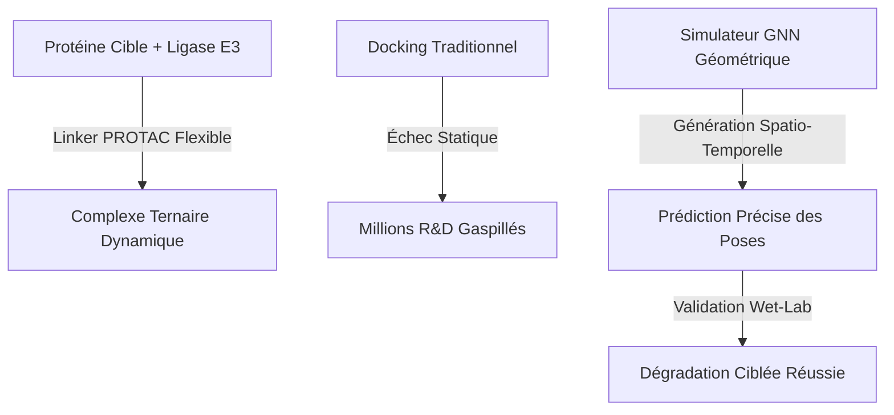
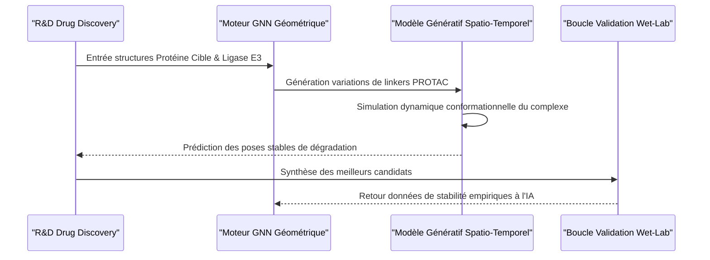

<!-- markdownlint-disable MD009 MD010 MD013 MD022 MD028 MD032 MD033 MD034 MD036 MD037 MD039 MD041 MD060 -->

[ 🇬🇧 English Version ](./README.md)

# PROTAC Ternary Complex Sim

> **Résumé exécutif :** Une plateforme de modèles génératifs spatio-temporels et de réseaux de neurones graphiques (GNN) géométriques pour simuler et prédire la dynamique conformationnelle des complexes ternaires massifs PROTAC pour la dégradation ciblée des protéines.

---

## 1. Aperçu visuel & Effet Wahou

## 2. La thèse contrariante (Peter Thiel Style)

- **La croyance populaire :** Les outils de prédiction de structure des protéines comme AlphaFold ont résolu la découverte de médicaments ; il suffit de faire du docking de molécules dans des poches statiques.
- **La vérité cachée :** Pour les dégradeurs ciblés de protéines (PROTACs), le docking statique est inutile. Le mécanisme entier repose sur des linkers très flexibles formant un "complexe ternaire" dynamique que les moteurs physiques traditionnels et les modèles d'IA statiques ne peuvent pas calculer, ce qui représente le véritable goulet d'étranglement de la pharmacologie moderne.

## 3. Le problème & La cible

- **Modèle économique :** B2B
- **Cible précise :** Sociétés pharmaceutiques, startups de drug discovery, CROs.
- **La douleur urgente :** Découvrir des dégradeurs ciblés de protéines (PROTACs) est extrêmement coûteux (des millions par hit). La difficulté majeure n'est pas de trouver les liants, mais de prédire avec précision la stabilité dynamique et la formation du complexe ternaire (Protéine cible - PROTAC - Ligase) in vivo.

## 4. Architecture technique & Plomberie

## 5. Modèle économique & Viabilité financière

| Métrique                        | Valeur                                                         |
| ------------------------------- | -------------------------------------------------------------- |
| **Structure de prix**           | Accords de Développement Conjoint (JDA) + Royalties sur jalons |
| **Objectif 12 mois**            | 1 à 2 JDAs pilotes avec des entreprises pharmaceutiques        |
| **Calcul du CA (Target 100k€)** | 1 JDA \* 100k€ jalon initial                                   |
| **Marge brute estimée**         | ~90% (Logiciel/Données)                                        |

## 6. Moteur de distribution & Fossé défensif (Moat)

- **Stratégie d'acquisition :** Ventes directes B2B et partenariats stratégiques avec des entreprises biotech, en s'appuyant fortement sur les succès empiriques publiés lors des validations en laboratoire (wet-lab).
- **Moat (Barrière à l'entrée) :** Les outils de docking traditionnels (chimie quantique, force fields) sont trop lents et échouent lamentablement sur les structures flexibles des linkers PROTACs. AlphaFold3 donne une vue statique mais ne gère pas la dynamique de dégradation. L'ensemble de données propriétaire généré par la validation wet-lab en boucle fermée crée un fossé biologique et computationnel massif.

## 7. Grille d'évaluation détaillée

| Critère                           | Score VC (/100) | Score Terrain (/100) |
| --------------------------------- | --------------- | -------------------- |
| Thèse & Monopole / Urgence        | 23 / 25         | -- / 25              |
| Moat / Résistance aux LLM natifs  | 24 / 25         | -- / 25              |
| Scalabilité / Friction d'adoption | 25 / 25         | -- / 25              |
| Unit Economics / ROI direct       | 22 / 25         | -- / 25              |
| **TOTAL**                         | **94 / 100**    | **-- / 100**         |

> **Verdict VC :** Les PROTACs sont l'avenir de la thérapeutique, et posséder le moteur de simulation revient à taxer l'ensemble de l'écosystème. L'approche GNN géométrique crée un moat de données propriétaire qui se renforce à chaque simulation. Très scalable et monétisable directement via les licences pharmaceutiques.

> **Verdict Terrain :** Forte urgence et valeur évidente pour la cible. La résistance aux LLM est élevée grâce à une intégration matérielle ou physique forte. Malgré quelques frictions d'adoption, la monétisation B2B est très claire.
