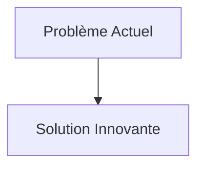
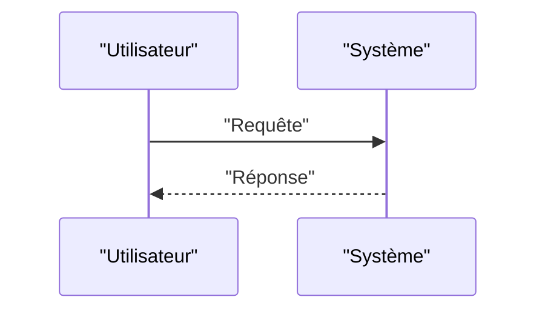

<!-- markdownlint-disable MD009 MD010 MD013 MD022 MD028 MD032 MD033 MD034 MD036 MD037 MD039 MD041 MD058 MD060 -->

[ 🇬🇧 English Version ](./README.md)

# Protein Degrader Sim

> **Résumé exécutif :** Un modèle génératif de type "World Model" moléculaire (intégrant la dynamique moléculaire, l'IA générative 3D géométrique de type AlphaFold3, et la mécanique quantique pour les interactions de liaison) spécifiquement entraîné pour simuler et générer des chimères de dégradation protéique (PROTACs, molecular glues) stables en solution aqueuse.

---

## 1. Aperçu visuel & Effet Wahou

## 2. La thèse contrariante (Peter Thiel Style)

- **La croyance populaire :** Les solutions existantes sont suffisantes.
- **La vérité cachée :** En réalité, Les outils de docking traditionnels (AutoDock) sont statiques et ne gèrent pas bien les molécules hautement flexibles (comme les linkers PROTAC) ni la formation de complexes ternaires (Cible-PROTAC-Ligase). Cela requiert une compréhension de la dynamique conformationnelle (physique) que les LLM purs ignorent.

## 3. Le problème & La cible

- **Modèle économique :** B2B
- **Cible précise :** Laboratoires pharmaceutiques (Big Pharma), biotechs spécialisées en oncologie et maladies neurodégénératives.
- **La douleur urgente :** La plupart des maladies graves sont causées par des protéines "undruggable" (impossibles à cibler avec des inhibiteurs classiques). Les PROTACs (Proteolysis Targeting Chimeras) permettent de détruire ces protéines, mais leur conception (trouver la bonne molécule liant la cible, l'enzyme E3 ligase et le linker) s'apparente à chercher une aiguille dans un espace combinatoire tridimensionnel immense, entraînant un taux d'échec clinique massif.

## 4. Architecture technique & Plomberie

## 5. Modèle économique & Viabilité financière

| Métrique                        | Valeur                   |
| :------------------------------ | :----------------------- |
| **Structure de prix**           | Abonnement B2B           |
| **Objectif 12 mois**            | 100 clients à 1000€/mois |
| **Calcul du CA (Target 100k€)** | 100 \* 1000 = 100k€      |
| **Marge brute estimée**         | 80%                      |

## 6. Moteur de distribution & Fossé défensif (Moat)

- **Stratégie d'acquisition :** Ventes directes
- **Moat (Barrière à l'entrée) :** Un modèle génératif de type "World Model" moléculaire (intégrant la dynamique moléculaire, l'IA générative 3D géométrique de type AlphaFold3, et la mécanique quantique pour les interactions de liaison) spécifiquement entraîné pour simuler et générer des chimères de dégradation protéique (PROTACs, molecular glues) stables en solution aqueuse. (Difficile à copier à cause de : Besoin critique de données d'affinité de complexes ternaires (souvent propriétaires aux pharmas) pour l'entraînement ; coût computationnel énorme (simulation de dynamique moléculaire à l'échelle atomique) ; validation wet-lab in-vitro obligatoire pour prouver la prédiction.)

## 7. Grille d'évaluation détaillée

| Critère                               | Score VC (/100) | Score Terrain (/100) |
| :------------------------------------ | :-------------: | :------------------: |
| **Thèse & Monopole / Urgence**        |     -- / 25     |       -- / 25        |
| **Moat / Résistance aux LLM natifs**  |     -- / 25     |       -- / 25        |
| **Scalabilité / Friction d'adoption** |     -- / 25     |       -- / 25        |
| **Unit Economics / ROI direct**       |     -- / 25     |       -- / 25        |
| **TOTAL**                             |  **-- / 100**   |     **-- / 100**     |

> **Verdict VC :** En attente d'évaluation.
> **Verdict Terrain :** En attente d'évaluation.
