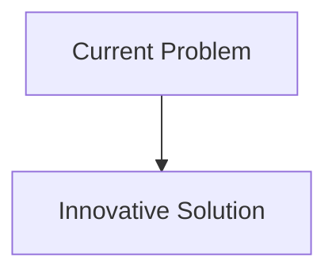
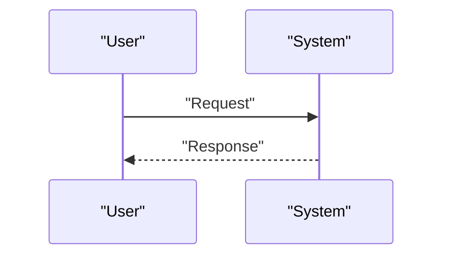

<!-- markdownlint-disable MD009 MD010 MD013 MD022 MD028 MD032 MD033 MD034 MD036 MD037 MD039 MD041 MD058 MD060 -->

[ 🇫🇷 Version Française ](./README.fr.md)

# Protein Degrader Sim

> **Executive Summary:** A generative model of the molecular "World Model" type (integrating molecular dynamics, 3D geometric generative AI of the AlphaFold3 type, and quantum mechanics for bonding interactions) specifically trained to simulate and generate protein degradation chimeras (PROTACs, molecular glues) stable in aqueous solution.

---

## 1. Visual Overview & Wow Effect

## 2. Contrarian Thesis (Peter Thiel Style)

- **Popular Belief:** Existing solutions are sufficient.
- **Hidden Truth:** In reality, traditional docking tools (AutoDock) are static and do not handle highly flexible molecules (like PROTAC linkers) or the formation of ternary complexes (Target-PROTAC-Ligase) well. This requires an understanding of conformational dynamics (physics) that pure LLMs ignore.

## 3. Problem & Target Market

- **Business Model:** B2B
- **Target Audience:** Pharmaceutical laboratories (Big Pharma), biotechs specializing in oncology and neurodegenerative diseases.
- **Urgent Pain Point:** Most serious diseases are caused by "undruggable" proteins (impossible to target with traditional inhibitors). PROTACs (Proteolysis Targeting Chimeras) make it possible to destroy these proteins, but their design (finding the right molecule binding the target, the E3 ligase enzyme and the linker) is akin to searching for a needle in an immense three-dimensional combinatorial space, leading to a massive clinical failure rate.

## 4. Technical Architecture & Infrastructure

## 5. Business Model & Financial Viability

| Metric                     | Value                        |
| :------------------------- | :--------------------------- |
| **Pricing Structure**      | B2B Subscription             |
| **12-Month Target**        | 100 customers at 1000€/month |
| **Revenue Formula**        | 100 \* 1000 = 100k€          |
| **Estimated Gross Margin** | 80%                          |

## 6. Distribution Engine & Moat

- **Acquisition Strategy:** Direct Sales
- **Moat (Defensibility):** A generative model of the molecular "World Model" type (integrating molecular dynamics, 3D geometric generative AI of the AlphaFold3 type, and quantum mechanics for bonding interactions) specifically trained to simulate and generate protein degradation chimeras (PROTACs, molecular glues) stable in aqueous solution.(Difficult to copy because of: Critical need for affinity data of ternary complexes (often proprietary to pharmas) for training; huge computational cost (molecular dynamics simulation at atomic scale); in-vitro wet-lab validation required to prove prediction.)

## 7. Detailed Evaluation Grid

| Criterion                       | VC Score (/100) | Market Score (/100) |
| :------------------------------ | :-------------: | :-----------------: |
| **Thesis & Monopoly / Urgency** |     -- / 25     |       -- / 25       |
| **Moat / LLM Immunity**         |     -- / 25     |       -- / 25       |
| **Scalability / UX Friction**   |     -- / 25     |       -- / 25       |
| **Unit Economics / ROI**        |     -- / 25     |       -- / 25       |
| **TOTAL**                       |  **-- / 100**   |    **-- / 100**     |

> **VC Verdict:** Pending evaluation.
> **Market Verdict:** Pending evaluation.
