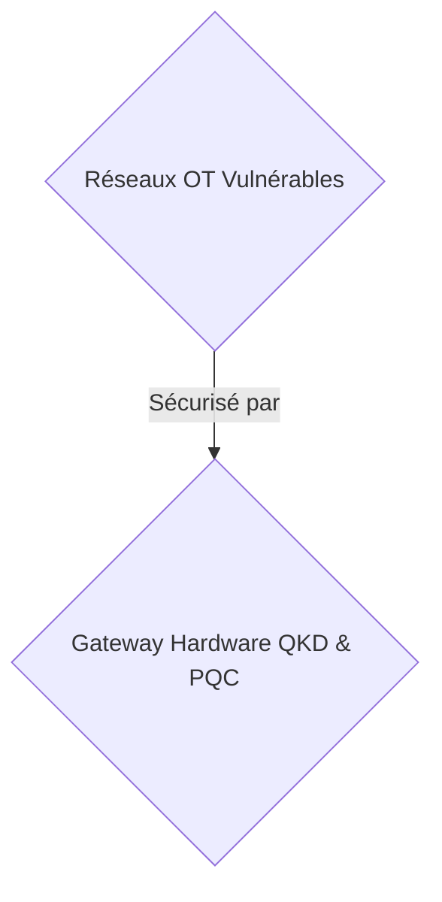
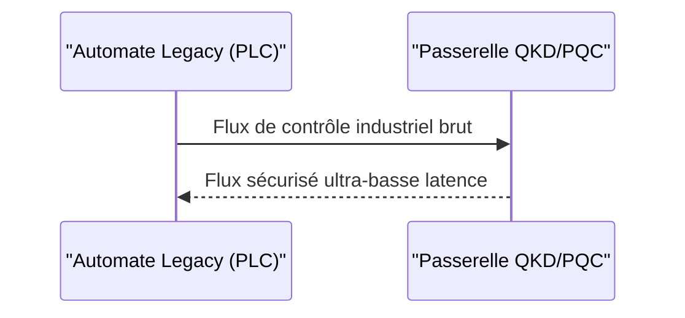

<!-- markdownlint-disable MD009 MD010 MD013 MD022 MD028 MD032 MD033 MD034 MD036 MD037 MD039 MD041 MD058 MD060 -->

[ 🇬🇧 English Version ](./README.md)

# QKD OT Guardian

> **Résumé exécutif :** Une surcouche matérielle de sécurité (Gateway Zero-Trust) utilisant la cryptographie post-quantique (QKD/PQC) pour sécuriser les infrastructures critiques.

---

## 1. Aperçu visuel & Effet Wahou

## 2. La thèse contrariante (Peter Thiel Style)

- **La croyance populaire :** Les VPN IT standards suffisent à protéger l'industrie.
- **La vérité cachée :** Les VPN/SaaS de sécurité traditionnels ajoutent trop de latence pour le contrôle industriel temps-réel (qui exige des temps de réponse < 5ms) et s'appuient sur une cryptographie classique (RSA/ECC) vouée à devenir obsolète.

## 3. Le problème & La cible

- **Modèle économique :** B2B
- **Cible précise :** Opérateurs d'infrastructures critiques (réseaux électriques, centrales nucléaires, stations d'épuration) (CISO, OT Security Managers).
- **La douleur urgente :** Les réseaux opérationnels (OT/ICS) utilisent des protocoles industriels legacy vulnérables aux attaques "Store Now, Decrypt Later" par de futurs ordinateurs quantiques. La mise à jour matérielle des automates (PLC) est financièrement et physiquement impossible à grande échelle.

## 4. Architecture technique & Plomberie

Un orchestrateur réseau de distribution de clés quantiques (QKD) et cryptographie post-quantique (PQC) agissant comme une surcouche de sécurité (Zero-Trust hardware gateway) placée devant les réseaux OT existants sans modifier les terminaux finaux.

## 5. Modèle économique & Viabilité financière

| Métrique                    | Valeur                    |
| --------------------------- | ------------------------- |
| Structure de prix           | Hardware + Abonnement B2B |
| Objectif 12 mois            | 100 sites industriels     |
| Calcul du CA (Target 100k€) | 100 \* 1000€ = 100k€      |
| Marge brute estimée         | 70%                       |

## 6. Moteur de distribution & Fossé défensif (Moat)

- **Stratégie d'acquisition :** Ventes directes gouvernementales et industrielles.
- **Moat (Barrière à l'entrée) :** Les VPN/SaaS de sécurité traditionnels ajoutent trop de latence pour le contrôle industriel temps-réel (qui exige des temps de réponse < 5ms) et s'appuient sur une cryptographie classique (RSA/ECC) vouée à devenir obsolète. Certifications industrielles strictes (IEC 62443) et coût matériel.

## 7. Grille d'évaluation détaillée

| Critère                           | Score VC (/100) | Score Terrain (/100) |
| --------------------------------- | --------------- | -------------------- |
| Thèse & Monopole / Urgence        | -- / 25         | -- / 25              |
| Moat / Résistance aux LLM natifs  | -- / 25         | -- / 25              |
| Scalability / Friction d'adoption | -- / 25         | -- / 25              |
| Unit Economics / ROI direct       | -- / 25         | -- / 25              |
| TOTAL                             | -- / 100        | -- / 100             |

> **Verdict VC :** En attente d'évaluation.
> **Verdict Terrain :** En attente d'évaluation.
