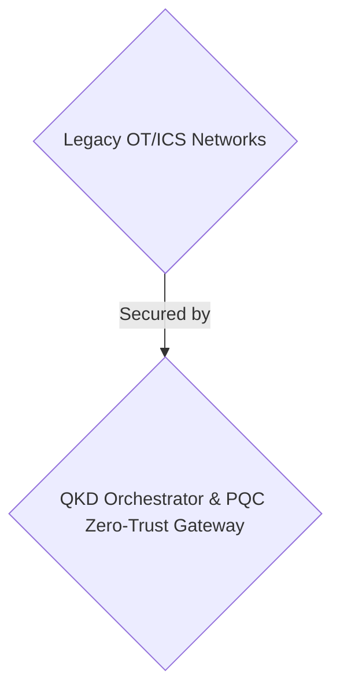
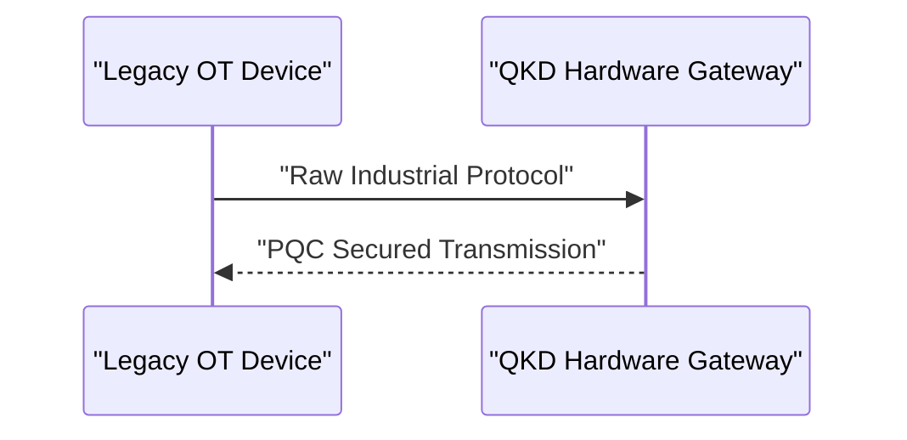

<!-- markdownlint-disable MD009 MD010 MD013 MD022 MD028 MD032 MD033 MD034 MD036 MD037 MD039 MD041 MD058 MD060 -->

[ 🇫🇷 Version Française ](./README.fr.md)

# QKD OT Guardian

> **Executive Summary:** A B2B quantum key distribution network orchestrator targeting critical infrastructure operators to secure legacy OT/ICS networks against "Store Now, Decrypt Later" quantum attacks.

---

## 1. Visual Overview & Wow Effect

## 2. Contrarian Thesis (Peter Thiel Style)

- **Popular Belief:** Standard IT VPNs and traditional cryptography (RSA/ECC) can secure industrial environments.
- **Hidden Truth:** Traditional security VPNs/SaaS add too much latency for real-time industrial control (which requires response times < 5ms) and rely on classical cryptography (RSA/ECC) that is doomed to obsolescence.

## 3. Problem & Target Market

- **Business Model:** B2B
- **Target Audience:** Critical infrastructure operators (power grids, nuclear plants, water treatment facilities) (CISO, OT Security Managers).
- **Urgent Pain Point:** Operational networks (OT/ICS) use legacy industrial protocols vulnerable to "Store Now, Decrypt Later" attacks by future quantum computers. Updating the hardware of programmable logic controllers (PLCs) is financially and physically impossible at scale.

## 4. Technical Architecture & Infrastructure

A quantum key distribution (QKD) and post-quantum cryptography (PQC) network orchestrator acting as a security overlay (Zero-Trust hardware gateway) placed in front of existing OT networks without modifying end terminals.

## 5. Business Model & Financial Viability

| Metric                 | Value                       |
| ---------------------- | --------------------------- |
| Pricing Structure      | B2B Hardware + Subscription |
| 12-Month Target        | 100 industrial sites        |
| Revenue Formula        | 100 \* 1000€ = 100k€        |
| Estimated Gross Margin | 70%                         |

## 6. Distribution Engine & Moat

- **Acquisition Strategy:** Direct sales to critical infrastructure providers and governments.
- **Moat (Defensibility):** Traditional security VPNs/SaaS add too much latency for real-time industrial control (which requires response times < 5ms) and rely on classical cryptography (RSA/ECC) that is doomed to obsolescence. High hardware cost and strict industrial certification requirements (IEC 62443).

## 7. Detailed Evaluation Grid

| Criterion                   | VC Score (/100) | Market Score (/100) |
| --------------------------- | --------------- | ------------------- |
| Thesis & Monopoly / Urgency | -- / 25         | -- / 25             |
| Moat / LLM Immunity         | -- / 25         | -- / 25             |
| Scalability / UX Friction   | -- / 25         | -- / 25             |
| Unit Economics / ROI        | -- / 25         | -- / 25             |
| TOTAL                       | -- / 100        | -- / 100            |

> **VC Verdict:** Pending evaluation.
> **Market Verdict:** Pending evaluation.
