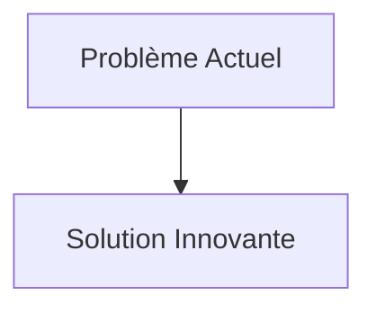
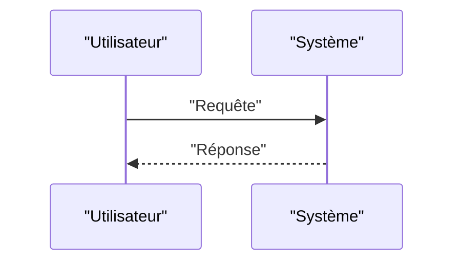

<!-- markdownlint-disable MD009 MD010 MD013 MD022 MD028 MD032 MD033 MD034 MD036 MD037 MD039 MD041 MD058 MD060 -->

[ 🇬🇧 English Version ](./README.md)

# QKD Satellite Mesh

> **Résumé exécutif :** Réseau maillé (Mesh) de nano-satellites (CubeSats) en orbite basse (LEO) équipés de sources de paires de photons intriqués et de terminaux optiques de communication laser pour relayer l'intrication quantique entre des stations au sol distantes de milliers de kilomètres.

---

## 1. Aperçu visuel & Effet Wahou

## 2. La thèse contrariante (Peter Thiel Style)

- **La croyance populaire :** Les solutions existantes sont suffisantes.
- **La vérité cachée :** En réalité, C'est un pur défi de physique (optique quantique, correction d'erreurs en espace libre) et d'ingénierie spatiale (pointage laser ultra-précis, gestion thermique). Aucun logiciel logiciel ou chiffrement mathématique (même PQC) ne peut fournir la sécurité inconditionnelle prouvée par les lois de la physique que permet le QKD.

## 3. Le problème & La cible

- **Modèle économique :** B2B / B2G (Gouvernement)
- **Cible précise :** Agences de renseignement, banques centrales, opérateurs télécoms, multinationales nécessitant des communications ultra-sécurisées.
- **La douleur urgente :** La distribution quantique de clés (QKD - Quantum Key Distribution) par fibre optique est limitée par la distance (atténuation du signal après ~100-200 km). Pour créer un internet quantique mondial et inviolable (indépendant des câbles sous-marins vulnérables au tapotement), il manque un relais spatial efficace.

## 4. Architecture technique & Plomberie

## 5. Modèle économique & Viabilité financière

| Métrique                        | Valeur                   |
| :------------------------------ | :----------------------- |
| **Structure de prix**           | Abonnement B2B           |
| **Objectif 12 mois**            | 100 clients à 1000€/mois |
| **Calcul du CA (Target 100k€)** | 100 \* 1000 = 100k€      |
| **Marge brute estimée**         | 80%                      |

## 6. Moteur de distribution & Fossé défensif (Moat)

- **Stratégie d'acquisition :** Ventes directes
- **Moat (Barrière à l'entrée) :** Réseau maillé (Mesh) de nano-satellites (CubeSats) en orbite basse (LEO) équipés de sources de paires de photons intriqués et de terminaux optiques de communication laser pour relayer l'intrication quantique entre des stations au sol distantes de milliers de kilomètres. (Difficile à copier à cause de : Coût d'accès à l'espace ; taux de perte de photons à travers l'atmosphère terrestre (nuages, turbulences) ; durée de vie des sources quantiques dans l'environnement radiatif spatial ; concurrence de l'infrastructure spatiale chinoise très avancée sur ce sujet.)

## 7. Grille d'évaluation détaillée

| Critère                               | Score VC (/100) | Score Terrain (/100) |
| :------------------------------------ | :-------------: | :------------------: |
| **Thèse & Monopole / Urgence**        |     -- / 25     |       -- / 25        |
| **Moat / Résistance aux LLM natifs**  |     -- / 25     |       -- / 25        |
| **Scalabilité / Friction d'adoption** |     -- / 25     |       -- / 25        |
| **Unit Economics / ROI direct**       |     -- / 25     |       -- / 25        |
| **TOTAL**                             |  **-- / 100**   |     **-- / 100**     |

> **Verdict VC :** En attente d'évaluation.
> **Verdict Terrain :** En attente d'évaluation.
