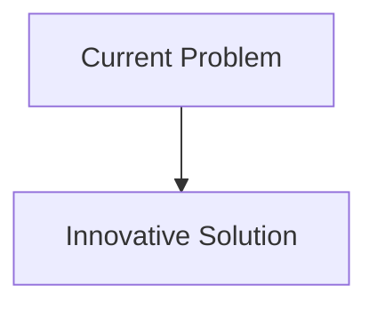
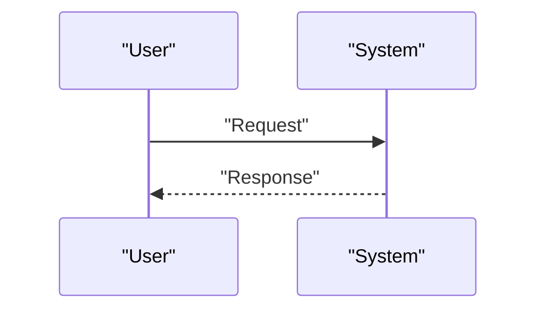

<!-- markdownlint-disable MD009 MD010 MD013 MD022 MD028 MD032 MD033 MD034 MD036 MD037 MD039 MD041 MD058 MD060 -->

[ 🇫🇷 Version Française ](./README.fr.md)

# QKD Satellite Mesh

> **Executive Summary:** Mesh network (Mesh) of low-orbit (LEO) nano-satellites (CubeSats) equipped with entangled photon pair sources and optical laser communication terminals to relay quantum entanglement between ground stations thousands of kilometers apart.

---

## 1. Visual Overview & Wow Effect

## 2. Contrarian Thesis (Peter Thiel Style)

- **Popular Belief:** Existing solutions are sufficient.
- **Hidden Truth:** In reality, it is a pure challenge of physics (quantum optics, error correction in free space) and space engineering (ultra-precise laser pointing, thermal management). No software or mathematical encryption (even PQC) can provide the unconditional security proven by the laws of physics that QKD allows.

## 3. Problem & Target Market

- **Business Model:** B2B / B2G (Gouvernement)
- **Target Audience:** Intelligence agencies, central banks, telecom operators, multinationals requiring ultra-secure communications.
- **Urgent Pain Point:** Quantum Key Distribution (QKD) by optical fiber is limited by distance (signal attenuation after ~100-200 km). To create a global, tamper-proof quantum internet (independent of undersea cables vulnerable to tapping), an effective spatial relay is missing.

## 4. Technical Architecture & Infrastructure

## 5. Business Model & Financial Viability

| Metric                     | Value                        |
| :------------------------- | :--------------------------- |
| **Pricing Structure**      | B2B Subscription             |
| **12-Month Target**        | 100 customers at 1000€/month |
| **Revenue Formula**        | 100 \* 1000 = 100k€          |
| **Estimated Gross Margin** | 80%                          |

## 6. Distribution Engine & Moat

- **Acquisition Strategy:** Direct Sales
- **Moat (Defensibility):** Mesh network (Mesh) of low-orbit (LEO) nano-satellites (CubeSats) equipped with entangled photon pair sources and optical laser communication terminals to relay quantum entanglement between ground stations thousands of kilometers apart.(Difficult to copy because of: Cost of access to space; rate of loss of photons through the Earth's atmosphere (clouds, turbulence); lifespan of quantum sources in the space radiative environment; competition from the very advanced Chinese space infrastructure on this subject.)

## 7. Detailed Evaluation Grid

| Criterion                       | VC Score (/100) | Market Score (/100) |
| :------------------------------ | :-------------: | :-----------------: |
| **Thesis & Monopoly / Urgency** |     -- / 25     |       -- / 25       |
| **Moat / LLM Immunity**         |     -- / 25     |       -- / 25       |
| **Scalability / UX Friction**   |     -- / 25     |       -- / 25       |
| **Unit Economics / ROI**        |     -- / 25     |       -- / 25       |
| **TOTAL**                       |  **-- / 100**   |    **-- / 100**     |

> **VC Verdict:** Pending evaluation.
> **Market Verdict:** Pending evaluation.
