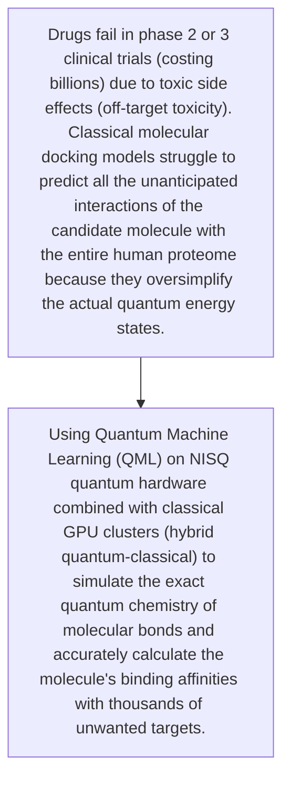
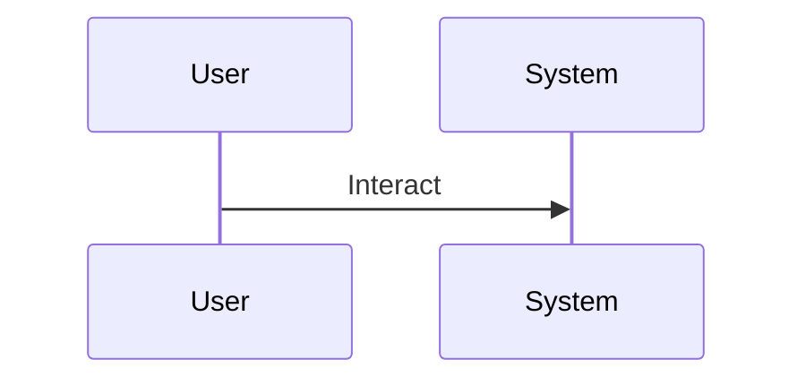

<!-- markdownlint-disable MD009 MD010 MD013 MD022 MD028 MD032 MD033 MD034 MD036 MD037 MD039 MD041 MD060 -->

[ 🇫🇷 Version Française ](./README.fr.md)

# QML Off-Target Toxicity

> **Executive Summary:** Using Quantum Machine Learning (QML) on NISQ quantum hardware combined with classical GPU clusters (hybrid quantum-classical) to simulate the exact quantum chemistry of molecular bonds and accurately calculate the molecule's binding affinities with thousands of unwanted targets.

---

## 1. Visual Overview & Wow Effect

## 2. Contrarian Thesis (Peter Thiel Style)

- **Popular Belief:** Classical molecular dynamics simulations encounter an exponential computational wall to evaluate the quantum mechanics (Schrödinger equation) of large molecules. An LLM cannot "guess" the exact binding energy of a protein fold; this requires physical simulation at the subatomic level.
- **Hidden Truth:** Using Quantum Machine Learning (QML) on NISQ quantum hardware combined with classical GPU clusters (hybrid quantum-classical) to simulate the exact quantum chemistry of molecular bonds and accurately calculate the molecule's binding affinities with thousands of unwanted targets.

## 3. Problem & Target Market

- **Business Model:** B2B
- **Target Audience:** Large pharmaceutical companies (Big Pharma), biotechs specializing in drug discovery, regulatory bodies (FDA, EMA).
- **Urgent Pain Point:** Drugs fail in phase 2 or 3 clinical trials (costing billions) due to toxic side effects (off-target toxicity). Classical molecular docking models struggle to predict all the unanticipated interactions of the candidate molecule with the entire human proteome because they oversimplify the actual quantum energy states.

## 4. Technical Architecture & Infrastructure

## 5. Business Model & Financial Viability

| Metric                 | Value                                     |
| ---------------------- | ----------------------------------------- |
| Pricing Structure      | [Price / Subscription Model / Commission] |
| 12-Month Target        | [Exact volume required for 100k ARR]      |
| Revenue Formula        | [Mathematical calculation]                |
| Estimated Gross Margin | [Margin %]                                |

## 6. Distribution Engine & Moat

- **Acquisition Strategy:** [Virality, network effect, direct sales, developer adoption]
- **Moat (Defensibility):** Current quantum hardware (NISQ) is still noisy and limited in number of logical qubits, uncertainty about when practical quantum advantage will be achieved for this specific problem, very long R&D time.

## 7. Detailed Evaluation Grid

| Criterion                   | VC Score (/100) | Market Score (/100) |
| --------------------------- | --------------- | ------------------- |
| Thesis & Monopoly / Urgency | 24 / 25         | -- / 25             |
| Moat / LLM Immunity         | 23 / 25         | -- / 25             |
| Scalability / UX Friction   | 24 / 25         | -- / 25             |
| Unit Economics / ROI        | 25 / 25         | -- / 25             |
| TOTAL                       | 96 / 100        | -- / 100            |

> **VC Verdict:** QML Off-Target Toxicity directly attacks the most expensive bottleneck in drug development, representing a massive market opportunity. The technical barrier to entry is immense, creating a near-insurmountable deep tech moat against conventional AI models. With virtually unlimited pricing power for a proven solution, this is a textbook monopoly play.
> **Market Verdict:** Pending evaluation.
