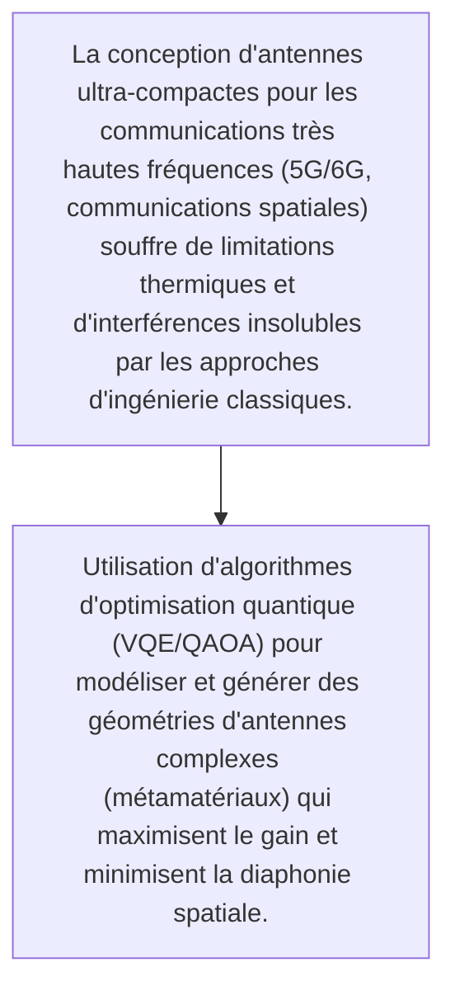
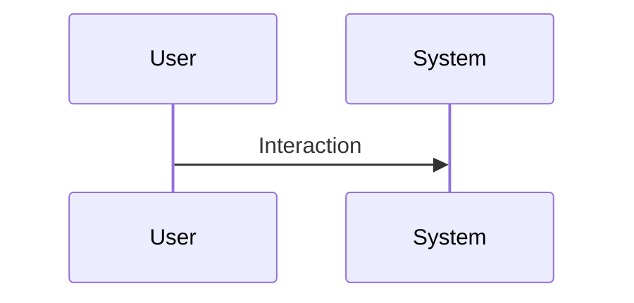

<!-- markdownlint-disable MD009 MD010 MD013 MD022 MD028 MD032 MD033 MD034 MD036 MD037 MD039 MD041 MD060 -->

[ 🇬🇧 English Version ](./README.md)

# Q-Antenna Forge

> **Résumé exécutif :** Utilisation d'algorithmes d'optimisation quantique (VQE/QAOA) pour modéliser et générer des géométries d'antennes complexes (métamatériaux) qui maximisent le gain et minimisent la diaphonie spatiale.

---

## 1. Aperçu visuel & Effet Wahou

## 2. La thèse contrariante (Peter Thiel Style)

- **La croyance populaire :** L'espace de recherche des géométries est exponentiellement trop vaste pour les simulateurs électromagnétiques classiques sur CPU/GPU, nécessitant des architectures quantiques (QPU) pour converger vers des optimums locaux non intuitifs.
- **La vérité cachée :** Utilisation d'algorithmes d'optimisation quantique (VQE/QAOA) pour modéliser et générer des géométries d'antennes complexes (métamatériaux) qui maximisent le gain et minimisent la diaphonie spatiale.

## 3. Le problème & La cible

- **Modèle économique :** B2B
- **Cible précise :** Opérateurs télécoms, défense, entreprises spatiales et constructeurs de véhicules autonomes
- **La douleur urgente :** La conception d'antennes ultra-compactes pour les communications très hautes fréquences (5G/6G, communications spatiales) souffre de limitations thermiques et d'interférences insolubles par les approches d'ingénierie classiques.

## 4. Architecture technique & Plomberie

## 5. Modèle économique & Viabilité financière

| Métrique                    | Valeur                                                          |
| --------------------------- | --------------------------------------------------------------- |
| Structure de prix           | [Prix / Modèle d'abonnement / Commission]                       |
| Objectif 12 mois            | [Nombre exact de clients/utilisateurs/transactions nécessaires] |
| Calcul du CA (Target 100k€) | [Formule mathématique exacte]                                   |
| Marge brute estimée         | [Marge en %]                                                    |

## 6. Moteur de distribution & Fossé défensif (Moat)

- **Stratégie d'acquisition :** [Viralité B2C, réseau C2C, acquisition B2B directe, adhésion dev M2M]
- **Moat (Barrière à l'entrée) :** Dépendance forte au temps d'accès aux ordinateurs quantiques NISQ, incertitude sur la preuve concrète d'avantage quantique par rapport aux heuristiques classiques avancées.

## 7. Grille d'évaluation détaillée

| Critère                           | Score VC (/100) | Score Terrain (/100) |
| --------------------------------- | --------------- | -------------------- |
| Thèse & Monopole / Urgence        | -- / 25         | -- / 25              |
| Moat / Résistance aux LLM natifs  | -- / 25         | -- / 25              |
| Scalabilité / Friction d'adoption | -- / 25         | -- / 25              |
| Unit Economics / ROI direct       | -- / 25         | -- / 25              |
| TOTAL                             | -- / 100        | -- / 100             |

> **Verdict VC :** En attente d'évaluation.
> **Verdict Terrain :** En attente d'évaluation.
