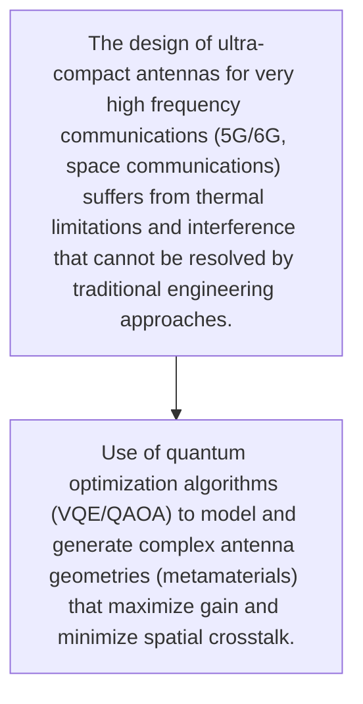
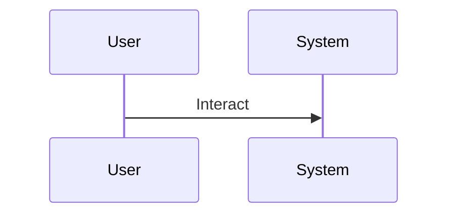

<!-- markdownlint-disable MD009 MD010 MD013 MD022 MD028 MD032 MD033 MD034 MD036 MD037 MD039 MD041 MD060 -->

[ 🇫🇷 Version Française ](./README.fr.md)

# Q-Antenna Forge

> **Executive Summary:** Use of quantum optimization algorithms (VQE/QAOA) to model and generate complex antenna geometries (metamaterials) that maximize gain and minimize spatial crosstalk.

---

## 1. Visual Overview & Wow Effect

## 2. Contrarian Thesis (Peter Thiel Style)

- **Popular Belief:** The search space of geometries is exponentially too large for classical electromagnetic simulators on CPU/GPU, requiring quantum architectures (QPU) to converge to non-intuitive local optima.
- **Hidden Truth:** Use of quantum optimization algorithms (VQE/QAOA) to model and generate complex antenna geometries (metamaterials) that maximize gain and minimize spatial crosstalk.

## 3. Problem & Target Market

- **Business Model:** B2B
- **Target Audience:** Telecom operators, defense, space companies and autonomous vehicle manufacturers
- **Urgent Pain Point:** The design of ultra-compact antennas for very high frequency communications (5G/6G, space communications) suffers from thermal limitations and interference that cannot be resolved by traditional engineering approaches.

## 4. Technical Architecture & Infrastructure

## 5. Business Model & Financial Viability

| Metric                 | Value                                     |
| ---------------------- | ----------------------------------------- |
| Pricing Structure      | [Price / Subscription Model / Commission] |
| 12-Month Target        | [Exact volume required for 100k ARR]      |
| Revenue Formula        | [Mathematical calculation]                |
| Estimated Gross Margin | [Margin %]                                |

## 6. Distribution Engine & Moat

- **Acquisition Strategy:** [Virality, network effect, direct sales, developer adoption]
- **Moat (Defensibility):** Strong dependence on access time to NISQ quantum computers, uncertainty on the concrete proof of quantum advantage compared to advanced classical heuristics.

## 7. Detailed Evaluation Grid

| Criterion                   | VC Score (/100) | Market Score (/100) |
| --------------------------- | --------------- | ------------------- |
| Thesis & Monopoly / Urgency | -- / 25         | -- / 25             |
| Moat / LLM Immunity         | -- / 25         | -- / 25             |
| Scalability / UX Friction   | -- / 25         | -- / 25             |
| Unit Economics / ROI        | -- / 25         | -- / 25             |
| TOTAL                       | -- / 100        | -- / 100            |

> **VC Verdict:** Pending evaluation.
> **Market Verdict:** Pending evaluation.
