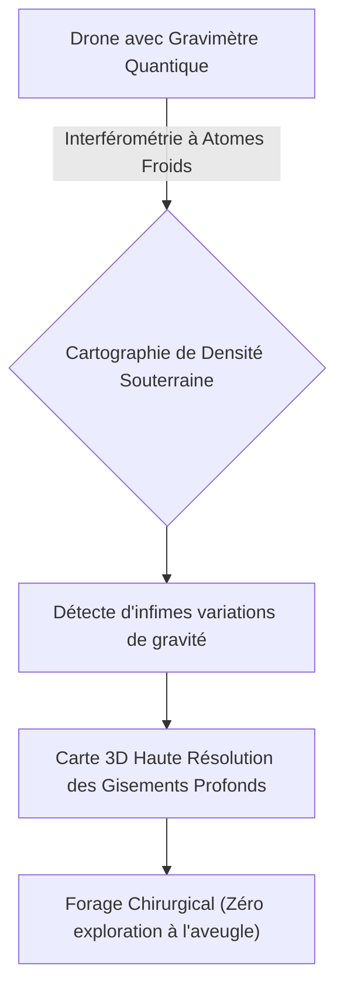
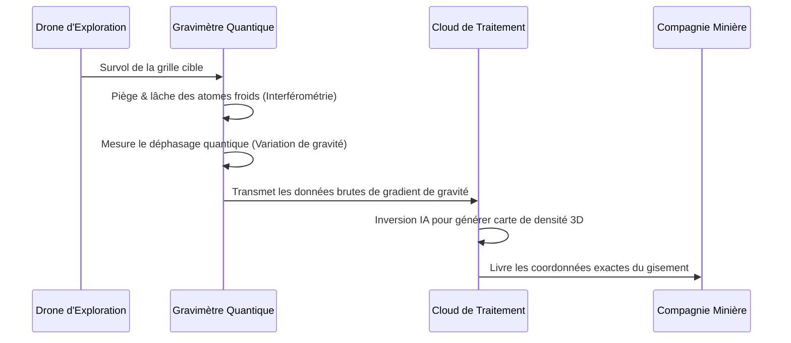

<!-- markdownlint-disable MD009 MD010 MD013 MD022 MD028 MD032 MD033 MD034 MD036 MD037 MD039 MD041 MD058 MD060 -->

[ 🇬🇧 English Version ](./README.md)

# Quantum Gravimeter Mining

> **Résumé exécutif :** Des capteurs quantiques embarqués sur drones utilisant l'interférométrie à atomes froids pour cartographier la densité du sous-sol en très haute résolution, révolutionnant la découverte de minéraux critiques.

---

## 1. Aperçu visuel & Effet Wahou

## 2. La thèse contrariante (Peter Thiel Style)

**La croyance populaire :** Trouver des minéraux critiques profonds nécessite des forages à l'aveugle destructeurs et coûteux ainsi que des relevés sismiques imprécis.
**La vérité cachée :** Le champ gravitationnel terrestre contient les signatures exactes de la densité du sous-sol ; en miniaturisant les interféromètres quantiques à atomes froids pour les déployer sur des drones, nous pouvons "radiographier" la croûte terrestre de manière non invasive, trouvant les minéraux critiques de la transition énergétique avec zéro forage à l'aveugle.

## 3. Le problème & La cible

**Modèle économique :** B2B
**Cible précise :** Compagnies minières, entreprises d'exploration de ressources critiques et d'énergie.
**La douleur urgente :** L'exploration profonde de minéraux critiques (lithium, terres rares) est hautement inefficace et gourmande en capitaux. Les forages à l'aveugle et les données sismiques imprécises entraînent des pertes financières massives et des retards sévères dans la sécurisation des matériaux essentiels à la transition énergétique mondiale.

## 4. Architecture technique & Plomberie

## 5. Modèle économique & Viabilité financière

| Métrique                    | Valeur                                                                                   |
| --------------------------- | ---------------------------------------------------------------------------------------- |
| Structure de prix           | Exploration-as-a-Service à haute valeur ajoutée (Frais de relevé + royalties sur succès) |
| Objectif 12 mois            | 2 contrats commerciaux de relevés (à 50 000€/relevé)                                     |
| Calcul du CA (Target 100k€) | 2 \* 50 000€ = 100 000€ de revenus annuels récurrents                                    |
| Marge brute estimée         | 70%                                                                                      |

## 6. Moteur de distribution & Fossé défensif (Moat)

**Stratégie d'acquisition :** Ventes B2B directes ciblant les Géologues en Chef et les Vice-Présidents de l'exploration des grands conglomérats miniers.
**Moat (Barrière à l'entrée) :** Miniaturiser l'interférométrie à atomes froids pour respecter les contraintes SWaP (Taille, Poids, Énergie) sur un drone en mouvement tout en isolant le bruit des vibrations environnementales extrêmes est un défi monumental de physique et d'ingénierie matérielle que les entreprises géospatiales standards ne peuvent pas reproduire.

## 7. Grille d'évaluation détaillée

| Critère                           | Score VC (/100) | Score Terrain (/100) |
| --------------------------------- | --------------- | -------------------- |
| Thèse & Monopole / Urgence        | -- / 25         | -- / 25              |
| Moat / Résistance aux LLM natifs  | -- / 25         | -- / 25              |
| Scalabilité / Friction d'adoption | -- / 25         | -- / 25              |
| Unit Economics / ROI direct       | -- / 25         | -- / 25              |
| **TOTAL**                         | **-- / 100**    | **-- / 100**         |

> **Verdict VC :** En attente d'évaluation.
> **Verdict Terrain :** En attente d'évaluation.
