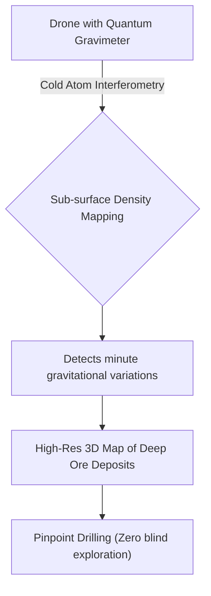
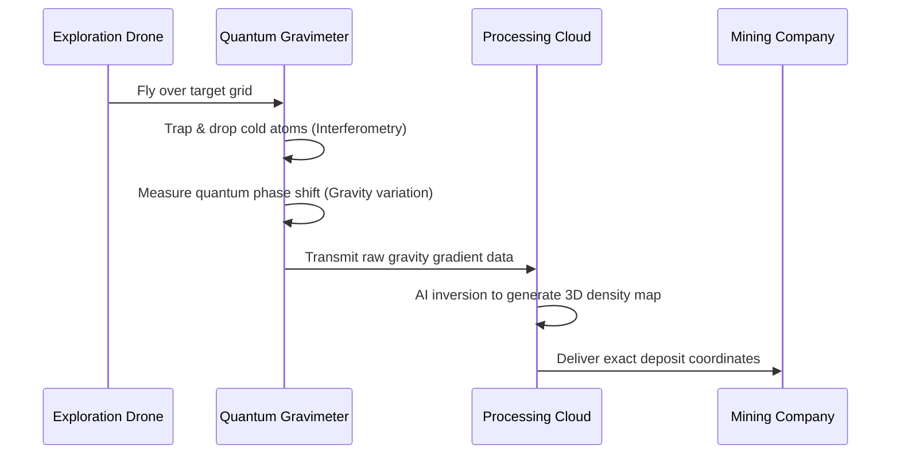

<!-- markdownlint-disable MD009 MD010 MD013 MD022 MD028 MD032 MD033 MD034 MD036 MD037 MD039 MD041 MD058 MD060 -->

[ 🇫🇷 Version Française ](./README.fr.md)

# Quantum Gravimeter Mining

> **Executive Summary:** Drone-mounted quantum sensors using cold atom interferometry to map sub-surface density in ultra-high resolution, revolutionizing the discovery of critical minerals.

---

## 1. Visual Overview & Wow Effect

## 2. Contrarian Thesis (Peter Thiel Style)

**Popular Belief:** Finding deep critical minerals requires destructive, expensive blind drilling and inaccurate seismic surveys.
**Hidden Truth:** The Earth's gravitational field holds exact signatures of sub-surface density; by miniaturizing quantum cold atom interferometers for drone deployment, we can non-invasively "x-ray" the Earth's crust, finding critical energy transition minerals with zero blind drilling.

## 3. Problem & Target Market

**Business Model:** B2B
**Target Audience:** Mining companies, critical resource exploration firms, and energy companies.
**Urgent Pain Point:** Deep exploration for critical minerals (lithium, rare earths) is highly inefficient and capital-intensive. Blind drilling and inaccurate seismic data lead to massive financial losses and severe delays in securing materials essential for the global energy transition.

## 4. Technical Architecture & Infrastructure

## 5. Business Model & Financial Viability

| Metric                 | Value                                                              |
| ---------------------- | ------------------------------------------------------------------ |
| Pricing Structure      | High-value Exploration-as-a-Service (Survey fee + success royalty) |
| 12-Month Target        | 2 commercial survey contracts (at 50,000€/survey)                  |
| Revenue Formula        | 2 \* 50,000€ = 100,000€ ARR                                        |
| Estimated Gross Margin | 70%                                                                |

## 6. Distribution Engine & Moat

**Acquisition Strategy:** Direct B2B sales targeting Chief Geologists and exploration VPs at major mining conglomerates.
**Moat (Defensibility):** Miniaturizing cold atom interferometry to fit SWaP (Size, Weight, and Power) constraints on a moving drone while isolating extreme environmental vibration noise is a monumental physics and hardware engineering challenge that standard geospatial companies cannot replicate.

## 7. Detailed Evaluation Grid

| Criterion                   | VC Score (/100) | Market Score (/100) |
| --------------------------- | --------------- | ------------------- |
| Thesis & Monopoly / Urgency | -- / 25         | -- / 25             |
| Moat / LLM Immunity         | -- / 25         | -- / 25             |
| Scalability / UX Friction   | -- / 25         | -- / 25             |
| Unit Economics / ROI        | -- / 25         | -- / 25             |
| **TOTAL**                   | **-- / 100**    | **-- / 100**        |

> **VC Verdict:** Pending evaluation.
> **Market Verdict:** Pending evaluation.
