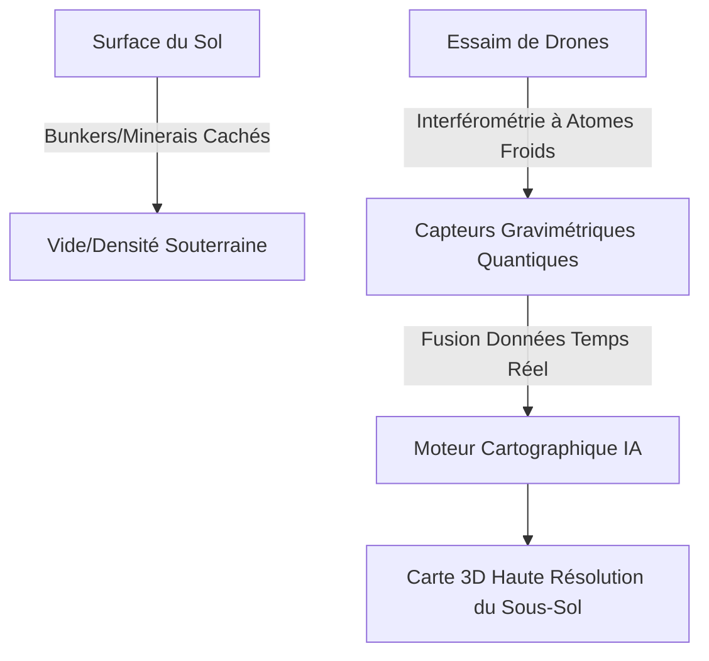
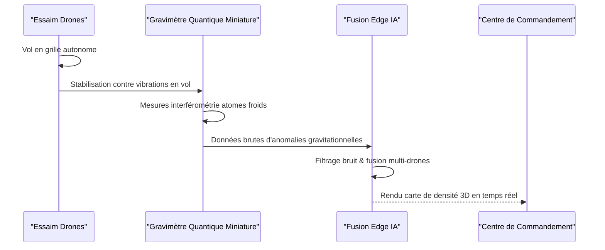

<!-- markdownlint-disable MD009 MD010 MD013 MD022 MD028 MD032 MD033 MD034 MD036 MD037 MD039 MD041 MD060 -->

[ 🇬🇧 English Version ](./README.md)

# Quantum Gravimetry Drone Swarm

> **Résumé exécutif :** Un essaim de drones autonomes équipés de gravimètres quantiques à atomes froids miniaturisés pour cartographier instantanément et de manière non invasive les infrastructures souterraines, aquifères et gisements en 3D haute résolution.

---

## 1. Aperçu visuel & Effet Wahou

## 2. La thèse contrariante (Peter Thiel Style)

- **La croyance populaire :** Cartographier le sous-sol nécessite soit de forer physiquement, ce qui est destructeur et lent, soit d'utiliser un radar à pénétration de sol, qui est imprécis et très limité en profondeur.
- **La vérité cachée :** La physique quantique permet de mesurer d'infimes variations de gravité avec une précision sans précédent. En miniaturisant ces capteurs et en les plaçant sur un essaim de drones, nous pouvons "voir" à travers la roche massive depuis les airs sans creuser un seul trou.

## 3. Le problème & La cible

- **Modèle économique :** B2B
- **Cible précise :** Prospection géophysique, exploration pétrolière/minière, ingénierie civile, forces de défense (détection de tunnels).
- **La douleur urgente :** Cartographier le sous-sol (infrastructures invisibles, aquifères, gisements, bunkers) coûte extrêmement cher, est lent et souvent dangereux. Les capteurs géophysiques actuels sont imprécis et limités en profondeur.

## 4. Architecture technique & Plomberie

## 5. Modèle économique & Viabilité financière

| Métrique                        | Valeur                                          |
| ------------------------------- | ----------------------------------------------- |
| **Structure de prix**           | Data-as-a-Service (DaaS) / Contrat de Relevé    |
| **Objectif 12 mois**            | 1 à 2 grands relevés pilotes (mines ou défense) |
| **Calcul du CA (Target 100k€)** | 1 Contrat de Relevé \* 100k€                    |
| **Marge brute estimée**         | ~70% (CapEx élevé pour drones)                  |

## 6. Moteur de distribution & Fossé défensif (Moat)

- **Stratégie d'acquisition :** Ventes B2B/B2G à fort ticket ciblant les ministères de la Défense et les VP Exploration des géants miniers.
- **Moat (Barrière à l'entrée) :** C'est un défi de hardware quantique pur. Réduire la taille, le poids et la consommation électrique (SWaP) des lasers et pièges magnéto-optiques pour qu'ils volent, tout en compensant les vibrations du drone, représente une barrière technologique immense qu'aucun SaaS ou entreprise d'IA pure ne peut reproduire.

## 7. Grille d'évaluation détaillée

| Critère                           | Score VC (/100) | Score Terrain (/100) |
| --------------------------------- | --------------- | -------------------- |
| Thèse & Monopole / Urgence        | 25 / 25         | -- / 25              |
| Moat / Résistance aux LLM natifs  | 22 / 25         | -- / 25              |
| Scalabilité / Friction d'adoption | 24 / 25         | -- / 25              |
| Unit Economics / ROI direct       | 21 / 25         | -- / 25              |
| **TOTAL**                         | **92 / 100**    | **-- / 100**         |

> **Verdict VC :** C'est un véritable monopole contrarien : cartographier le sous-sol invisible à l'échelle avec des drones plutôt que des équipes au sol. La combinaison matériel-logiciel garantit des coûts de changement élevés. Si cela fonctionne, cela devient le standard de facto pour l'extraction et l'infrastructure.

> **Verdict Terrain :** Forte urgence et valeur évidente pour la cible. La résistance aux LLM est élevée grâce à une intégration matérielle ou physique forte. Malgré quelques frictions d'adoption, la monétisation B2B est très claire.
