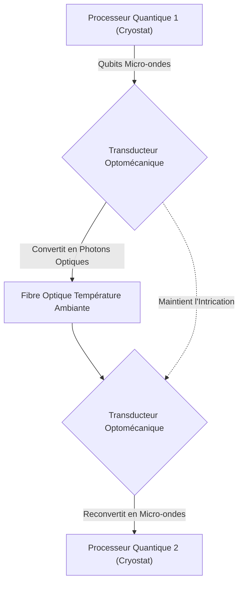
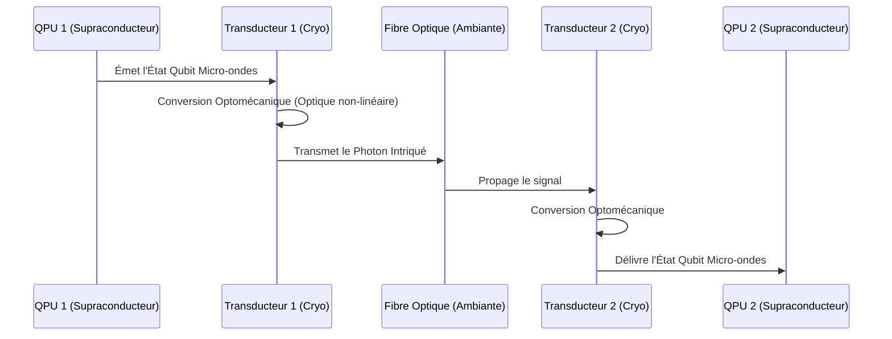

<!-- markdownlint-disable MD009 MD010 MD013 MD022 MD028 MD032 MD033 MD034 MD036 MD037 MD039 MD041 MD058 MD060 -->

[ 🇬🇧 English Version ](./README.md)

# Quantum Photonic Interconnect

> **Résumé exécutif :** Un routeur photonique intégré qui convertit les états quantiques micro-ondes en photons optiques intriqués, formant un bus de données quantique distribué pour faire passer les ordinateurs quantiques au-delà des limites d'un seul cryostat.

---

## 1. Aperçu visuel & Effet Wahou

## 2. La thèse contrariante (Peter Thiel Style)

**La croyance populaire :** L'informatique quantique passe à l'échelle en entassant de plus en plus de qubits dans des cryostats uniques et de plus en plus massifs.
**La vérité cachée :** L'approche du cryostat unique atteint une limite physique stricte concernant les charges thermiques et la diaphonie électromagnétique (crosstalk) ; la véritable scalabilité quantique nécessite des QPU mis en réseau de manière distribuée, ce qui n'est possible que via une interconnexion photonique cohérente micro-ondes vers optique qui préserve l'intrication à température ambiante.

## 3. Le problème & La cible

**Modèle économique :** B2B (Licensing d'IP ou fourniture de composants)
**Cible précise :** Constructeurs de data centers de pointe, Hyperscalers (Google, AWS, Azure), et fabricants de processeurs quantiques.
**La douleur urgente :** Le passage à l'échelle des ordinateurs quantiques vers un nombre de qubits commercialement viable est bloqué par l'incapacité de relier plusieurs unités de traitement quantique (QPU). L'architecture actuelle limite la taille de l'ordinateur à ce qui peut tenir dans un seul réfrigérateur, paralysant la progression de toute l'industrie de l'informatique quantique.

## 4. Architecture technique & Plomberie

## 5. Modèle économique & Viabilité financière

| Métrique                    | Valeur                                                                          |
| --------------------------- | ------------------------------------------------------------------------------- |
| Structure de prix           | Frais initiaux R&D/NRE + Licence de Propriété Intellectuelle par interconnexion |
| Objectif 12 mois            | 1 contrat PoC de co-développement avec un OEM Quantique (à 100 000€)            |
| Calcul du CA (Target 100k€) | 1 \* 100 000€ = 100 000€ de revenus annuels récurrents                          |
| Marge brute estimée         | 90% (Si pure Licence d'IP)                                                      |

## 6. Moteur de distribution & Fossé défensif (Moat)

**Stratégie d'acquisition :** Ventes techniques directes et joint-ventures stratégiques avec les équipementiers matériels quantiques de premier plan et les instituts de recherche.
**Moat (Barrière à l'entrée) :** La technologie repose sur des percées fondamentales en optique non linéaire, en matériaux optomécaniques et en ingénierie cryogénique de précision. Aucun logiciel ne peut compenser le manque de matériel physique capable de transduire de manière cohérente l'information quantique, créant un fossé deep tech presque impénétrable.

## 7. Grille d'évaluation détaillée

| Critère                           | Score VC (/100) | Score Terrain (/100) |
| --------------------------------- | --------------- | -------------------- |
| Thèse & Monopole / Urgence        | 24 / 25         | -- / 25              |
| Moat / Résistance aux LLM natifs  | 25 / 25         | -- / 25              |
| Scalabilité / Friction d'adoption | 20 / 25         | -- / 25              |
| Unit Economics / ROI direct       | 22 / 25         | -- / 25              |
| **TOTAL**                         | **91 / 100**    | **-- / 100**         |

> **Verdict VC :** Quantum Photonic Interconnect s'attaque à un goulot d'étranglement physique majeur dans la mise à l'échelle quantique, se positionnant comme un monopole deep-tech fondamental. Le besoin d'innovations matérielles (optique non linéaire à température cryogénique) crée un fossé infranchissable pour les concurrents purement logiciels. Le modèle de licence est très rentable auprès des fabricants, bien que les cycles R&D exigeront des capitaux patients.
> **Verdict Terrain :** En attente d'évaluation.
