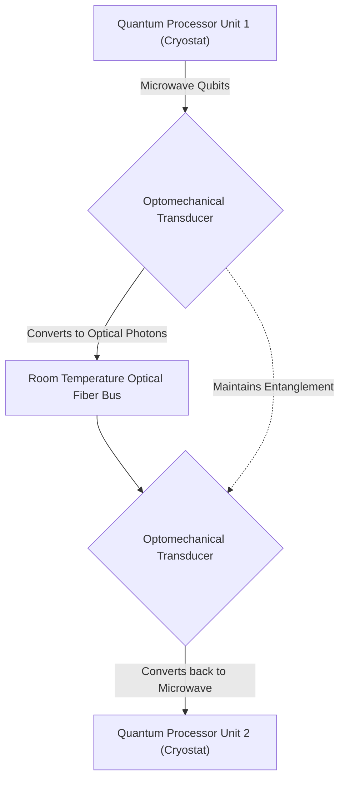
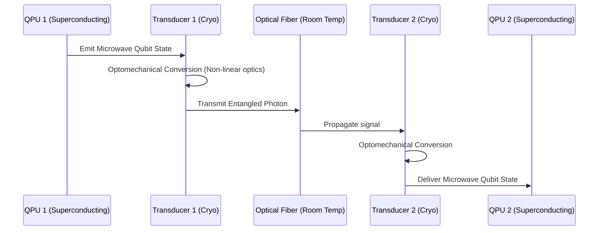

<!-- markdownlint-disable MD009 MD010 MD013 MD022 MD028 MD032 MD033 MD034 MD036 MD037 MD039 MD041 MD058 MD060 -->

[ 🇫🇷 Version Française ](./README.fr.md)

# Quantum Photonic Interconnect

> **Executive Summary:** An integrated photonic router that transduces microwave quantum states into entangled optical photons, forming a distributed quantum data bus to scale quantum computers beyond single-cryostat limits.

---

## 1. Visual Overview & Wow Effect

## 2. Contrarian Thesis (Peter Thiel Style)

**Popular Belief:** Quantum computing scales by packing more and more qubits into increasingly massive, single super-cooled cryostats.
**Hidden Truth:** The single-cryostat approach hits a strict physical limit regarding thermal loads and electromagnetic crosstalk; true quantum scalability requires distributed networked QPUs, which is only possible via a coherent microwave-to-optical photonic interconnect that preserves entanglement at room temperature.

## 3. Problem & Target Market

**Business Model:** B2B (IP Licensing or Component Supply)
**Target Audience:** Advanced data center builders, Hyperscalers (Google, AWS, Azure), and quantum processor manufacturers.
**Urgent Pain Point:** Scaling quantum computers to commercially viable qubit counts is blocked by the inability to link multiple Quantum Processing Units (QPUs). Current architectures limit computer size to what can fit inside one fridge, bottlenecking the entire quantum computing industry's progression.

## 4. Technical Architecture & Infrastructure

## 5. Business Model & Financial Viability

| Metric                 | Value                                                                           |
| ---------------------- | ------------------------------------------------------------------------------- |
| Pricing Structure      | Upfront R&D/NRE (Non-Recurring Engineering) fee + IP Licensing per interconnect |
| 12-Month Target        | 1 PoC co-development contract with a Quantum OEM (at 100,000€)                  |
| Revenue Formula        | 1 \* 100,000€ = 100,000€ ARR                                                    |
| Estimated Gross Margin | 90% (If purely IP Licensing)                                                    |

## 6. Distribution Engine & Moat

**Acquisition Strategy:** Direct technical sales and strategic joint ventures with top-tier quantum hardware OEMs and research institutes.
**Moat (Defensibility):** The technology relies on fundamental breakthroughs in non-linear optics, optomechanical materials, and precision cryogenic engineering. No amount of software can compensate for the lack of physical hardware capable of coherently transducing quantum information, creating a nearly impenetrable deep tech moat.

## 7. Detailed Evaluation Grid

| Criterion                   | VC Score (/100) | Market Score (/100) |
| --------------------------- | --------------- | ------------------- |
| Thesis & Monopoly / Urgency | -- / 25         | -- / 25             |
| Moat / LLM Immunity         | -- / 25         | -- / 25             |
| Scalability / UX Friction   | -- / 25         | -- / 25             |
| Unit Economics / ROI        | -- / 25         | -- / 25             |
| **TOTAL**                   | **-- / 100**    | **-- / 100**        |

> **VC Verdict:** Pending evaluation.
> **Market Verdict:** Pending evaluation.
