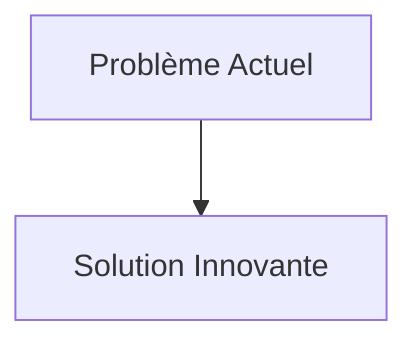
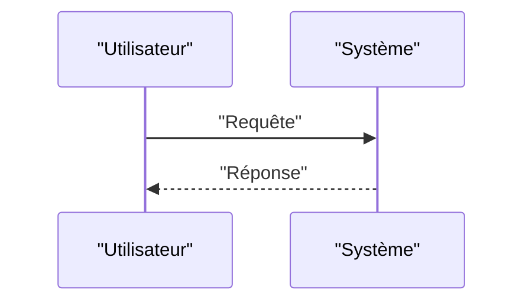

<!-- markdownlint-disable MD009 MD010 MD013 MD022 MD028 MD032 MD033 MD034 MD036 MD037 MD039 MD041 MD058 MD060 -->

[ 🇬🇧 English Version ](./README.md)

# Quantum Radar Countermeasure

> **Résumé exécutif :** Un système de brouillage et de leurrage (spoofing) quantique embarqué. Il identifie les photons intriqués du signal radar ennemi entrant, brise leur cohérence quantique et renvoie des photons falsifiés avec l'état quantique altéré pour induire en erreur le récepteur radar quantique (injection de bruit et manipulation de phase).

---

## 1. Aperçu visuel & Effet Wahou

## 2. La thèse contrariante (Peter Thiel Style)

- **La croyance populaire :** Les solutions existantes sont suffisantes.
- **La vérité cachée :** En réalité, Ce problème relève de la physique quantique matérielle extrême. Aucune mise à jour logicielle, aucun algorithme classique, ni aucune peinture absorbant les ondes radio classiques ne peut contrer l'intrication photonique.

## 3. Le problème & La cible

- **Modèle économique :** B2G / B2B
- **Cible précise :** Défense et aérospatiale (forces armées, agences de renseignement), fabricants d'aéronefs furtifs, opérateurs de satellites.
- **La douleur urgente :** Les radars quantiques (utilisant l'intrication quantique ou "quantum illumination") rendent obsolètes les technologies furtives actuelles (Stealth). Ils peuvent détecter des aéronefs ou des satellites qui sont invisibles aux radars classiques, modifiant fondamentalement l'équilibre stratégique et rendant vulnérables des flottes valant des milliards de dollars.

## 4. Architecture technique & Plomberie

## 5. Modèle économique & Viabilité financière

| Métrique                        | Valeur                   |
| :------------------------------ | :----------------------- |
| **Structure de prix**           | Abonnement B2B           |
| **Objectif 12 mois**            | 100 clients à 1000€/mois |
| **Calcul du CA (Target 100k€)** | 100 \* 1000 = 100k€      |
| **Marge brute estimée**         | 80%                      |

## 6. Moteur de distribution & Fossé défensif (Moat)

- **Stratégie d'acquisition :** Ventes directes
- **Moat (Barrière à l'entrée) :** Un système de brouillage et de leurrage (spoofing) quantique embarqué. Il identifie les photons intriqués du signal radar ennemi entrant, brise leur cohérence quantique et renvoie des photons falsifiés avec l'état quantique altéré pour induire en erreur le récepteur radar quantique (injection de bruit et manipulation de phase). (Difficile à copier à cause de : Technologique à très haut risque (TRL faible), besoin de matériel photonique quantique cryogénique compact pour être embarqué, classification secrète inévitable limitant le marché (ITAR/secret défense).)

## 7. Grille d'évaluation détaillée

| Critère                               | Score VC (/100) | Score Terrain (/100) |
| :------------------------------------ | :-------------: | :------------------: |
| **Thèse & Monopole / Urgence**        |     -- / 25     |       -- / 25        |
| **Moat / Résistance aux LLM natifs**  |     -- / 25     |       -- / 25        |
| **Scalabilité / Friction d'adoption** |     -- / 25     |       -- / 25        |
| **Unit Economics / ROI direct**       |     -- / 25     |       -- / 25        |
| **TOTAL**                             |  **-- / 100**   |     **-- / 100**     |

> **Verdict VC :** En attente d'évaluation.
> **Verdict Terrain :** En attente d'évaluation.
