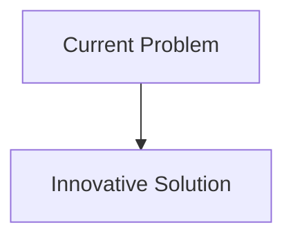
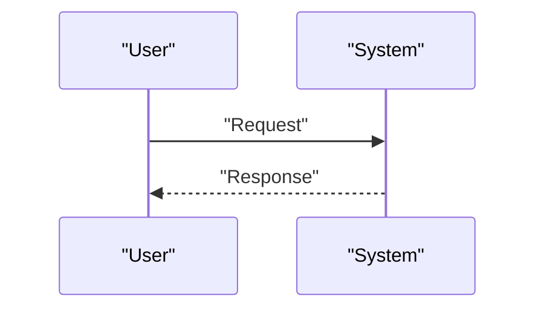

<!-- markdownlint-disable MD009 MD010 MD013 MD022 MD028 MD032 MD033 MD034 MD036 MD037 MD039 MD041 MD058 MD060 -->

[ 🇫🇷 Version Française ](./README.fr.md)

# Quantum Radar Countermeasure

> **Executive Summary:** An on-board quantum jamming and spoofing system. It identifies entangled photons from the incoming enemy radar signal, breaks their quantum coherence and returns falsified photons with the altered quantum state to mislead the quantum radar receiver (noise injection and phase manipulation).

---

## 1. Visual Overview & Wow Effect

## 2. Contrarian Thesis (Peter Thiel Style)

- **Popular Belief:** Existing solutions are sufficient.
- **Hidden Truth:** In reality, this problem concerns extreme material quantum physics. No software updates, no classical algorithms, nor any conventional radio wave-absorbing paint can counter photon entanglement.

## 3. Problem & Target Market

- **Business Model:** B2G / B2B
- **Target Audience:** Defense and aerospace (armed forces, intelligence agencies), stealth aircraft manufacturers, satellite operators.
- **Urgent Pain Point:** Quantum radars (using quantum entanglement or “quantum illumination”) make current stealth technologies (Stealth) obsolete. They can detect aircraft or satellites that are invisible to conventional radars, fundamentally changing the strategic balance and making billions of dollars worth of fleets vulnerable.

## 4. Technical Architecture & Infrastructure

## 5. Business Model & Financial Viability

| Metric                     | Value                        |
| :------------------------- | :--------------------------- |
| **Pricing Structure**      | B2B Subscription             |
| **12-Month Target**        | 100 customers at 1000€/month |
| **Revenue Formula**        | 100 \* 1000 = 100k€          |
| **Estimated Gross Margin** | 80%                          |

## 6. Distribution Engine & Moat

- **Acquisition Strategy:** Direct Sales
- **Moat (Defensibility):** An on-board quantum jamming and spoofing system. It identifies entangled photons from the incoming enemy radar signal, breaks their quantum coherence and returns falsified photons with the altered quantum state to mislead the quantum radar receiver (noise injection and phase manipulation).(Difficult to copy because of: Very high risk technology (low TRL), need for compact cryogenic quantum photonic hardware to be onboard, inevitable secret classification limiting the market (ITAR/defense secret).)

## 7. Detailed Evaluation Grid

| Criterion                       | VC Score (/100) | Market Score (/100) |
| :------------------------------ | :-------------: | :-----------------: |
| **Thesis & Monopoly / Urgency** |     -- / 25     |       -- / 25       |
| **Moat / LLM Immunity**         |     -- / 25     |       -- / 25       |
| **Scalability / UX Friction**   |     -- / 25     |       -- / 25       |
| **Unit Economics / ROI**        |     -- / 25     |       -- / 25       |
| **TOTAL**                       |  **-- / 100**   |    **-- / 100**     |

> **VC Verdict:** Pending evaluation.
> **Market Verdict:** Pending evaluation.
