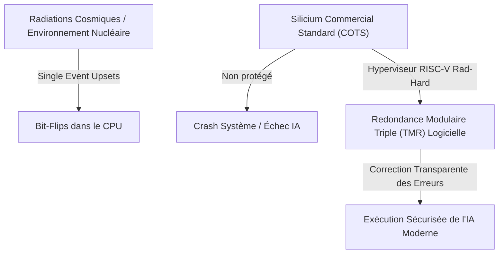
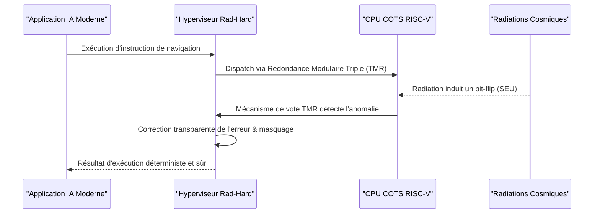

<!-- markdownlint-disable MD009 MD010 MD013 MD022 MD028 MD032 MD033 MD034 MD036 MD037 MD039 MD041 MD060 -->

[ 🇬🇧 English Version ](./README.md)

# Rad-Hard RISC-V Hypervisor

> **Résumé exécutif :** Un hyperviseur logiciel ultra-sécurisé couplé à une architecture RISC-V open-source optimisée pour l'atténuation des erreurs logicielles, permettant aux IA modernes de s'exécuter en toute sécurité sur du silicium commercial dans des environnements très irradiés (Spatial/Nucléaire).

---

## 1. Aperçu visuel & Effet Wahou

## 2. La thèse contrariante (Peter Thiel Style)

- **La croyance populaire :** Pour faire du calcul dans l'espace ou en milieu nucléaire, il faut utiliser des puces physiquement "rad-hardened" (durcies aux radiations), qui sont incroyablement chères, propriétaires et fondamentalement en retard de plusieurs décennies sur les architectures CPU modernes.
- **La vérité cachée :** En co-concevant profondément un hyperviseur Bare Metal avec une architecture RISC-V open-source, nous pouvons transférer la charge de la protection contre les radiations des contraintes physiques matérielles vers une redondance intelligente logicielle/micro-architecture, débloquant les capacités de l'IA moderne sur du silicium commercial (COTS) bon marché.

## 3. Le problème & La cible

- **Modèle économique :** B2B
- **Cible précise :** Agences spatiales (NASA, ESA), constructeurs de satellites commerciaux, opérateurs de centrales nucléaires, robotique de démantèlement extrême.
- **La douleur urgente :** Exécuter des IAs modernes de navigation ou de traitement d'images de manière sûre dans l'espace est quasiment impossible sans subir des bit-flips constants (Single Event Upsets) sur des puces "rad-hard" traditionnelles et très lentes.

## 4. Architecture technique & Plomberie

## 5. Modèle économique & Viabilité financière

| Métrique                        | Valeur                                                   |
| ------------------------------- | -------------------------------------------------------- |
| **Structure de prix**           | Licence Entreprise Fort Ticket + Support / Certification |
| **Objectif 12 mois**            | 1 à 2 licences pilotes avec des startups du New Space    |
| **Calcul du CA (Target 100k€)** | 2 licences \* 50k€/an                                    |
| **Marge brute estimée**         | ~95% (Pur Logiciel)                                      |

## 6. Moteur de distribution & Fossé défensif (Moat)

- **Stratégie d'acquisition :** Ventes directes B2B aux équipes d'ingénierie du New Space, en tirant parti de la confiance de la communauté open-source RISC-V et des certifications de tests d'irradiation réussis en cyclotron.
- **Moat (Barrière à l'entrée) :** Cela nécessite un développement profond d'OS embarqué (Ring 0 / Bare Metal) couplé à une expertise en micro-architecture (RTL). Aucune API cloud ou LLM ne peut protéger physiquement un registre CPU contre un rayonnement cosmique en temps réel tout en garantissant des temps d'exécution déterministes. La certification spatiale elle-même est un fossé massif.

## 7. Grille d'évaluation détaillée

| Critère                           | Score VC (/100) | Score Terrain (/100) |
| --------------------------------- | --------------- | -------------------- |
| Thèse & Monopole / Urgence        | 25 / 25         | -- / 25              |
| Moat / Résistance aux LLM natifs  | 24 / 25         | -- / 25              |
| Scalabilité / Friction d'adoption | 22 / 25         | -- / 25              |
| Unit Economics / ROI direct       | 21 / 25         | -- / 25              |
| **TOTAL**                         | **92 / 100**    | **-- / 100**         |

> **Verdict VC :** Un positionnement à contre-courant brillant contre le matériel hérité résistant aux radiations. Utiliser un logiciel pour corriger les erreurs du silicium commercial débloque des gains de performances massifs. Le verrouillage technique et les moats réglementaires sont absolus.

> **Verdict Terrain :** Urgence modérée mais valeur stratégique à long terme. L'immunité aux LLM est bonne, reposant sur des modèles spécifiques. L'adoption présente des frictions notables qui pourraient ralentir la monétisation initiale.
