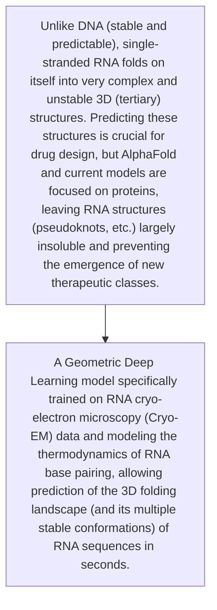
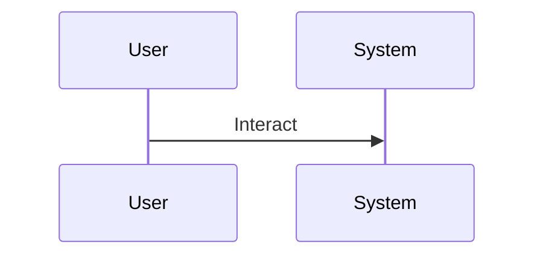

<!-- markdownlint-disable MD009 MD010 MD013 MD022 MD028 MD032 MD033 MD034 MD036 MD037 MD039 MD041 MD060 -->

[ 🇫🇷 Version Française ](./README.fr.md)

# RNA Tertiary Structure Sim

> **Executive Summary:** A Geometric Deep Learning model specifically trained on RNA cryo-electron microscopy (Cryo-EM) data and modeling the thermodynamics of RNA base pairing, allowing prediction of the 3D folding landscape (and its multiple stable conformations) of RNA sequences in seconds.

---

## 1. Visual Overview & Wow Effect

## 2. Contrarian Thesis (Peter Thiel Style)

- **Popular Belief:** RNA does not fold according to the same thermodynamic laws and sequence rules as amino acids in proteins. Generic textual or visual AI algorithms cannot understand the quantum mechanics/physics of RNA-specific 3-body interactions.
- **Hidden Truth:** A Geometric Deep Learning model specifically trained on RNA cryo-electron microscopy (Cryo-EM) data and modeling the thermodynamics of RNA base pairing, allowing prediction of the 3D folding landscape (and its multiple stable conformations) of RNA sequences in seconds.

## 3. Problem & Target Market

- **Business Model:** B2B
- **Target Audience:** RNA-based therapy startups (mRNA, RNAi), pharmaceutical laboratories developing next-generation vaccines.
- **Urgent Pain Point:** Unlike DNA (stable and predictable), single-stranded RNA folds on itself into very complex and unstable 3D (tertiary) structures. Predicting these structures is crucial for drug design, but AlphaFold and current models are focused on proteins, leaving RNA structures (pseudoknots, etc.) largely insoluble and preventing the emergence of new therapeutic classes.

## 4. Technical Architecture & Infrastructure

## 5. Business Model & Financial Viability

| Metric                 | Value                                     |
| ---------------------- | ----------------------------------------- |
| Pricing Structure      | [Price / Subscription Model / Commission] |
| 12-Month Target        | [Exact volume required for 100k ARR]      |
| Revenue Formula        | [Mathematical calculation]                |
| Estimated Gross Margin | [Margin %]                                |

## 6. Distribution Engine & Moat

- **Acquisition Strategy:** [Virality, network effect, direct sales, developer adoption]
- **Moat (Defensibility):** Severe lack of high-quality training data (there are far fewer experimentally resolved RNA structures than protein structures in the PDB), very high cost of sequencing and wet-lab testing to validate predictions.

## 7. Detailed Evaluation Grid

| Criterion                   | VC Score (/100) | Market Score (/100) |
| --------------------------- | --------------- | ------------------- |
| Thesis & Monopoly / Urgency | 24 / 25         | -- / 25             |
| Moat / LLM Immunity         | 24 / 25         | -- / 25             |
| Scalability / UX Friction   | 25 / 25         | -- / 25             |
| Unit Economics / ROI        | 22 / 25         | -- / 25             |
| TOTAL                       | 95 / 100        | -- / 100            |

> **VC Verdict:** RNA therapeutics are constrained by structural unpredictability. Modeling the 3D folding landscape is a platform monopoly that owns the next era of drug design. The geometric deep learning approach forms a compounding, proprietary data moat.
> **Market Verdict:** Pending evaluation.
