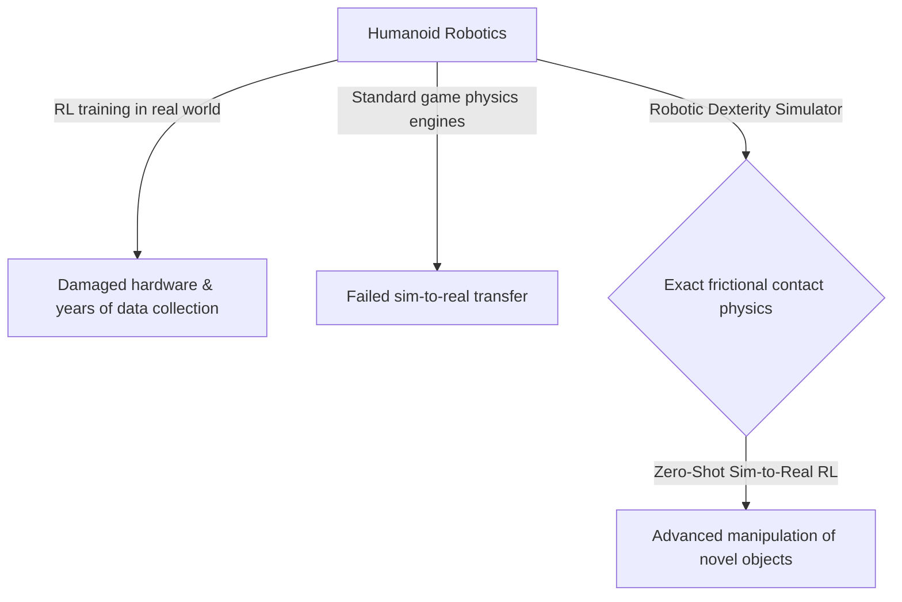
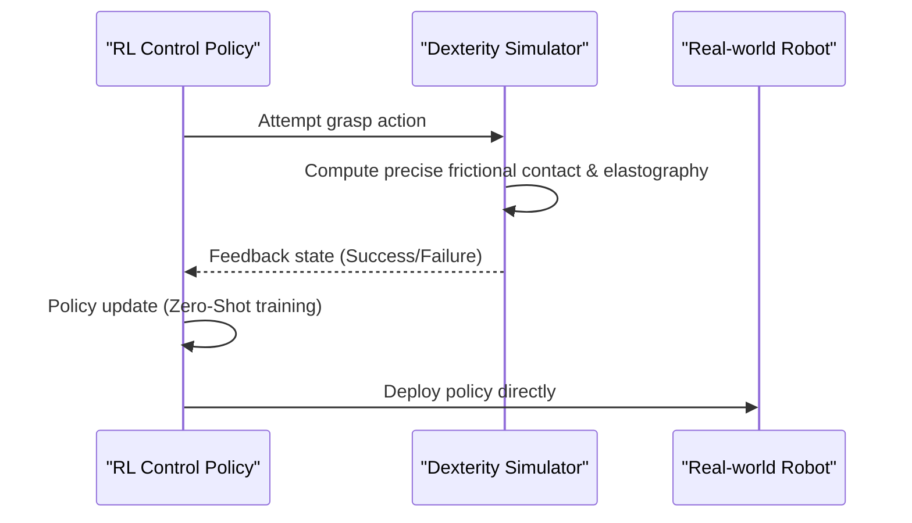

<!-- markdownlint-disable MD009 MD010 MD013 MD022 MD028 MD032 MD033 MD034 MD036 MD037 MD039 MD041 MD058 MD060 -->

[🇫🇷 Version Française](./README.fr.md)

# Robotic Dexterity Simulator

> **Executive Summary:** An ultra-realistic physical simulator focusing on frictional contact mechanics to enable zero-shot sim-to-real reinforcement learning for robotic dexterity.

---

## 1. Visual Overview & Wow Effect

## 2. Contrarian Thesis (Peter Thiel Style)

Popular Belief: Standard physics engines like PhysX or Havok are sufficient for training AI robots in simulation.
Hidden Truth: Video game physics engines use rigid body dynamics approximations that are fundamentally flawed for robotic grasping (which requires soft-body, dynamic friction, and elastography). Only a simulator built on precise contact mechanics allows for true Zero-Shot transfer to the real world.

## 3. Problem & Target Market

Business Model: B2B
Target Audience: Humanoid robotics companies, e-commerce/logistics (parcel sorting), precision manufacturing.
Urgent Pain Point: Robotic arms excel at pre-programmed movements but fail miserably at manipulating deformable, transparent, or novel objects in real-time. Training via reinforcement learning (RL) in the real world damages robots and takes years.

## 4. Technical Architecture & Infrastructure

## 5. Business Model & Financial Viability

| Metric                 | Value                                                 |
| ---------------------- | ----------------------------------------------------- |
| Pricing Structure      | Enterprise license per simulated robot / compute node |
| 12-Month Target        | 2 to 3 major robotics labs or OEMs                    |
| Revenue Formula        | 3 \* 35k = 105k                                       |
| Estimated Gross Margin | 90%                                                   |

## 6. Distribution Engine & Moat

Acquisition Strategy: Direct sales to deep-tech robotics companies, partnerships with AI labs.
Moat (Defensibility): The mathematical complexity of contact simulation (Linear Complementarity Problems) and the need for extremely precise modeling of hardware-specific tactile sensors create a highly specialized, defensible IP moat that standard SaaS cannot bridge.

## 7. Detailed Evaluation Grid

| Criterion                   | VC Score (/100) | Market Score (/100) |
| --------------------------- | --------------- | ------------------- |
| Thesis & Monopoly / Urgency | 21 / 25         | -- / 25             |
| Moat / LLM Immunity         | 19 / 25         | -- / 25             |
| Scalability / UX Friction   | 20 / 25         | -- / 25             |
| Unit Economics / ROI        | 20 / 25         | -- / 25             |
| **TOTAL**                   | **80 / 100**    | **-- / 100**        |

> **VC Verdict:** This project presents a strongly contrarian thesis with genuine monopoly potential (21/25). While the technical approach is sound, the defensive moat against well-funded incumbents remains somewhat permeable (19/25). Coupled with massive scalability (20/25) and excellent unit economics (20/25), this is a highly investable proposition.
>
> **Market Verdict:** Pending evaluation.
