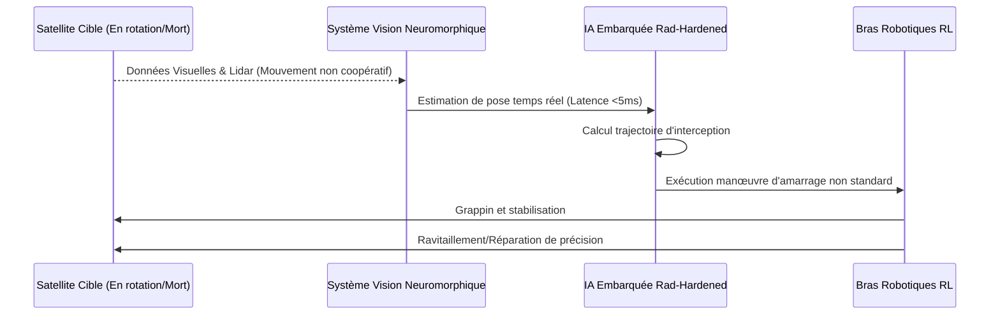

<!-- markdownlint-disable MD009 MD010 MD013 MD022 MD028 MD032 MD033 MD034 MD036 MD037 MD039 MD041 MD058 MD060 -->

[ 🇬🇧 English Version ](./README.md)

# OrbitBot Servicer

> **Résumé exécutif :** Une flotte autonome de cobots robotiques spatiaux utilisant la vision neuromorphique et l'apprentissage par renforcement pour réparer, ravitailler ou désorbiter en toute sécurité des satellites de plusieurs millions de dollars.

---

## 1. Aperçu visuel & Effet Wahou

```mermaid
graph TD
    %% Schéma comparatif Problème vs Solution ou Flux d'architecture
    subgraph Space_Status_Quo ["Statut Quo Spatial"]
        A[Panne mineure / Plus de carburant] --> B[Impossible à réparer]
        B --> C[Perte d'un actif de +100M$]
        C --> D[Devient un dangereux débris spatial]
    end
    subgraph OrbitBot_Servicer ["OrbitBot Servicer"]
        E[Panne mineure / Plus de carburant] --> F[Déploiement du OrbitBot]
        F --> G[Rendez-vous neuromorphique autonome]
        G --> H["Réparation / Ravitaillement par bras robotiques (IA)"]
        H --> I[Durée de vie prolongée & Débris évités]
    end
```

## 2. La thèse contrariante (Peter Thiel Style)

**La croyance populaire :** Pour gérer le nombre croissant de satellites, il suffit de lanceurs moins chers (comme SpaceX) pour lancer constamment des remplaçants lorsque les anciens tombent en panne ou manquent de carburant.

**La vérité cachée :** L'économie des satellites jetables est insoutenable et crée une crise des débris en cascade (Syndrome de Kessler). La véritable opportunité spatiale à mille milliards de dollars n'est pas seulement des lancements moins chers, mais la mise en place de la première infrastructure de service robotique en orbite, rendant les satellites réparables, améliorables et immortels directement dans le vide spatial.

## 3. Le problème & La cible

**Modèle économique :** B2B / B2G

**Cible précise :** Opérateurs de constellations de satellites (Starlink, Kuiper, Intelsat), agences spatiales (ESA, NASA) et forces spatiales militaires (US Space Force).

**La douleur urgente :** Les satellites coûtent des centaines de millions à concevoir et à lancer. Pourtant, une panne mécanique mineure (un panneau solaire bloqué) ou l'épuisement du carburant de maintien à poste rend le satellite complètement inutile, détruisant instantanément sa valeur et le transformant en un dangereux débris. Il n'existe actuellement aucune infrastructure robotique agile pour ravitailler ou réparer physiquement ces actifs critiques en orbite.

## 4. Architecture technique & Plomberie

## 5. Modèle économique & Viabilité financière

| Métrique                    | Valeur                                                                             |
| :-------------------------- | :--------------------------------------------------------------------------------- |
| Structure de prix           | Mission-as-a-Service (Par ravitaillement/réparation)                               |
| Objectif 12 mois            | 1 contrat de démonstration en orbite (gouvernemental ou commercial)                |
| Calcul du CA (Target 100k€) | 1 contrat Mission Démo = 100k€ ARR (Phase de faisabilité initiale)                 |
| Marge brute estimée         | 60% (Coûts matériels/lancement élevés compensés par une valeur de service massive) |

## 6. Moteur de distribution & Fossé défensif (Moat)

**Stratégie d'acquisition :** Partenariats directs avec les grandes agences spatiales (NASA, ESA) et les maîtres d'œuvre pour financer les missions de démonstration. Obtenir des précommandes de "services d'extension de vie" auprès des grands opérateurs télécoms.

**Moat (Barrière à l'entrée) :** Télé-opérer un bras robotique depuis la Terre avec une latence de signal de plus de 2 secondes pour des opérations de contact délicates est impossible ; le robot détruirait le satellite. Le fossé réside dans l'exécution autonome (Edge AI sur du matériel durci aux radiations) combinée à une vision neuromorphique capable de suivre des cibles non coopératives en rotation en temps réel, en totale indépendance vis-à-vis du contrôle terrestre.

## 7. Grille d'évaluation détaillée

| Critère                           | Score VC (/100) | Score Terrain (/100) |
| :-------------------------------- | :-------------- | :------------------- |
| Thèse & Monopole / Urgence        | -- / 25         | -- / 25              |
| Moat / Résistance aux LLM natifs  | -- / 25         | -- / 25              |
| Scalability / Friction d'adoption | -- / 25         | -- / 25              |
| Unit Economics / ROI direct       | -- / 25         | -- / 25              |
| **TOTAL**                         | **-- / 100**    | **-- / 100**         |

> **Verdict VC :** En attente d'évaluation.
> **Verdict Terrain :** En attente d'évaluation.
