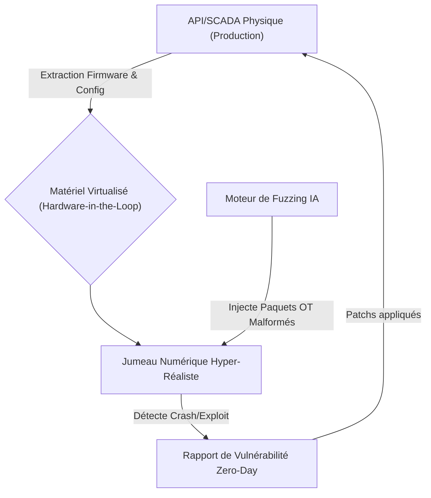
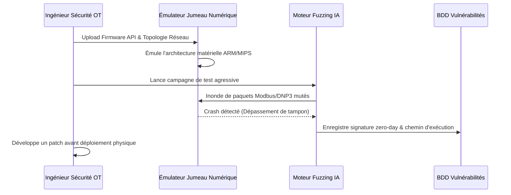

<!-- markdownlint-disable MD009 MD010 MD013 MD022 MD028 MD032 MD033 MD034 MD036 MD037 MD039 MD041 MD058 MD060 -->

[ 🇬🇧 English Version ](./README.md)

# SCADA Fuzzing Twin

> **Résumé exécutif :** Une plateforme de jumeau numérique hyper-réaliste qui émule de manière sécurisée les systèmes de contrôle industriel (SCADA/PLC) pour exécuter un fuzzing de vulnérabilités zero-day agressif piloté par l'IA sans risquer d'endommager l'infrastructure physique.

---

## 1. Aperçu visuel & Effet Wahou

## 2. La thèse contrariante (Peter Thiel Style)

**La croyance populaire :** La cybersécurité des infrastructures critiques repose sur la surveillance passive des réseaux et l'installation de meilleurs pare-feux autour des systèmes industriels obsolètes.
**La vérité cachée :** La surveillance passive ne détecte que les menaces connues ; il est impossible de trouver des vulnérabilités zero-day dans une centrale nucléaire ou un réseau d'eau car on ne peut pas faire de tests d'intrusion actifs (pentest ou "fuzzing") sur des automates en production sans les faire exploser. La seule façon d'atteindre une véritable résilience proactive est la sécurité offensive agressive exécutée sur des jumeaux matériels virtualisés parfaits.

## 3. Le problème & La cible

**Modèle économique :** B2B
**Cible précise :** Opérateurs d'infrastructures critiques (OIV : énergie, eau, industrie lourde), agences nationales de cybersécurité, et fournisseurs d'automatisation industrielle.
**La douleur urgente :** Exécuter des tests d'intrusion agressifs ou du fuzzing de protocole sur des technologies opérationnelles (OT) en direct, comme les API/RTU, provoque des interruptions de service, la destruction du matériel ou des accidents physiques catastrophiques. Par conséquent, les vulnérabilités zero-day restent totalement indétectées jusqu'à ce que des pirates étatiques les exploitent (ex: Stuxnet).

## 4. Architecture technique & Plomberie

## 5. Modèle économique & Viabilité financière

| Métrique                    | Valeur                                                            |
| --------------------------- | ----------------------------------------------------------------- |
| Structure de prix           | Licence Entreprise annuelle à forte valeur + Conseil/Installation |
| Objectif 12 mois            | 3 Opérateurs d'Infrastructures Critiques (à 35 000€/an)           |
| Calcul du CA (Target 100k€) | 3 \* 35 000€ = 105 000€ de revenus annuels récurrents             |
| Marge brute estimée         | 80%                                                               |

## 6. Moteur de distribution & Fossé défensif (Moat)

**Stratégie d'acquisition :** Ventes directes d'entreprise à haut niveau ciblant les Responsables de la Sécurité des Systèmes d'Information (RSSI/CISO) des entreprises nationales de services publics.
**Moat (Barrière à l'entrée) :** Les scanners de vulnérabilités IT standards (Nessus, Qualys) se contentent de vérifier les versions d'OS ; ils ne comprennent pas les protocoles OT propriétaires ni n'émulent la logique matérielle. Extraire avec succès et émuler parfaitement des firmwares SoC/ASIC propriétaires et obsolètes dans un environnement virtuel requiert une immense expertise en rétro-ingénierie que les startups de cybersécurité génériques n'ont pas.

## 7. Grille d'évaluation détaillée

| Critère                           | Score VC (/100) | Score Terrain (/100) |
| --------------------------------- | --------------- | -------------------- |
| Thèse & Monopole / Urgence        | -- / 25         | -- / 25              |
| Moat / Résistance aux LLM natifs  | -- / 25         | -- / 25              |
| Scalabilité / Friction d'adoption | -- / 25         | -- / 25              |
| Unit Economics / ROI direct       | -- / 25         | -- / 25              |
| **TOTAL**                         | **-- / 100**    | **-- / 100**         |

> **Verdict VC :** En attente d'évaluation.
> **Verdict Terrain :** En attente d'évaluation.
