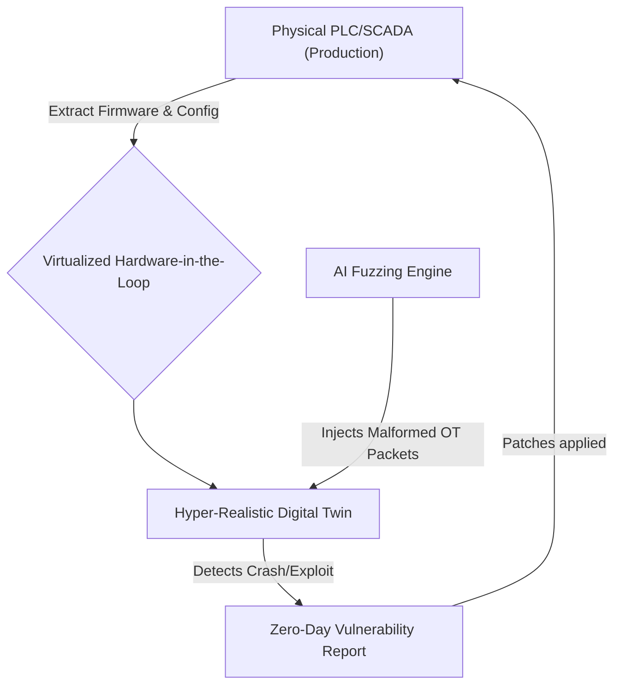
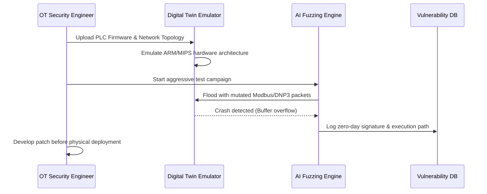

<!-- markdownlint-disable MD009 MD010 MD013 MD022 MD028 MD032 MD033 MD034 MD036 MD037 MD039 MD041 MD058 MD060 -->

[ 🇫🇷 Version Française ](./README.fr.md)

# SCADA Fuzzing Twin

> **Executive Summary:** A hyper-realistic digital twin platform that securely emulates industrial control systems (SCADA/PLC) to run aggressive, AI-driven zero-day vulnerability fuzzing without risking physical infrastructure damage.

---

## 1. Visual Overview & Wow Effect

## 2. Contrarian Thesis (Peter Thiel Style)

**Popular Belief:** Critical infrastructure cybersecurity relies on passive network monitoring and installing better firewalls around legacy industrial systems.
**Hidden Truth:** Passive monitoring only detects known threats; you cannot find zero-day vulnerabilities in a nuclear plant or water grid because you cannot actively penetration-test or "fuzz" production PLCs without blowing them up. The only way to achieve true proactive resilience is by aggressive offensive security executed on perfect virtualized hardware twins.

## 3. Problem & Target Market

**Business Model:** B2B
**Target Audience:** Critical infrastructure operators (energy, water, heavy industry), national cybersecurity agencies, and industrial automation vendors.
**Urgent Pain Point:** Running aggressive penetration tests or protocol fuzzing on live Operational Technology (OT) like PLCs/RTUs causes service interruptions, hardware destruction, or catastrophic physical accidents. Consequently, zero-day vulnerabilities remain completely undetected until state-sponsored hackers exploit them (e.g., Stuxnet).

## 4. Technical Architecture & Infrastructure

## 5. Business Model & Financial Viability

| Metric                 | Value                                                             |
| ---------------------- | ----------------------------------------------------------------- |
| Pricing Structure      | High-value annual Enterprise License + Setup/Emulation consulting |
| 12-Month Target        | 3 Critical Infrastructure Operators (at 35,000€/year)             |
| Revenue Formula        | 3 \* 35,000€ = 105,000€ ARR                                       |
| Estimated Gross Margin | 80%                                                               |

## 6. Distribution Engine & Moat

**Acquisition Strategy:** Direct high-level enterprise sales targeting Chief Information Security Officers (CISOs) at national utility companies.
**Moat (Defensibility):** Standard IT vulnerability scanners (Nessus, Qualys) only check OS versions; they do not understand proprietary OT protocols or emulate hardware logic. Successfully extracting and perfectly emulating legacy, proprietary SoC/ASIC firmware in a virtual environment requires immense reverse-engineering expertise that generic cybersecurity startups lack.

## 7. Detailed Evaluation Grid

| Criterion                   | VC Score (/100) | Market Score (/100) |
| --------------------------- | --------------- | ------------------- |
| Thesis & Monopoly / Urgency | 22 / 25         | -- / 25             |
| Moat / LLM Immunity         | 23 / 25         | -- / 25             |
| Scalability / UX Friction   | 20 / 25         | -- / 25             |
| Unit Economics / ROI        | 24 / 25         | -- / 25             |
| **TOTAL**                   | **89 / 100**    | **-- / 100**        |

> **VC Verdict:** SCADA Fuzzing Twin secures the highly vulnerable and massively expanding physical infrastructure sector. Generating purely software-based replicas of legacy controllers (PLCs) avoids disrupting vital plant operations, ensuring zero-friction adoption. The deep moat lies in proprietary OT protocol libraries, making generic cybersecurity or LLM platforms entirely useless.
> **Market Verdict:** Pending evaluation.
