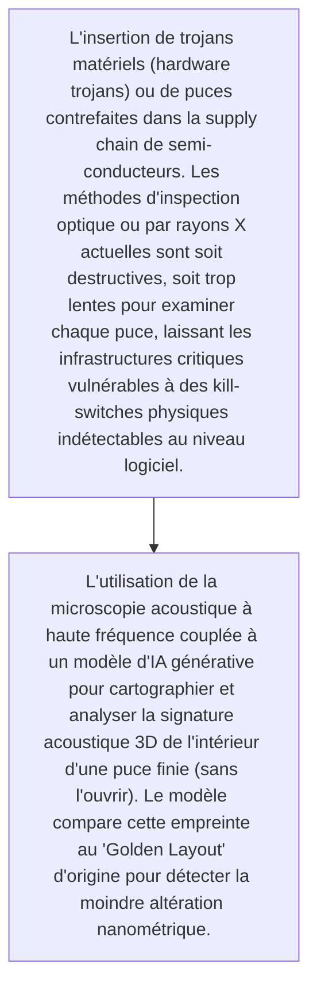
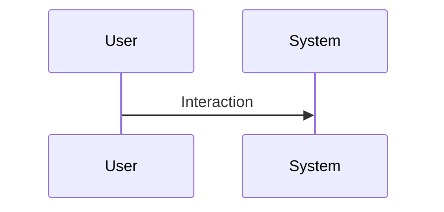

<!-- markdownlint-disable MD009 MD010 MD013 MD022 MD028 MD032 MD033 MD034 MD036 MD037 MD039 MD041 MD060 -->

[ 🇬🇧 English Version ](./README.md)

# Semiconductor Acoustic Microscopy

> **Résumé exécutif :** L'utilisation de la microscopie acoustique à haute fréquence couplée à un modèle d'IA générative pour cartographier et analyser la signature acoustique 3D de l'intérieur d'une puce finie (sans l'ouvrir). Le modèle compare cette empreinte au "Golden Layout" d'origine pour détecter la moindre altération nanométrique.

---

## 1. Aperçu visuel & Effet Wahou

## 2. La thèse contrariante (Peter Thiel Style)

- **La croyance populaire :** Un logiciel antivirus, un pare-feu ou un EDR ne peut pas détecter une porte dérobée gravée dans le silicium lui-même. La solution nécessite une combinaison profonde de matériel de détection physique spécialisé (capteurs ultrasoniques) et de modèles d'IA capables de traiter des ondes complexes.
- **La vérité cachée :** L'utilisation de la microscopie acoustique à haute fréquence couplée à un modèle d'IA générative pour cartographier et analyser la signature acoustique 3D de l'intérieur d'une puce finie (sans l'ouvrir). Le modèle compare cette empreinte au "Golden Layout" d'origine pour détecter la moindre altération nanométrique.

## 3. Le problème & La cible

- **Modèle économique :** B2B
- **Cible précise :** Fonderies de puces (TSMC, Intel), concepteurs fabless (Nvidia, AMD), fournisseurs de défense, et data centers critiques.
- **La douleur urgente :** L'insertion de trojans matériels (hardware trojans) ou de puces contrefaites dans la supply chain de semi-conducteurs. Les méthodes d'inspection optique ou par rayons X actuelles sont soit destructives, soit trop lentes pour examiner chaque puce, laissant les infrastructures critiques vulnérables à des kill-switches physiques indétectables au niveau logiciel.

## 4. Architecture technique & Plomberie

## 5. Modèle économique & Viabilité financière

| Métrique                    | Valeur                                                          |
| --------------------------- | --------------------------------------------------------------- |
| Structure de prix           | [Prix / Modèle d'abonnement / Commission]                       |
| Objectif 12 mois            | [Nombre exact de clients/utilisateurs/transactions nécessaires] |
| Calcul du CA (Target 100k€) | [Formule mathématique exacte]                                   |
| Marge brute estimée         | [Marge en %]                                                    |

## 6. Moteur de distribution & Fossé défensif (Moat)

- **Stratégie d'acquisition :** [Viralité B2C, réseau C2C, acquisition B2B directe, adhésion dev M2M]
- **Moat (Barrière à l'entrée) :** Difficulté de miniaturiser ou de rendre la vitesse de scan viable pour les lignes de production de masse, coût élevé de l'équipement matériel, difficulté d'obtenir les plans de conception ("Golden Layouts") propriétaires des puces auprès des fabricants.

## 7. Grille d'évaluation détaillée

| Critère                           | Score VC (/100) | Score Terrain (/100) |
| --------------------------------- | --------------- | -------------------- |
| Thèse & Monopole / Urgence        | -- / 25         | -- / 25              |
| Moat / Résistance aux LLM natifs  | -- / 25         | -- / 25              |
| Scalabilité / Friction d'adoption | -- / 25         | -- / 25              |
| Unit Economics / ROI direct       | -- / 25         | -- / 25              |
| TOTAL                             | -- / 100        | -- / 100             |

> **Verdict VC :** En attente d'évaluation.
> **Verdict Terrain :** En attente d'évaluation.
