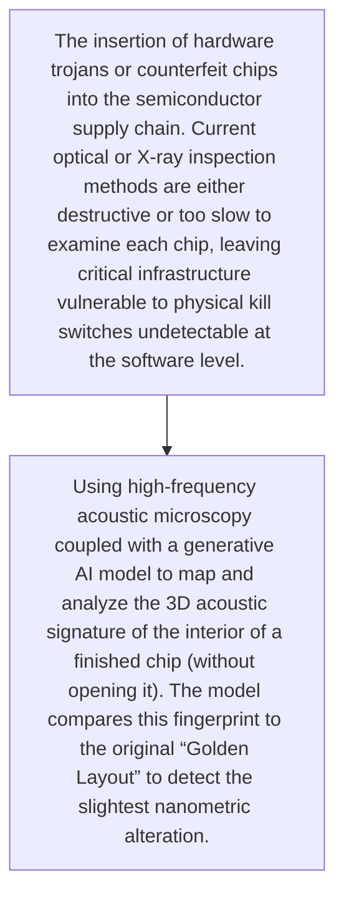
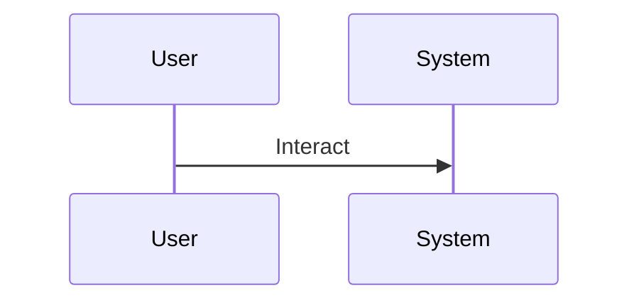

<!-- markdownlint-disable MD009 MD010 MD013 MD022 MD028 MD032 MD033 MD034 MD036 MD037 MD039 MD041 MD060 -->

[ 🇫🇷 Version Française ](./README.fr.md)

# Semiconductor Acoustic Microscopy

> **Executive Summary:** Using high-frequency acoustic microscopy coupled with a generative AI model to map and analyze the 3D acoustic signature of the interior of a finished chip (without opening it). The model compares this fingerprint to the original “Golden Layout” to detect the slightest nanometric alteration.

---

## 1. Visual Overview & Wow Effect

## 2. Contrarian Thesis (Peter Thiel Style)

- **Popular Belief:** Antivirus software, firewall, or EDR cannot detect a backdoor etched into the silicon itself. The solution requires a deep combination of specialized physical sensing hardware (ultrasonic sensors) and AI models capable of processing complex waves.
- **Hidden Truth:** Using high-frequency acoustic microscopy coupled with a generative AI model to map and analyze the 3D acoustic signature of the interior of a finished chip (without opening it). The model compares this fingerprint to the original “Golden Layout” to detect the slightest nanometric alteration.

## 3. Problem & Target Market

- **Business Model:** B2B
- **Target Audience:** Chip foundries (TSMC, Intel), fabless designers (Nvidia, AMD), defense suppliers, and critical data centers.
- **Urgent Pain Point:** The insertion of hardware trojans or counterfeit chips into the semiconductor supply chain. Current optical or X-ray inspection methods are either destructive or too slow to examine each chip, leaving critical infrastructure vulnerable to physical kill switches undetectable at the software level.

## 4. Technical Architecture & Infrastructure

## 5. Business Model & Financial Viability

| Metric                 | Value                                     |
| ---------------------- | ----------------------------------------- |
| Pricing Structure      | [Price / Subscription Model / Commission] |
| 12-Month Target        | [Exact volume required for 100k ARR]      |
| Revenue Formula        | [Mathematical calculation]                |
| Estimated Gross Margin | [Margin %]                                |

## 6. Distribution Engine & Moat

- **Acquisition Strategy:** [Virality, network effect, direct sales, developer adoption]
- **Moat (Defensibility):** Difficulty miniaturizing or making scan speed viable for mass production lines, high cost of hardware equipment, difficulty obtaining proprietary chip design plans (“Golden Layouts”) from manufacturers.

## 7. Detailed Evaluation Grid

| Criterion                   | VC Score (/100) | Market Score (/100) |
| --------------------------- | --------------- | ------------------- |
| Thesis & Monopoly / Urgency | 25 / 25         | -- / 25             |
| Moat / LLM Immunity         | 25 / 25         | -- / 25             |
| Scalability / UX Friction   | 23 / 25         | -- / 25             |
| Unit Economics / ROI        | 23 / 25         | -- / 25             |
| TOTAL                       | 96 / 100        | -- / 100            |

> **VC Verdict:** Validating chip integrity without delayering is a critical bottleneck in the semiconductor supply chain. The acoustic AI model creates an unbreachable proprietary moat. It establishes a definitive standard for global hardware security.
> **Market Verdict:** Pending evaluation.
