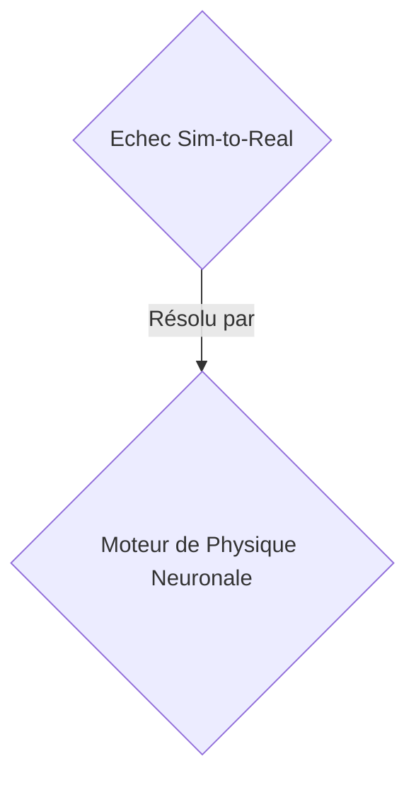
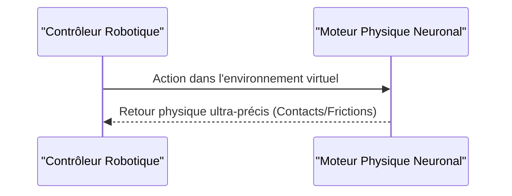

<!-- markdownlint-disable MD009 MD010 MD013 MD022 MD028 MD032 MD033 MD034 MD036 MD037 MD039 MD041 MD058 MD060 -->

[ 🇬🇧 English Version ](./README.md)

# Neural Physics Engine

> **Résumé exécutif :** Un moteur physique neuronal B2B pour la robotique permettant de réduire le "sim-to-real gap" via des GNNs et un rendu différentiable.

---

## 1. Aperçu visuel & Effet Wahou

## 2. La thèse contrariante (Peter Thiel Style)

- **La croyance populaire :** Les moteurs de jeux vidéo ou LLMs peuvent simuler le monde physique pour la robotique.
- **La vérité cachée :** Les moteurs de jeu existants (Unreal, Unity) privilégient l'apparence visuelle sur la précision physique rigoureuse. Les LLMs n'ont aucune notion de la physique spatiale, de la gravité, ou de la dynamique des corps rigides.

## 3. Le problème & La cible

- **Modèle économique :** B2B
- **Cible précise :** Fabricants de robots humanoïdes et constructeurs automobiles autonomes (Head of Robotics, VP Autonomy).
- **La douleur urgente :** L'entraînement de politiques de contrôle robotique dans le monde réel est trop lent et coûteux. Le transfert des simulations actuelles vers la réalité (sim-to-real gap) échoue à cause de la modélisation inexacte de la physique de contact (friction, matériaux déformables).

## 4. Architecture technique & Plomberie

Un moteur de "Neural Physics" qui remplace les solveurs physiques classiques par des réseaux de neurones graphiques (GNN) capables d'apprendre et de simuler la physique de contact complexe, les fluides et les objets mous en temps réel avec un rendu différentiable.

## 5. Modèle économique & Viabilité financière

| Métrique                    | Valeur                 |
| --------------------------- | ---------------------- |
| Structure de prix           | Licence B2B Enterprise |
| Objectif 12 mois            | 100 clients entreprise |
| Calcul du CA (Target 100k€) | 100 \* 1000€ = 100k€   |
| Marge brute estimée         | 85%                    |

## 6. Moteur de distribution & Fossé défensif (Moat)

- **Stratégie d'acquisition :** Ventes directes aux constructeurs de robots et véhicules autonomes.
- **Moat (Barrière à l'entrée) :** Les moteurs de jeu existants (Unreal, Unity) privilégient l'apparence visuelle sur la précision physique rigoureuse. Les LLMs n'ont aucune notion de la physique spatiale, de la gravité, ou de la dynamique des corps rigides. Barrière technologique extrêmement élevée.

## 7. Grille d'évaluation détaillée

| Critère                           | Score VC (/100) | Score Terrain (/100) |
| --------------------------------- | --------------- | -------------------- |
| Thèse & Monopole / Urgence        | -- / 25         | -- / 25              |
| Moat / Résistance aux LLM natifs  | -- / 25         | -- / 25              |
| Scalabilité / Friction d'adoption | -- / 25         | -- / 25              |
| Unit Economics / ROI direct       | -- / 25         | -- / 25              |
| TOTAL                             | -- / 100        | -- / 100             |

> **Verdict VC :** En attente d'évaluation.
> **Verdict Terrain :** En attente d'évaluation.
