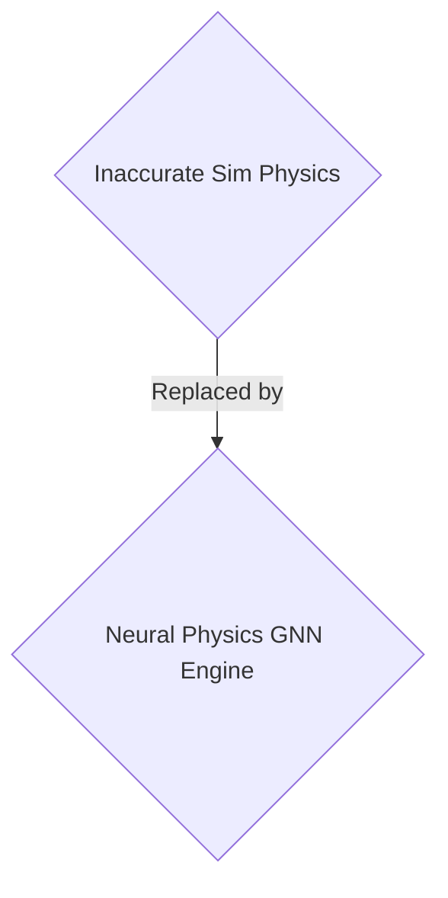
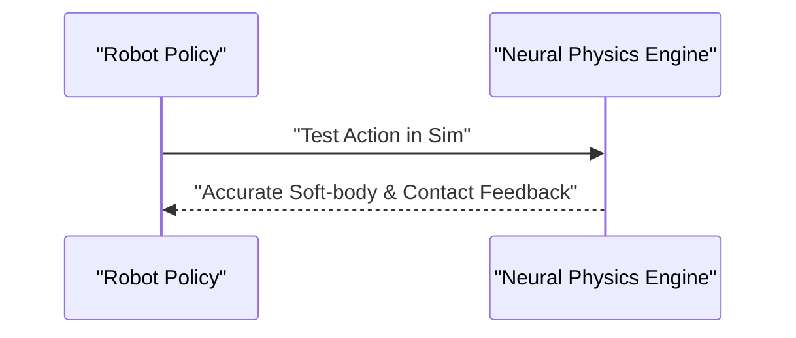

<!-- markdownlint-disable MD009 MD010 MD013 MD022 MD028 MD032 MD033 MD034 MD036 MD037 MD039 MD041 MD058 MD060 -->

[ 🇫🇷 Version Française ](./README.fr.md)

# Neural Physics Engine

> **Executive Summary:** A B2B neural physics engine for robotics and autonomous vehicle manufacturers to close the sim-to-real gap using differentiable rendering and Graph Neural Networks.

---

## 1. Visual Overview & Wow Effect

## 2. Contrarian Thesis (Peter Thiel Style)

- **Popular Belief:** Standard game engines and LLMs can simulate reality for robotics.
- **Hidden Truth:** Existing game engines (Unreal, Unity) prioritize visual appearance over rigorous physical accuracy. LLMs have no concept of spatial physics, gravity, or rigid body dynamics.

## 3. Problem & Target Market

- **Business Model:** B2B
- **Target Audience:** Humanoid robot manufacturers and autonomous vehicle manufacturers (Head of Robotics, VP Autonomy).
- **Urgent Pain Point:** Training robotic control policies in the real world is too slow and expensive. Transferring current simulations to reality (the sim-to-real gap) fails due to inaccurate modeling of contact physics (friction, deformable materials).

## 4. Technical Architecture & Infrastructure

A "Neural Physics" engine that replaces classic physical solvers with Graph Neural Networks (GNNs) capable of learning and simulating complex contact physics, fluids, and soft objects in real time with differentiable rendering.

## 5. Business Model & Financial Viability

| Metric                 | Value                  |
| ---------------------- | ---------------------- |
| Pricing Structure      | B2B Enterprise License |
| 12-Month Target        | 100 enterprise clients |
| Revenue Formula        | 100 \* 1000€ = 100k€   |
| Estimated Gross Margin | 85%                    |

## 6. Distribution Engine & Moat

- **Acquisition Strategy:** Direct sales to robotics and AV manufacturers.
- **Moat (Defensibility):** Existing game engines (Unreal, Unity) prioritize visual appearance over rigorous physical accuracy. LLMs have no concept of spatial physics. Extreme technological barrier and dependence on heavy hardware infrastructure (NVIDIA Omniverse).

## 7. Detailed Evaluation Grid

| Criterion                   | VC Score (/100) | Market Score (/100) |
| --------------------------- | --------------- | ------------------- |
| Thesis & Monopoly / Urgency | -- / 25         | -- / 25             |
| Moat / LLM Immunity         | -- / 25         | -- / 25             |
| Scalability / UX Friction   | -- / 25         | -- / 25             |
| Unit Economics / ROI        | -- / 25         | -- / 25             |
| TOTAL                       | -- / 100        | -- / 100            |

> **VC Verdict:** Pending evaluation.
> **Market Verdict:** Pending evaluation.
