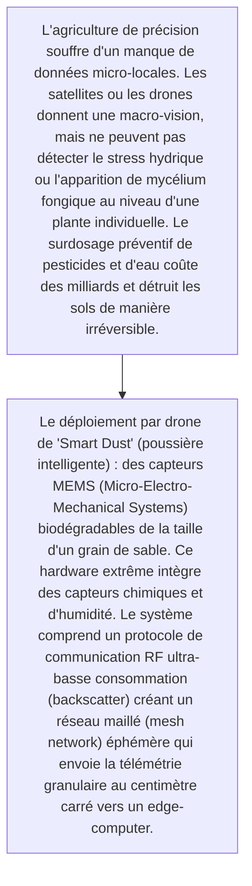
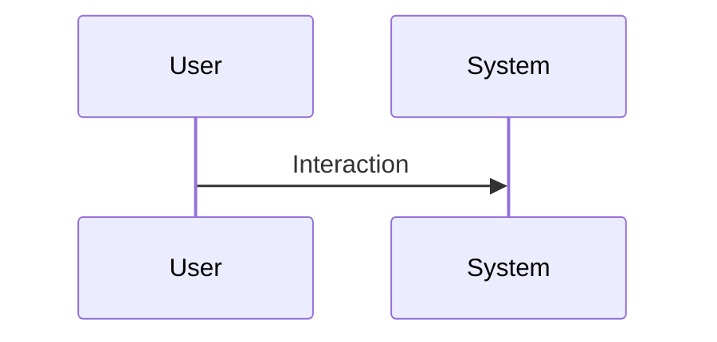

<!-- markdownlint-disable MD009 MD010 MD013 MD022 MD028 MD032 MD033 MD034 MD036 MD037 MD039 MD041 MD060 -->

[ 🇬🇧 English Version ](./README.md)

# Smart Dust Agricultural Mesh

> **Résumé exécutif :** Le déploiement par drone de "Smart Dust" (poussière intelligente) : des capteurs MEMS (Micro-Electro-Mechanical Systems) biodégradables de la taille d'un grain de sable. Ce hardware extrême intègre des capteurs chimiques et d'humidité. Le système comprend un protocole de communication RF ultra-basse consommation (backscatter) créant un réseau maillé (mesh network) éphémère qui envoie la télémétrie granulaire au centimètre carré vers un edge-computer.

---

## 1. Aperçu visuel & Effet Wahou

## 2. La thèse contrariante (Peter Thiel Style)

- **La croyance populaire :** L'innovation est purement matérielle (développement de SoC biodégradables) et au niveau de la couche physique des réseaux sans fil. Les logiciels d'agriculture prédictive basés sur le cloud ne peuvent pas opérer sans ces données intimes du terrain, qui n'ont jamais été captées à cette échelle.
- **La vérité cachée :** Le déploiement par drone de "Smart Dust" (poussière intelligente) : des capteurs MEMS (Micro-Electro-Mechanical Systems) biodégradables de la taille d'un grain de sable. Ce hardware extrême intègre des capteurs chimiques et d'humidité. Le système comprend un protocole de communication RF ultra-basse consommation (backscatter) créant un réseau maillé (mesh network) éphémère qui envoie la télémétrie granulaire au centimètre carré vers un edge-computer.

## 3. Le problème & La cible

- **Modèle économique :** B2B
- **Cible précise :** Grandes exploitations agricoles commerciales (agro-industrie), coopératives, producteurs de cultures à très haute valeur ajoutée (viticulture, serres industrielles).
- **La douleur urgente :** L'agriculture de précision souffre d'un manque de données micro-locales. Les satellites ou les drones donnent une macro-vision, mais ne peuvent pas détecter le stress hydrique ou l'apparition de mycélium fongique au niveau d'une plante individuelle. Le surdosage préventif de pesticides et d'eau coûte des milliards et détruit les sols de manière irréversible.

## 4. Architecture technique & Plomberie

## 5. Modèle économique & Viabilité financière

| Métrique                    | Valeur                                                          |
| --------------------------- | --------------------------------------------------------------- |
| Structure de prix           | [Prix / Modèle d'abonnement / Commission]                       |
| Objectif 12 mois            | [Nombre exact de clients/utilisateurs/transactions nécessaires] |
| Calcul du CA (Target 100k€) | [Formule mathématique exacte]                                   |
| Marge brute estimée         | [Marge en %]                                                    |

## 6. Moteur de distribution & Fossé défensif (Moat)

- **Stratégie d'acquisition :** [Viralité B2C, réseau C2C, acquisition B2B directe, adhésion dev M2M]
- **Moat (Barrière à l'entrée) :** La fabrication de semi-conducteurs biodégradables de cette taille est à la limite de la recherche fondamentale (TRL bas), risque réglementaire sur l'éparpillement de micro-électronique dans les cultures alimentaires, durée de vie des batteries/récupération d'énergie, fiabilité des transmissions RF à travers la canopée des cultures.

## 7. Grille d'évaluation détaillée

| Critère                           | Score VC (/100) | Score Terrain (/100) |
| --------------------------------- | --------------- | -------------------- |
| Thèse & Monopole / Urgence        | 23 / 25         | -- / 25              |
| Moat / Résistance aux LLM natifs  | 22 / 25         | -- / 25              |
| Scalabilité / Friction d'adoption | 25 / 25         | -- / 25              |
| Unit Economics / ROI direct       | 22 / 25         | -- / 25              |
| TOTAL                             | 92 / 100        | -- / 100             |

> **Verdict VC :** Le jeu ultime de l'edge computing dans l'agritech. Le matériel éphémère et le protocole backscatter créent un moat technique unique. Un TAM immense et des coûts de changement élevés une fois que les agriculteurs intègrent les données dans leurs modèles de rendement.
> **Verdict Terrain :** En attente d'évaluation.
