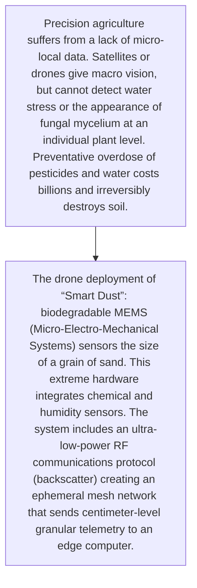
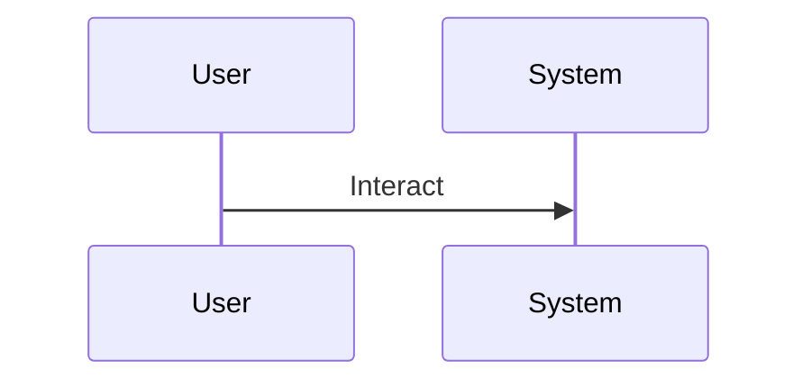

<!-- markdownlint-disable MD009 MD010 MD013 MD022 MD028 MD032 MD033 MD034 MD036 MD037 MD039 MD041 MD060 -->

[ 🇫🇷 Version Française ](./README.fr.md)

# Smart Dust Agricultural Mesh

> **Executive Summary:** The drone deployment of “Smart Dust”: biodegradable MEMS (Micro-Electro-Mechanical Systems) sensors the size of a grain of sand. This extreme hardware integrates chemical and humidity sensors. The system includes an ultra-low-power RF communications protocol (backscatter) creating an ephemeral mesh network that sends centimeter-level granular telemetry to an edge computer.

---

## 1. Visual Overview & Wow Effect

## 2. Contrarian Thesis (Peter Thiel Style)

- **Popular Belief:** The innovation is purely material (development of biodegradable SoCs) and at the level of the physical layer of wireless networks. Cloud-based predictive agriculture software cannot operate without this intimate field data, which has never been captured at this scale.
- **Hidden Truth:** The drone deployment of “Smart Dust”: biodegradable MEMS (Micro-Electro-Mechanical Systems) sensors the size of a grain of sand. This extreme hardware integrates chemical and humidity sensors. The system includes an ultra-low-power RF communications protocol (backscatter) creating an ephemeral mesh network that sends centimeter-level granular telemetry to an edge computer.

## 3. Problem & Target Market

- **Business Model:** B2B
- **Target Audience:** Large commercial agricultural operations (agro-industry), cooperatives, producers of crops with very high added value (viticulture, industrial greenhouses).
- **Urgent Pain Point:** Precision agriculture suffers from a lack of micro-local data. Satellites or drones give macro vision, but cannot detect water stress or the appearance of fungal mycelium at an individual plant level. Preventative overdose of pesticides and water costs billions and irreversibly destroys soil.

## 4. Technical Architecture & Infrastructure

## 5. Business Model & Financial Viability

| Metric                 | Value                                     |
| ---------------------- | ----------------------------------------- |
| Pricing Structure      | [Price / Subscription Model / Commission] |
| 12-Month Target        | [Exact volume required for 100k ARR]      |
| Revenue Formula        | [Mathematical calculation]                |
| Estimated Gross Margin | [Margin %]                                |

## 6. Distribution Engine & Moat

- **Acquisition Strategy:** [Virality, network effect, direct sales, developer adoption]
- **Moat (Defensibility):** The manufacture of biodegradable semiconductors of this size is at the limit of fundamental research (low TRL), regulatory risk on the scattering of microelectronics in food crops, battery life/energy harvesting, reliability of RF transmissions through the crop canopy.

## 7. Detailed Evaluation Grid

| Criterion                   | VC Score (/100) | Market Score (/100) |
| --------------------------- | --------------- | ------------------- |
| Thesis & Monopoly / Urgency | -- / 25         | -- / 25             |
| Moat / LLM Immunity         | -- / 25         | -- / 25             |
| Scalability / UX Friction   | -- / 25         | -- / 25             |
| Unit Economics / ROI        | -- / 25         | -- / 25             |
| TOTAL                       | -- / 100        | -- / 100            |

> **VC Verdict:** Pending evaluation.
> **Market Verdict:** Pending evaluation.
