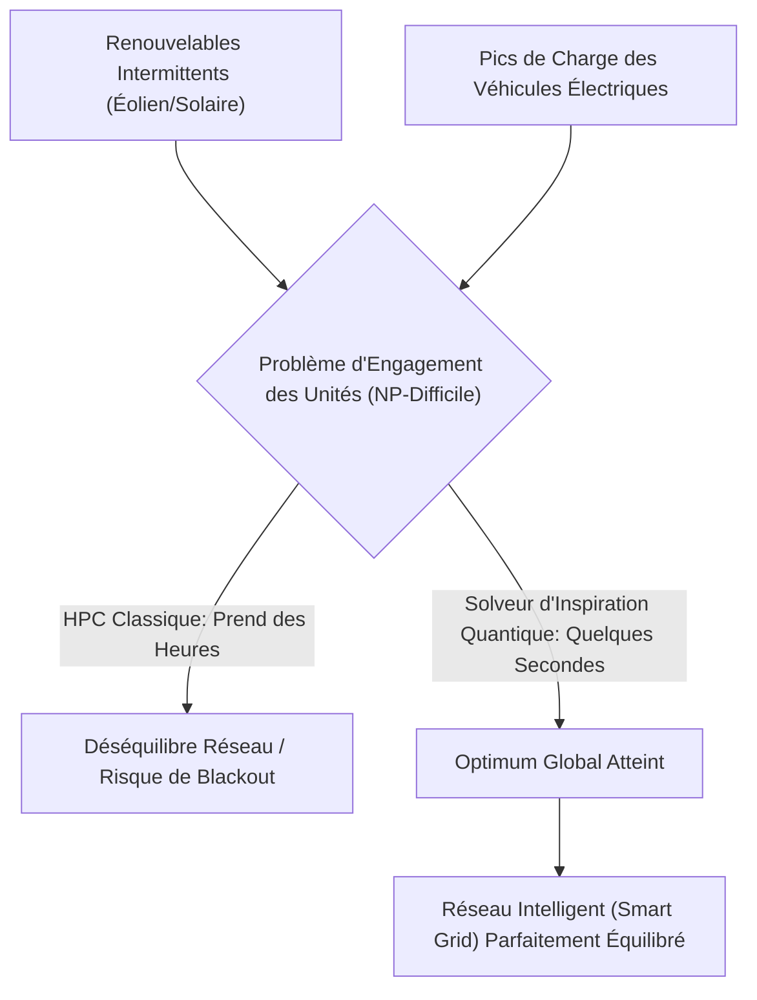
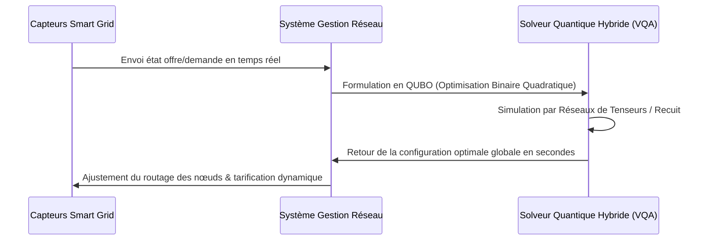

<!-- markdownlint-disable MD009 MD010 MD013 MD022 MD028 MD032 MD033 MD034 MD036 MD037 MD039 MD041 MD058 MD060 -->

[ 🇬🇧 English Version ](./README.md)

# Smart Grid Quantum Optimizer

> **Résumé exécutif :** Un solveur hybride inspiré du quantique utilisant des Algorithmes Quantiques Variationnels (VQA) pour optimiser dynamiquement la répartition du réseau électrique en quelques secondes, évitant les blackouts causés par l'intermittence des énergies renouvelables.

---

## 1. Aperçu visuel & Effet Wahou

## 2. La thèse contrariante (Peter Thiel Style)

**La croyance populaire :** Intégrer plus d'énergie renouvelable dans le réseau nécessite simplement de meilleures batteries et un logiciel de gestion classique légèrement mis à jour.
**La vérité cachée :** L'ajout exponentiel de nœuds d'énergie décentralisés transforme la répartition du réseau en un problème mathématique NP-difficile. Les supercalculateurs classiques ne peuvent physiquement pas le résoudre en temps réel, ce qui signifie que plus de renouvelables mènera directement à plus de blackouts catastrophiques, à moins de passer à l'optimisation combinatoire d'inspiration quantique.

## 3. Le problème & La cible

**Modèle économique :** B2B
**Cible précise :** Gestionnaires de réseau de transport (GRT, ex: RTE), grands producteurs d'énergie renouvelable et services publics.
**La douleur urgente :** L'intégration massive des énergies renouvelables intermittentes (éolien, solaire) et des véhicules électriques déstabilise les réseaux. L'optimisation en temps réel de la répartition énergétique est un problème NP-difficile (Unit Commitment Problem) que les supercalculateurs classiques mettent trop de temps à résoudre, entraînant des pertes financières massives par inefficacité et des risques de blackout systémique.

## 4. Architecture technique & Plomberie

## 5. Modèle économique & Viabilité financière

| Métrique                    | Valeur                                                                |
| --------------------------- | --------------------------------------------------------------------- |
| Structure de prix           | Abonnement API de grande valeur basé sur le nombre de nœuds du réseau |
| Objectif 12 mois            | 2 Pilotes Opérateurs de Réseau Régionaux (à 50 000€/pilote)           |
| Calcul du CA (Target 100k€) | 2 \* 50 000€ = 100 000€ de revenus annuels récurrents                 |
| Marge brute estimée         | 85% (Couche logicielle)                                               |

## 6. Moteur de distribution & Fossé défensif (Moat)

**Stratégie d'acquisition :** Ventes B2B directes et partenariats Proof-of-Concept avec les gestionnaires de réseaux de transport nationaux.
**Moat (Barrière à l'entrée) :** Les algorithmes heuristiques classiques (Programmation Linéaire en Nombres Entiers Mixtes) échouent à mesure que le réseau s'étend. Construire un solveur hybride utilisant des Réseaux de Tenseurs et des Algorithmes Quantiques Variationnels nécessite une expertise hautement spécialisée en informatique quantique et en mathématiques que les plateformes d'optimisation cloud génériques n'ont pas.

## 7. Grille d'évaluation détaillée

| Critère                           | Score VC (/100) | Score Terrain (/100) |
| --------------------------------- | --------------- | -------------------- |
| Thèse & Monopole / Urgence        | -- / 25         | -- / 25              |
| Moat / Résistance aux LLM natifs  | -- / 25         | -- / 25              |
| Scalabilité / Friction d'adoption | -- / 25         | -- / 25              |
| Unit Economics / ROI direct       | -- / 25         | -- / 25              |
| **TOTAL**                         | **-- / 100**    | **-- / 100**         |

> **Verdict VC :** En attente d'évaluation.
> **Verdict Terrain :** En attente d'évaluation.
