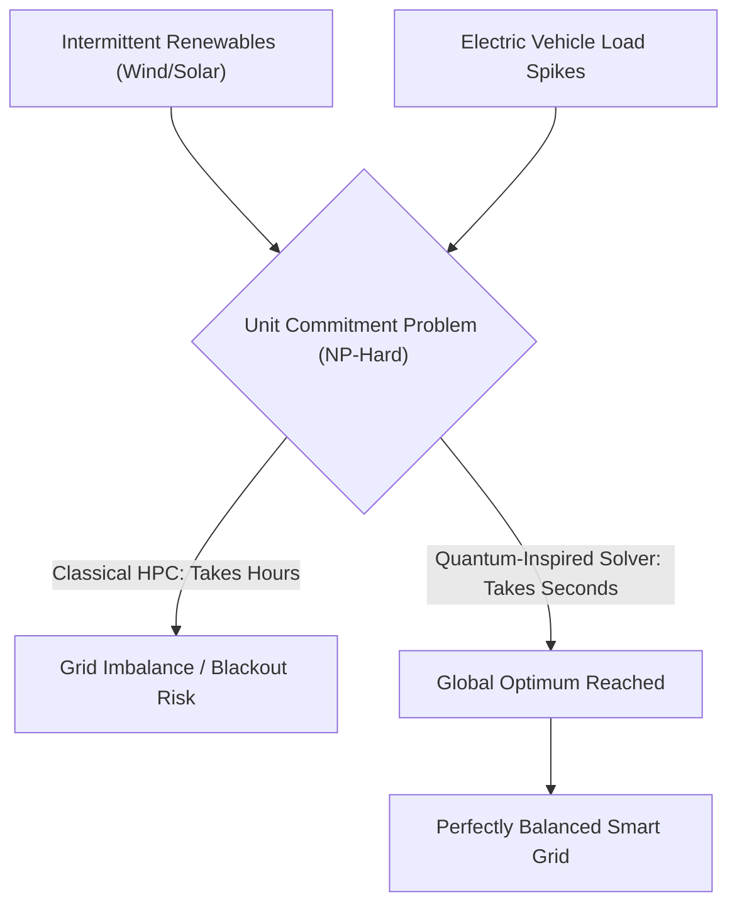
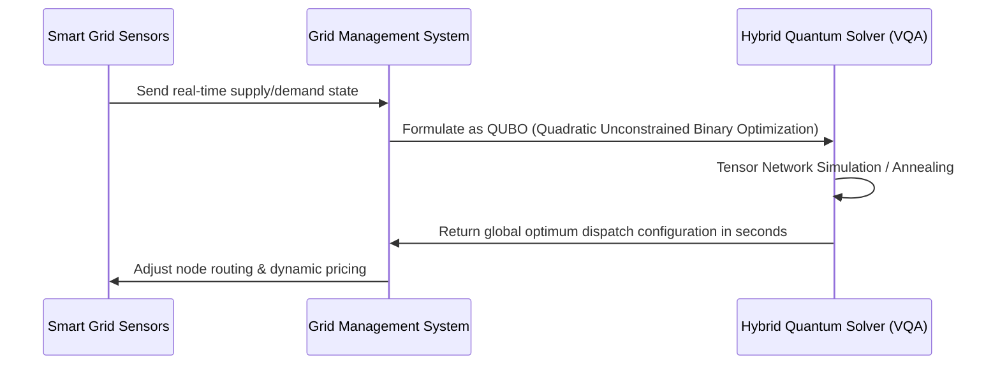

<!-- markdownlint-disable MD009 MD010 MD013 MD022 MD028 MD032 MD033 MD034 MD036 MD037 MD039 MD041 MD058 MD060 -->

[ 🇫🇷 Version Française ](./README.fr.md)

# Smart Grid Quantum Optimizer

> **Executive Summary:** A hybrid quantum-inspired solver using Variational Quantum Algorithms (VQA) to dynamically optimize power grid dispatching in seconds, preventing blackouts caused by renewable energy intermittency.

---

## 1. Visual Overview & Wow Effect

## 2. Contrarian Thesis (Peter Thiel Style)

**Popular Belief:** Integrating more renewable energy into the grid simply requires better batteries and slightly upgraded classical grid management software.
**Hidden Truth:** The exponential addition of decentralized energy nodes turns grid dispatching into an NP-hard mathematical problem. Classical supercomputers physically cannot solve this in real-time, meaning more renewables will directly lead to more catastrophic blackouts unless we transition to quantum-inspired combinatorial optimization.

## 3. Problem & Target Market

**Business Model:** B2B
**Target Audience:** Transmission System Operators (TSO, e.g., National Grid), major renewable energy producers, and utility companies.
**Urgent Pain Point:** The massive integration of intermittent renewables (wind, solar) and electric vehicles destabilizes power grids. Optimizing real-time energy dispatching is an NP-hard "Unit Commitment Problem" that classical supercomputers take too long to solve, leading to massive financial losses due to inefficiencies and systemic blackout risks.

## 4. Technical Architecture & Infrastructure

## 5. Business Model & Financial Viability

| Metric                 | Value                                                |
| ---------------------- | ---------------------------------------------------- |
| Pricing Structure      | High-value API Subscription based on grid node count |
| 12-Month Target        | 2 Regional Grid Operator Pilots (at 50,000€/pilot)   |
| Revenue Formula        | 2 \* 50,000€ = 100,000€ ARR                          |
| Estimated Gross Margin | 85% (Software layer)                                 |

## 6. Distribution Engine & Moat

**Acquisition Strategy:** Direct B2B sales and Proof-of-Concept partnerships with national transmission system operators.
**Moat (Defensibility):** Classical heuristic algorithms (Mixed-Integer Linear Programming) fail as the grid scales. Building a hybrid solver using Tensor Networks and Variational Quantum Algorithms requires highly specialized quantum computing and mathematics expertise that generic cloud optimization platforms lack.

## 7. Detailed Evaluation Grid

| Criterion                   | VC Score (/100) | Market Score (/100) |
| --------------------------- | --------------- | ------------------- |
| Thesis & Monopoly / Urgency | 23 / 25         | -- / 25             |
| Moat / LLM Immunity         | 25 / 25         | -- / 25             |
| Scalability / UX Friction   | 20 / 25         | -- / 25             |
| Unit Economics / ROI        | 22 / 25         | -- / 25             |
| **TOTAL**                   | **90 / 100**    | **-- / 100**        |

> **VC Verdict:** Smart Grid Quantum Optimizer tackles the NP-hard problem of real-time power grid routing with massive financial and ecological implications. The use of hybrid quantum annealing creates an insurmountable barrier to entry for classical AI optimization solvers. While the B2B utility sales cycle is notoriously slow, the lock-in and potential for global scaling are exceptional.
> **Market Verdict:** Pending evaluation.
