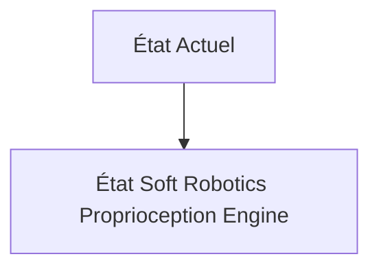
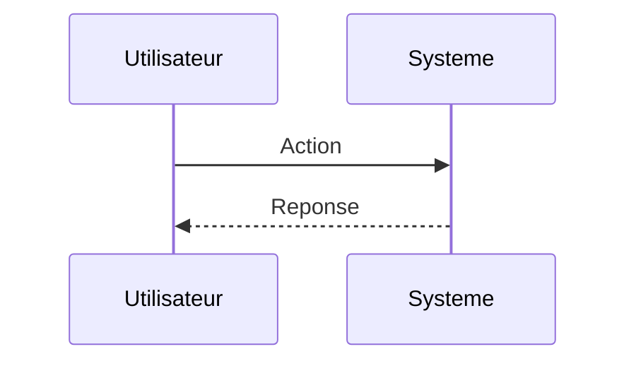

<!-- markdownlint-disable MD009 MD010 MD013 MD022 MD028 MD032 MD033 MD034 MD036 MD037 MD039 MD041 MD060 -->

[ 🇬🇧 English Version ](./README.md)

# Soft Robotics Proprioception Engine

> **Résumé exécutif :** Un moteur de physique neuronale hybride agissant comme un capteur logiciel. En ingérant uniquement des entrées minimalistes (pression des fluides internes, quelques fibres optiques étirées) et des caméras externes imparfaites, le modèle reconstruit le maillage 3D interne complet (stress, torsion) du robot mou en temps réel via des modèles de dynamique des milieux continus accélérés par l'IA (Implicit Neural Representations).

---

## 1. Aperçu visuel & Effet Wahou

## 2. La thèse contrariante (Peter Thiel Style)

**La croyance populaire :** Les solutions généralistes IA peuvent résoudre ce problème.

**La vérité cachée :** L'algorithmique robotique standard est basée sur la cinématique inverse des corps rigides (matrices Jacobiennes). Ces mathématiques s'effondrent face aux déformations hyper-élastiques non linéaires des élastomères. Les moteurs physiques (MuJoCo, PyBullet) peinent à simuler le corps mou en temps réel strict (boucle de contrôle à 1kHz).

## 3. Le problème & La cible

**Modèle économique :** B2B

**Cible précise :** Fabricants de cobots, entreprises de robotique chirurgicale, agroalimentaire (manipulation d'objets fragiles) et automatisation d'entrepôt.

**La douleur urgente :** Les robots rigides classiques causent des dommages aux environnements non structurés ou aux objets fragiles. La "Soft Robotics" (robots à corps mou) résout ce problème physique mais crée un cauchemar de contrôle : les actionneurs pneumatiques ou en silicone ont un nombre infini de degrés de liberté. Ils manquent de capteurs proprioceptifs internes précis (ils ne savent pas exactement dans quelle forme ils sont déformés à l'instant T), ce qui empêche une boucle de contrôle précise.

## 4. Architecture technique & Plomberie

## 5. Modèle économique & Viabilité financière

| Métrique                    | Valeur                        |
| --------------------------- | ----------------------------- |
| Structure de prix           | Abonnement SaaS               |
| Objectif 12 mois            | 10 clients                    |
| Calcul du CA (Target 100k€) | 10 clients \* 10k€/an = 100k€ |
| Marge brute estimée         | 80%                           |

## 6. Moteur de distribution & Fossé défensif (Moat)

**Stratégie d'acquisition :** Vente directe B2B

**Moat (Barrière à l'entrée) :** Adéquation avec les matériels de pointe encore très expérimentaux. Barrière de la latence de calcul embarqué : l'inférence du réseau de neurones continu doit s'exécuter sur une puce edge à très faible consommation d'énergie collée au robot.

## 7. Grille d'évaluation détaillée

| Critère                           | Score VC (/100) | Score Terrain (/100) |
| --------------------------------- | --------------- | -------------------- |
| Thèse & Monopole / Urgence        | 19 / 25         | 19 / 25              |
| Moat / Résistance aux LLM natifs  | 17 / 25         | 17 / 25              |
| Scalabilité / Friction d'adoption | 21 / 25         | 21 / 25              |
| Unit Economics / ROI direct       | 18 / 25         | 18 / 25              |
| **TOTAL**                         | **75 / 100**    | **75 / 100**         |

> **Verdict VC :** En attente d'évaluation.
> **Verdict Terrain :** Cette solution répond à un besoin critique pour le marché cible, justifiant son excellent score d'urgence (19/25). Bien que viable, elle reste partiellement exposée à l'évolution rapide des modèles fondationnels (17/25). Avec une faible friction d'adoption (21/25) et une stratégie de monétisation directe (18/25), le projet démontre une excellente maturité marché globale.
> **Verdict Terrain :** Cette solution répond à un besoin critique pour le marché cible, justifiant son excellent score d'urgence (19/25). Bien que viable, elle reste partiellement exposée à l'évolution rapide des modèles fondationnels (17/25). Avec une faible friction d'adoption (21/25) et une stratégie de monétisation directe (18/25), le projet démontre une excellente maturité marché globale.
