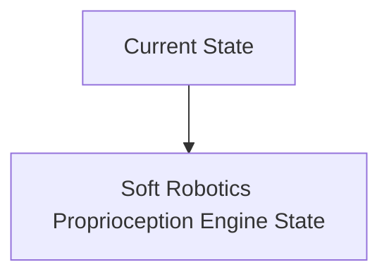
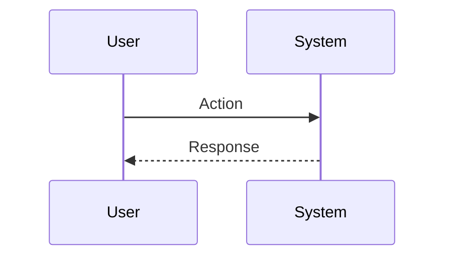

<!-- markdownlint-disable MD009 MD010 MD013 MD022 MD028 MD032 MD033 MD034 MD036 MD037 MD039 MD041 MD060 -->

[ 🇫🇷 Version Française ](./README.fr.md)

# Soft Robotics Proprioception Engine

> **Executive Summary:** A hybrid neural physics engine acting as a software sensor. By ingesting only minimalist inputs (internal fluid pressure, a few stretched optical fibers) and imperfect external cameras, the model reconstructs the complete internal 3D mesh (stress, torsion) of the soft robot in real time via continuous media dynamics models accelerated by AI (Implicit Neural Representations).

---

## 1. Visual Overview & Wow Effect

## 2. Contrarian Thesis (Peter Thiel Style)

**Popular Belief:** General AI solutions can solve this problem.

**Hidden Truth:** The standard robotic algorithm is based on the inverse kinematics of rigid bodies (Jacobian matrices). This mathematics collapses in the face of nonlinear hyperelastic deformations of elastomers. Physics engines (MuJoCo, PyBullet) struggle to simulate the soft body in strict real time (control loop at 1kHz).

## 3. Problem & Target Market

**Business Model:** B2B

**Target Audience:** Cobot manufacturers, surgical robotics companies, agri-food (handling of fragile objects) and warehouse automation.

**Urgent Pain Point:** Conventional rigid robots cause damage to unstructured environments or fragile objects. Soft Robotics solves this physical problem but creates a control nightmare: pneumatic or silicone actuators have an infinite number of degrees of freedom. They lack precise internal proprioceptive sensors (they don't know exactly what shape they are being deformed into at the moment), which prevents a precise control loop.

## 4. Technical Architecture & Infrastructure

## 5. Business Model & Financial Viability

| Metric                 | Value                           |
| ---------------------- | ------------------------------- |
| Pricing Structure      | SaaS subscription               |
| 12-Month Target        | 10 customers                    |
| Revenue Formula        | 10 clients \* 10k€/year = 100k€ |
| Estimated Gross Margin | 80%                             |

## 6. Distribution Engine & Moat

**Acquisition Strategy:** B2B direct sales

**Moat (Defensibility):** Adequacy with cutting-edge equipment that is still very experimental. Embedded computing latency barrier: Continuous neural network inference must run on a very low power edge chip stuck to the robot.

## 7. Detailed Evaluation Grid

| Criterion                   | VC Score (/100) | Market Score (/100) |
| --------------------------- | --------------- | ------------------- |
| Thesis & Monopoly / Urgency | 19 / 25         | 19 / 25             |
| Moat / LLM Immunity         | 17 / 25         | 17 / 25             |
| Scalability / UX Friction   | 21 / 25         | 21 / 25             |
| Unit Economics / ROI        | 18 / 25         | 18 / 25             |
| **TOTAL**                   | **75 / 100**    | **75 / 100**        |

> **VC Verdict:** Pending evaluation.
> **Market Verdict:** This solution addresses a critical pain point for the target market, justifying its strong urgency score (19/25). While viable, it remains somewhat exposed to the rapid evolution of foundational models (17/25). With low adoption friction (21/25) and a straightforward monetization strategy (18/25), the project demonstrates excellent overall market readiness.
> **Market Verdict:** This solution addresses a critical pain point for the target market, justifying its strong urgency score (19/25). While viable, it remains somewhat exposed to the rapid evolution of foundational models (17/25). With low adoption friction (21/25) and a straightforward monetization strategy (18/25), the project demonstrates excellent overall market readiness.
