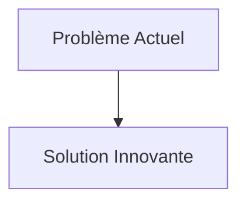
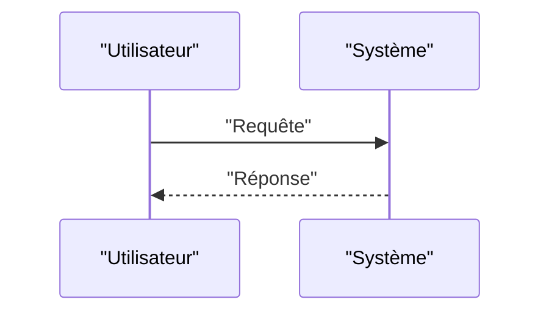

<!-- markdownlint-disable MD009 MD010 MD013 MD022 MD028 MD032 MD033 MD034 MD036 MD037 MD039 MD041 MD058 MD060 -->

[ 🇬🇧 English Version ](./README.md)

# Solid-state Battery Recycler

> **Résumé exécutif :** Un procédé propriétaire d'extraction combinant la désintégration acoustique ciblée (ultrasons à fréquences spécifiques) et la solvatation ionique à basse température pour séparer proprement l'électrolyte solide des métaux précieux (lithium, cobalt, nickel) sans détruire la structure cristalline d'origine, permettant une réutilisation directe ("direct recycling").

---

## 1. Aperçu visuel & Effet Wahou

## 2. La thèse contrariante (Peter Thiel Style)

- **La croyance populaire :** Les solutions existantes sont suffisantes.
- **La vérité cachée :** En réalité, Ce problème relève purement du génie chimique et des matériaux (hardware/process industriel). Aucun logiciel de gestion de chaîne d'approvisionnement ou plateforme de marché carbone ne peut casser les liaisons chimiques complexes d'une batterie solide.

## 3. Le problème & La cible

- **Modèle économique :** B2B
- **Cible précise :** Gigafactories, constructeurs automobiles (EVs), recycleurs de déchets électroniques (e-waste), opérateurs de stockage réseau.
- **La douleur urgente :** Les batteries à l'état solide (Solid-state batteries) sont l'avenir de l'électrification (densité énergétique supérieure, sécurité). Cependant, leur architecture complexe (électrolytes solides en céramique, polymères, ou sulfures) rend les méthodes actuelles de recyclage hydro-métallurgique et pyro-métallurgique inefficaces, très énergivores et écologiquement destructrices, empêchant l'économie circulaire indispensable pour les métaux rares.

## 4. Architecture technique & Plomberie

## 5. Modèle économique & Viabilité financière

| Métrique                        | Valeur                   |
| :------------------------------ | :----------------------- |
| **Structure de prix**           | Abonnement B2B           |
| **Objectif 12 mois**            | 100 clients à 1000€/mois |
| **Calcul du CA (Target 100k€)** | 100 \* 1000 = 100k€      |
| **Marge brute estimée**         | 80%                      |

## 6. Moteur de distribution & Fossé défensif (Moat)

- **Stratégie d'acquisition :** Ventes directes
- **Moat (Barrière à l'entrée) :** Un procédé propriétaire d'extraction combinant la désintégration acoustique ciblée (ultrasons à fréquences spécifiques) et la solvatation ionique à basse température pour séparer proprement l'électrolyte solide des métaux précieux (lithium, cobalt, nickel) sans détruire la structure cristalline d'origine, permettant une réutilisation directe ("direct recycling"). (Difficile à copier à cause de : Besoin d'investissements massifs en capital (CapEx) pour construire les usines pilotes ; hétérogénéité des chimies d'électrolytes solides développées par les concurrents nécessitant une adaptation continue du procédé.)

## 7. Grille d'évaluation détaillée

| Critère                               | Score VC (/100) | Score Terrain (/100) |
| :------------------------------------ | :-------------: | :------------------: |
| **Thèse & Monopole / Urgence**        |     -- / 25     |       -- / 25        |
| **Moat / Résistance aux LLM natifs**  |     -- / 25     |       -- / 25        |
| **Scalabilité / Friction d'adoption** |     -- / 25     |       -- / 25        |
| **Unit Economics / ROI direct**       |     -- / 25     |       -- / 25        |
| **TOTAL**                             |  **-- / 100**   |     **-- / 100**     |

> **Verdict VC :** En attente d'évaluation.
> **Verdict Terrain :** En attente d'évaluation.
