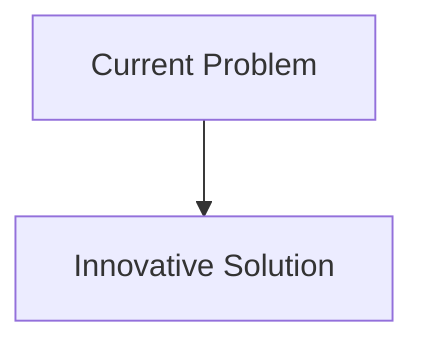
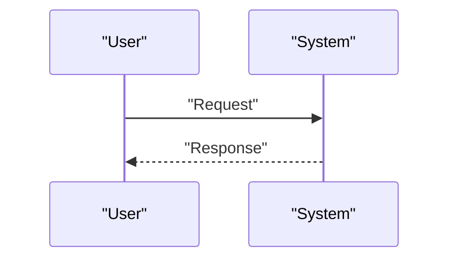

<!-- markdownlint-disable MD009 MD010 MD013 MD022 MD028 MD032 MD033 MD034 MD036 MD037 MD039 MD041 MD058 MD060 -->

[ 🇫🇷 Version Française ](./README.fr.md)

# Solid-state Battery Recycler

> **Executive Summary:** A proprietary extraction process combining targeted acoustic disintegration (ultrasound at specific frequencies) and low-temperature ionic solvation to cleanly separate the solid electrolyte from precious metals (lithium, cobalt, nickel) without destroying the original crystal structure, allowing direct reuse ("direct recycling").

---

## 1. Visual Overview & Wow Effect

## 2. Contrarian Thesis (Peter Thiel Style)

- **Popular Belief:** Existing solutions are sufficient.
- **Hidden Truth:** In reality, this problem is purely a matter of chemical engineering and materials (hardware/industrial process). No supply chain management software or carbon market platform can break the complex chemical bonds of a solid-state battery.

## 3. Problem & Target Market

- **Business Model:** B2B
- **Target Audience:** Gigafactories, automobile manufacturers (EVs), electronic waste recyclers (e-waste), network storage operators.
- **Urgent Pain Point:** Solid-state batteries are the future of electrification (higher energy density, safety). However, their complex architecture (solid electrolytes in ceramic, polymers, or sulfides) makes current hydro-metallurgical and pyro-metallurgical recycling methods inefficient, very energy-intensive and ecologically destructive, preventing the circular economy essential for rare metals.

## 4. Technical Architecture & Infrastructure

## 5. Business Model & Financial Viability

| Metric                     | Value                        |
| :------------------------- | :--------------------------- |
| **Pricing Structure**      | B2B Subscription             |
| **12-Month Target**        | 100 customers at 1000€/month |
| **Revenue Formula**        | 100 \* 1000 = 100k€          |
| **Estimated Gross Margin** | 80%                          |

## 6. Distribution Engine & Moat

- **Acquisition Strategy:** Direct Sales
- **Moat (Defensibility):** A proprietary extraction process combining targeted acoustic disintegration (ultrasound at specific frequencies) and low-temperature ionic solvation to cleanly separate the solid electrolyte from precious metals (lithium, cobalt, nickel) without destroying the original crystal structure, allowing direct reuse ("direct recycling").(Difficult to copy because of: Need for massive capital investment (CapEx) to build the pilot plants; heterogeneity of solid electrolyte chemistries developed by competitors requiring continuous adaptation of the process.)

## 7. Detailed Evaluation Grid

| Criterion                       | VC Score (/100) | Market Score (/100) |
| :------------------------------ | :-------------: | :-----------------: |
| **Thesis & Monopoly / Urgency** |     -- / 25     |       -- / 25       |
| **Moat / LLM Immunity**         |     -- / 25     |       -- / 25       |
| **Scalability / UX Friction**   |     -- / 25     |       -- / 25       |
| **Unit Economics / ROI**        |     -- / 25     |       -- / 25       |
| **TOTAL**                       |  **-- / 100**   |    **-- / 100**     |

> **VC Verdict:** Pending evaluation.
> **Market Verdict:** Pending evaluation.
