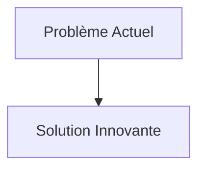
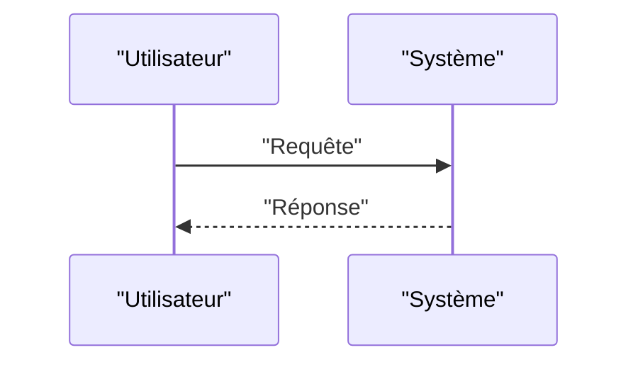

<!-- markdownlint-disable MD009 MD010 MD013 MD022 MD028 MD032 MD033 MD034 MD036 MD037 MD039 MD041 MD058 MD060 -->

[ 🇬🇧 English Version ](./README.md)

# Space Reactor Core Sim

> **Résumé exécutif :** Un moteur de simulation multiphysique spatio-temporelle (World Model des rayonnements et de la thermohydraulique en microgravité) couplé à des algorithmes de transport de neutrons de Monte Carlo accélérés par GPU pour certifier numériquement le comportement du réacteur, les boucles d'évacuation de la chaleur (caloducs) et la dégradation des matériaux en conditions spatiales.

---

## 1. Aperçu visuel & Effet Wahou

## 2. La thèse contrariante (Peter Thiel Style)

- **La croyance populaire :** Les solutions existantes sont suffisantes.
- **La vérité cachée :** En réalité, Les codes de simulation nucléaire civils terrestres (OpenMC, MCNP) supposent la gravité terrestre pour le transfert de chaleur (convection naturelle). Il faut recoder fondamentalement les lois physiques pour la microgravité et le vide spatial, avec une certification de niveau agence spatiale.

## 3. Le problème & La cible

- **Modèle économique :** B2G / B2B
- **Cible précise :** Agences spatiales (NASA, ESA, CNSA), startups du New Space visant l'exploitation minière lunaire ou la propulsion vers Mars, constructeurs de petits réacteurs modulaires (SMR).
- **La douleur urgente :** L'exploration spatiale lointaine et les bases lunaires/martiennes nécessitent une énergie dense et continue que le solaire ne peut fournir. Les micro-réacteurs nucléaires spatiaux sont la seule solution, mais on ne peut pas les tester facilement sur Terre de manière réaliste (à cause de la gravité, du vide et des radiations terrestres différentes), ce qui bloque l'obtention des licences de vol.

## 4. Architecture technique & Plomberie

## 5. Modèle économique & Viabilité financière

| Métrique                        | Valeur                   |
| :------------------------------ | :----------------------- |
| **Structure de prix**           | Abonnement B2B           |
| **Objectif 12 mois**            | 100 clients à 1000€/mois |
| **Calcul du CA (Target 100k€)** | 100 \* 1000 = 100k€      |
| **Marge brute estimée**         | 80%                      |

## 6. Moteur de distribution & Fossé défensif (Moat)

- **Stratégie d'acquisition :** Ventes directes
- **Moat (Barrière à l'entrée) :** Un moteur de simulation multiphysique spatio-temporelle (World Model des rayonnements et de la thermohydraulique en microgravité) couplé à des algorithmes de transport de neutrons de Monte Carlo accélérés par GPU pour certifier numériquement le comportement du réacteur, les boucles d'évacuation de la chaleur (caloducs) et la dégradation des matériaux en conditions spatiales. (Difficile à copier à cause de : Réglementation ITAR/export control ultra-stricte limitant le marché adressable ; besoin d'une validation expérimentale par de rares expériences en tour d'impesanteur ou en orbite pour calibrer le modèle ; lenteur de l'adoption institutionnelle.)

## 7. Grille d'évaluation détaillée

| Critère                               | Score VC (/100) | Score Terrain (/100) |
| :------------------------------------ | :-------------: | :------------------: |
| **Thèse & Monopole / Urgence**        |     -- / 25     |       -- / 25        |
| **Moat / Résistance aux LLM natifs**  |     -- / 25     |       -- / 25        |
| **Scalabilité / Friction d'adoption** |     -- / 25     |       -- / 25        |
| **Unit Economics / ROI direct**       |     -- / 25     |       -- / 25        |
| **TOTAL**                             |  **-- / 100**   |     **-- / 100**     |

> **Verdict VC :** En attente d'évaluation.
> **Verdict Terrain :** En attente d'évaluation.
