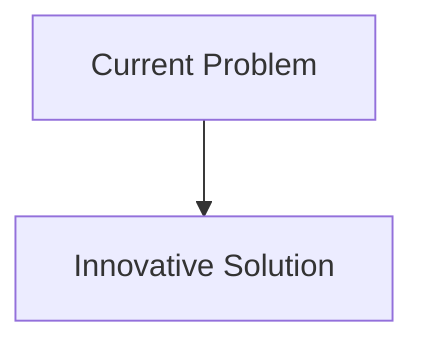
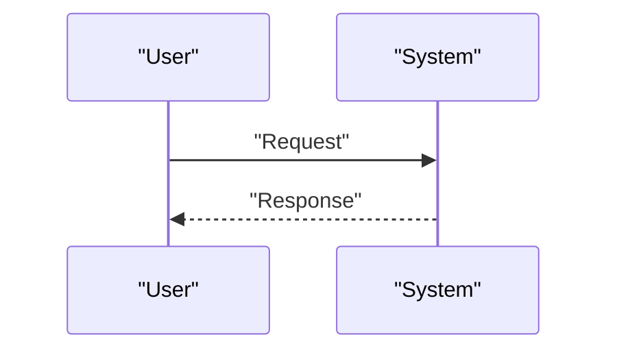

<!-- markdownlint-disable MD009 MD010 MD013 MD022 MD028 MD032 MD033 MD034 MD036 MD037 MD039 MD041 MD058 MD060 -->

[ 🇫🇷 Version Française ](./README.fr.md)

# Space Reactor Core Sim

> **Executive Summary:** A space-time multiphysics simulation engine (World Model of radiation and thermohydraulics in microgravity) coupled with GPU-accelerated Monte Carlo neutron transport algorithms to digitally certify the behavior of the reactor, the heat evacuation loops (heat pipes) and the degradation of materials in space conditions.

---

## 1. Visual Overview & Wow Effect

## 2. Contrarian Thesis (Peter Thiel Style)

- **Popular Belief:** Existing solutions are sufficient.
- **Hidden Truth:** In reality, Terrestrial civil nuclear simulation codes (OpenMC, MCNP) assume Earth's gravity for heat transfer (natural convection). We must fundamentally recode the physical laws for microgravity and the vacuum of space, with space agency level certification.

## 3. Problem & Target Market

- **Business Model:** B2G / B2B
- **Target Audience:** Space agencies (NASA, ESA, CNSA), New Space startups targeting lunar mining or propulsion to Mars, manufacturers of small modular reactors (SMR).
- **Urgent Pain Point:** Deep space exploration and lunar/martian bases require dense, continuous energy that solar cannot provide. Space micro-nuclear reactors are the only solution, but they cannot be easily tested on Earth in a realistic manner (because of gravity, vacuum and different terrestrial radiation), which blocks obtaining flight licenses.

## 4. Technical Architecture & Infrastructure

## 5. Business Model & Financial Viability

| Metric                     | Value                        |
| :------------------------- | :--------------------------- |
| **Pricing Structure**      | B2B Subscription             |
| **12-Month Target**        | 100 customers at 1000€/month |
| **Revenue Formula**        | 100 \* 1000 = 100k€          |
| **Estimated Gross Margin** | 80%                          |

## 6. Distribution Engine & Moat

- **Acquisition Strategy:** Direct Sales
- **Moat (Defensibility):** A space-time multiphysics simulation engine (World Model of radiation and thermohydraulics in microgravity) coupled with GPU-accelerated Monte Carlo neutron transport algorithms to digitally certify the behavior of the reactor, the heat evacuation loops (heat pipes) and the degradation of materials in space conditions.(Difficult to copy because of: Ultra-strict ITAR/export control regulations limiting the addressable market; need for experimental validation by rare experiments in zero gravity tower or in orbit to calibrate the model; slow institutional adoption.)

## 7. Detailed Evaluation Grid

| Criterion                       | VC Score (/100) | Market Score (/100) |
| :------------------------------ | :-------------: | :-----------------: |
| **Thesis & Monopoly / Urgency** |     -- / 25     |       -- / 25       |
| **Moat / LLM Immunity**         |     -- / 25     |       -- / 25       |
| **Scalability / UX Friction**   |     -- / 25     |       -- / 25       |
| **Unit Economics / ROI**        |     -- / 25     |       -- / 25       |
| **TOTAL**                       |  **-- / 100**   |    **-- / 100**     |

> **VC Verdict:** Pending evaluation.
> **Market Verdict:** Pending evaluation.
