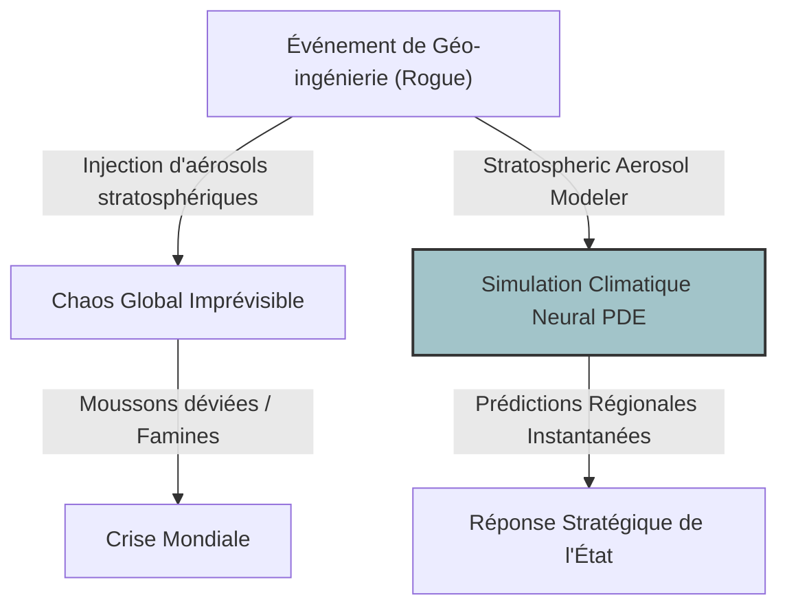
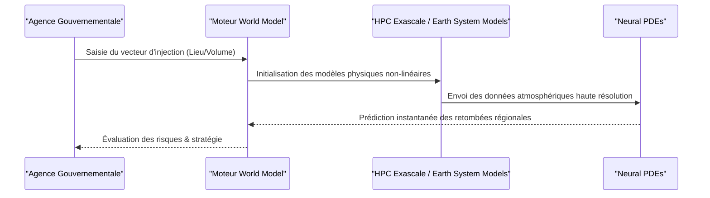

<!-- markdownlint-disable MD009 MD010 MD013 MD022 MD028 MD032 MD033 MD034 MD036 MD037 MD039 MD041 MD058 MD060 -->

[ 🇬🇧 English Version ](./README.md)

# Stratospheric Aerosol Modeler

> **Résumé exécutif :** Un "World Model" climatique utilisant le calcul exascale et les Neural PDEs pour prédire instantanément les retombées régionales chaotiques des interventions de géo-ingénierie solaire.

---

## 1. Aperçu visuel & Effet Wahou

## 2. La thèse contrariante (Peter Thiel Style)

**La croyance populaire :** La géo-ingénierie est trop dangereuse pour être tentée, nous devrions donc nous concentrer uniquement sur la réduction des émissions et les modèles climatiques CMIP6 standards.
**La vérité cachée :** Face à l'échec des objectifs d'émission, un État désespéré ou un acteur isolé _tentera_ unilatéralement la géo-ingénierie solaire. Lorsque cela se produira, les modèles climatiques standards seront trop lents et imprécis pour prédire les retombées. Nous avons besoin d'un système de défense prédictif dès maintenant.

## 3. Le problème & La cible

**Modèle économique :** B2G
**Cible précise :** Les États-nations, les agences environnementales (UNEP), et les compagnies d'assurance/réassurance souveraines.
**La douleur urgente :** La géo-ingénierie solaire (injection d'aérosols pour refroidir la Terre) devient une menace géopolitique réelle. Ses effets collatéraux (moussons déviées, famines, trous dans la couche d'ozone) sont actuellement impossibles à prévoir avec certitude et rapidité.

## 4. Architecture technique & Plomberie

## 5. Modèle économique & Viabilité financière

| Métrique                        | Valeur                                                     |
| :------------------------------ | :--------------------------------------------------------- |
| **Structure de prix**           | Abonnement gouvernemental / Licence souveraine             |
| **Objectif 12 mois**            | 1 à 2 contrats avec des ministères (défense/environnement) |
| **Calcul du CA (Target 100k€)** | 1 contrat \* 250k€ = 250k€ ARR                             |
| **Marge brute estimée**         | 65% (Coûts massifs de calcul HPC)                          |

## 6. Moteur de distribution & Fossé défensif (Moat)

**Stratégie d'acquisition :** Ventes directes B2G ciblant les conseils de sécurité nationale, les ministères de la défense et les grands réassureurs mondiaux.
**Moat (Barrière à l'entrée) :** Nécessite une puissance de calcul extrême (HPC) combinée à des réseaux de neurones informés par la physique (PINNs). Il s'attaque à une physique non linéaire et chaotique que l'IA générative ou les logiciels climatiques hérités ne peuvent simuler.

## 7. Grille d'évaluation détaillée

| Critère                               | Score VC (/100) | Score Terrain (/100) |
| :------------------------------------ | :-------------- | :------------------- |
| **Thèse & Monopole / Urgence**        | -- / 25         | 20 / 25              |
| **Moat / Résistance aux LLM natifs**  | -- / 25         | 23 / 25              |
| **Scalabilité / Friction d'adoption** | -- / 25         | 14 / 25              |
| **Unit Economics / ROI direct**       | -- / 25         | 18 / 25              |
| **TOTAL**                             | **-- / 100**    | **75 / 100**         |

> **Verdict VC :** Cible le marché B2G controversé mais inévitable de la géo-ingénierie solaire, offrant une immense valeur systémique. Le fossé algorithmique et physique est vaste. Cependant, les cycles de vente souverains et la volatilité politique rendent la monétisation rapide très incertaine à court terme.

> **Verdict Terrain :** Stratospheric-aerosol-modeler s'attaque au domaine controversé mais de plus en plus urgent de la géo-ingénierie. Les simulations spécialisées de la physique atmosphérique créent un fossé solide. Cependant, les frictions réglementaires et le nombre limité d'acheteurs de niveau national rendent la voie de la monétisation complexe.
