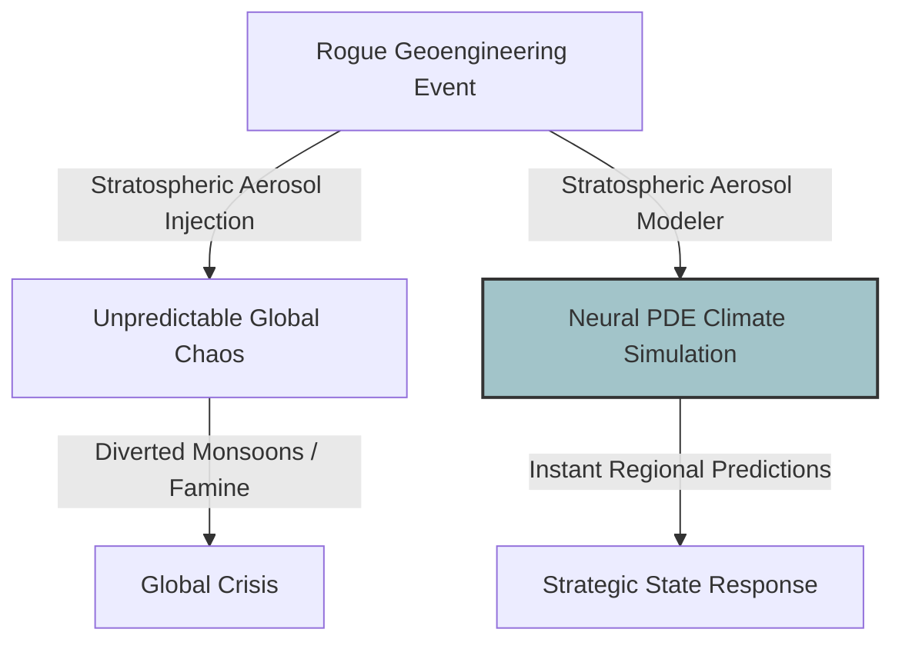
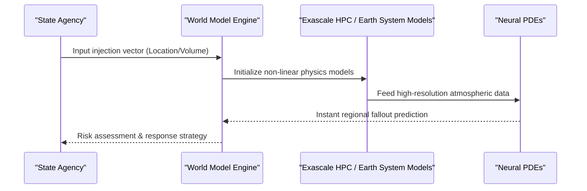

<!-- markdownlint-disable MD009 MD010 MD013 MD022 MD028 MD032 MD033 MD034 MD036 MD037 MD039 MD041 MD058 MD060 -->

[ 🇫🇷 Version Française ](./README.fr.md)

# Stratospheric Aerosol Modeler

> **Executive Summary:** A climate "World Model" using exascale computing and Neural PDEs to instantly predict the regional, chaotic fallout of solar geoengineering interventions.

---

## 1. Visual Overview & Wow Effect

## 2. Contrarian Thesis (Peter Thiel Style)

**Popular Belief:** Geoengineering is too dangerous to ever attempt, so we should focus solely on emission reduction and standard CMIP6 climate models.
**Hidden Truth:** As emission targets fail, a desperate state or rogue actor _will_ unilaterally attempt solar geoengineering. When that happens, standard climate models will be too slow and coarse to predict the fallout. We need a predictive defense system now.

## 3. Problem & Target Market

**Business Model:** B2G
**Target Audience:** Nation-states, environmental agencies (UNEP), and sovereign insurance/reinsurance companies.
**Urgent Pain Point:** Solar geoengineering (injecting aerosols to cool the Earth) is becoming a real geopolitical threat. Its collateral effects—like shifting monsoons, causing famines, or depleting the ozone layer—are currently impossible to predict with certainty and speed.

## 4. Technical Architecture & Infrastructure

## 5. Business Model & Financial Viability

| Metric                     | Value                                                  |
| :------------------------- | :----------------------------------------------------- |
| **Pricing Structure**      | High-level government subscription / Sovereign license |
| **12-Month Target**        | 1 - 2 contracts with defense/environmental ministries  |
| **Revenue Formula**        | 1 contract \* €250k = €250k ARR                        |
| **Estimated Gross Margin** | 65% (Massive HPC compute overhead)                     |

## 6. Distribution Engine & Moat

**Acquisition Strategy:** Direct B2G sales targeting national security councils, defense ministries, and global reinsurance firms.
**Moat (Defensibility):** Requires extreme computational power (HPC) combined with Physics-Informed Neural Networks (PINNs). It tackles non-linear chaotic physics that standard generative AI or legacy climate software cannot simulate.

## 7. Detailed Evaluation Grid

| Criterion                       | VC Score (/100) | Market Score (/100) |
| :------------------------------ | :-------------- | :------------------ |
| **Thesis & Monopoly / Urgency** | -- / 25         | -- / 25             |
| **Moat / LLM Immunity**         | -- / 25         | -- / 25             |
| **Scalability / UX Friction**   | -- / 25         | -- / 25             |
| **Unit Economics / ROI**        | -- / 25         | -- / 25             |
| **TOTAL**                       | **-- / 100**    | **-- / 100**        |

> **VC Verdict:** Pending evaluation.

> **Market Verdict:** Pending evaluation.
