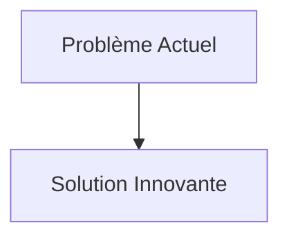
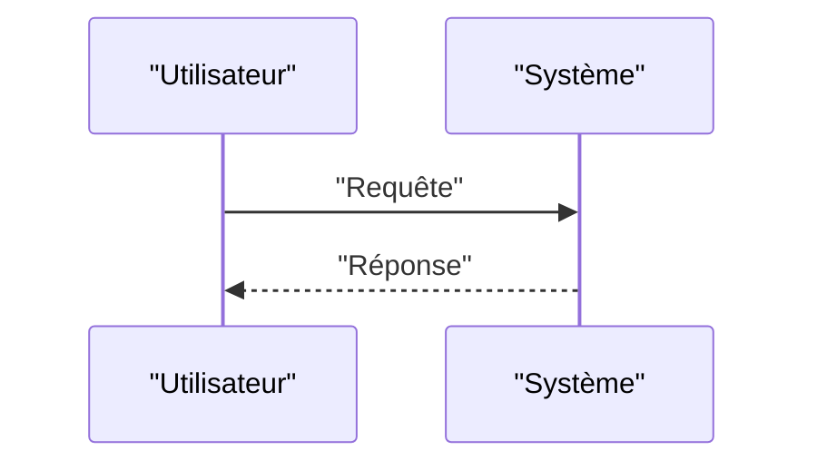

<!-- markdownlint-disable MD009 MD010 MD013 MD022 MD028 MD032 MD033 MD034 MD036 MD037 MD039 MD041 MD058 MD060 -->

[ 🇬🇧 English Version ](./README.md)

# Subglacial Lake Sampler Bot

> **Résumé exécutif :** Conception d'une sonde robotique thermo-pénétrante autonome (cryobot) équipée de capteurs de micro-fluidique pour l'analyse in situ, de systèmes de décontamination de classe spatiale intégrés, et de systèmes de navigation basés sur des capteurs acoustiques et magnétiques pour évoluer à l'aveugle sous des kilomètres de glace.

---

## 1. Aperçu visuel & Effet Wahou

## 2. La thèse contrariante (Peter Thiel Style)

- **La croyance populaire :** Les solutions existantes sont suffisantes.
- **La vérité cachée :** En réalité, Il s'agit d'un pur problème de hardware extrême et de robotique sous contrainte sévère (pression écrasante, température glaciale, absence totale de signal GPS ou radio). Les logiciels standards ne peuvent pas orchestrer un système hardware autonome et stérile dans ces conditions.

## 3. Le problème & La cible

- **Modèle économique :** B2B / B2G
- **Cible précise :** Instituts de recherche climatique, agences spatiales (préparation aux missions sur Europe/Encelade), entreprises d'exploration géologique et de bioprospection extrême.
- **La douleur urgente :** L'exploration des lacs sous-glaciaires (comme le lac Vostok) est cruciale pour comprendre le climat passé et chercher des formes de vie extrêmophiles. Cependant, forer des kilomètres de glace et prélever des échantillons sans contaminer ces écosystèmes isolés depuis des millions d'années est un cauchemar technique.

## 4. Architecture technique & Plomberie

## 5. Modèle économique & Viabilité financière

| Métrique                        | Valeur                   |
| :------------------------------ | :----------------------- |
| **Structure de prix**           | Abonnement B2B           |
| **Objectif 12 mois**            | 100 clients à 1000€/mois |
| **Calcul du CA (Target 100k€)** | 100 \* 1000 = 100k€      |
| **Marge brute estimée**         | 80%                      |

## 6. Moteur de distribution & Fossé défensif (Moat)

- **Stratégie d'acquisition :** Ventes directes
- **Moat (Barrière à l'entrée) :** Conception d'une sonde robotique thermo-pénétrante autonome (cryobot) équipée de capteurs de micro-fluidique pour l'analyse in situ, de systèmes de décontamination de classe spatiale intégrés, et de systèmes de navigation basés sur des capteurs acoustiques et magnétiques pour évoluer à l'aveugle sous des kilomètres de glace. (Difficile à copier à cause de : Ingénierie matérielle très coûteuse, risque d'échec total (perte de la sonde sous la glace), marché de niche initial (principalement scientifique et gouvernemental) avant les applications commerciales (bioprospection ou missions spatiales).)

## 7. Grille d'évaluation détaillée

| Critère                               | Score VC (/100) | Score Terrain (/100) |
| :------------------------------------ | :-------------: | :------------------: |
| **Thèse & Monopole / Urgence**        |     -- / 25     |       -- / 25        |
| **Moat / Résistance aux LLM natifs**  |     -- / 25     |       -- / 25        |
| **Scalabilité / Friction d'adoption** |     -- / 25     |       -- / 25        |
| **Unit Economics / ROI direct**       |     -- / 25     |       -- / 25        |
| **TOTAL**                             |  **-- / 100**   |     **-- / 100**     |

> **Verdict VC :** En attente d'évaluation.
> **Verdict Terrain :** En attente d'évaluation.
