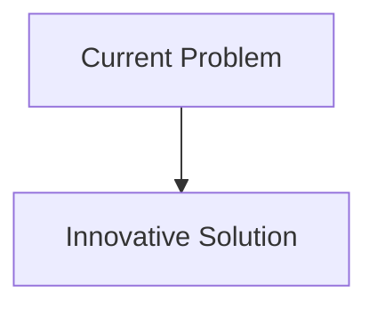
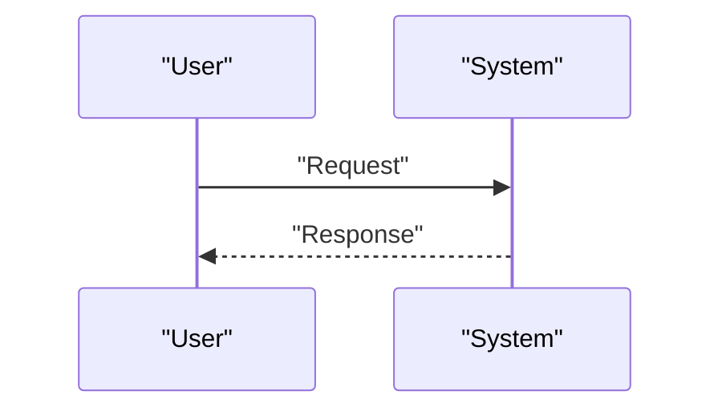

<!-- markdownlint-disable MD009 MD010 MD013 MD022 MD028 MD032 MD033 MD034 MD036 MD037 MD039 MD041 MD058 MD060 -->

[ 🇫🇷 Version Française ](./README.fr.md)

# Subglacial Lake Sampler Bot

> **Executive Summary:** Design of an autonomous thermo-penetrating robotic probe (cryobot) equipped with micro-fluidic sensors for in situ analysis, integrated space-class decontamination systems, and navigation systems based on acoustic and magnetic sensors to move blindly under kilometers of ice.

---

## 1. Visual Overview & Wow Effect

## 2. Contrarian Thesis (Peter Thiel Style)

- **Popular Belief:** Existing solutions are sufficient.
- **Hidden Truth:** In reality, this is a pure problem of extreme hardware and robotics under severe stress (crushing pressure, freezing temperature, total absence of GPS or radio signal). Standard software cannot orchestrate an autonomous and sterile hardware system under these conditions.

## 3. Problem & Target Market

- **Business Model:** B2B / B2G
- **Target Audience:** Climate research institutes, space agencies (preparation for missions to Europe/Enceladus), geological exploration and extreme bioprospecting companies.
- **Urgent Pain Point:** Exploring subglacial lakes (like Lake Vostok) is crucial for understanding past climate and searching for extremophile life forms. However, drilling through miles of ice and taking samples without contaminating these ecosystems that have been isolated for millions of years is a technical nightmare.

## 4. Technical Architecture & Infrastructure

## 5. Business Model & Financial Viability

| Metric                     | Value                        |
| :------------------------- | :--------------------------- |
| **Pricing Structure**      | B2B Subscription             |
| **12-Month Target**        | 100 customers at 1000€/month |
| **Revenue Formula**        | 100 \* 1000 = 100k€          |
| **Estimated Gross Margin** | 80%                          |

## 6. Distribution Engine & Moat

- **Acquisition Strategy:** Direct Sales
- **Moat (Defensibility):** Design of an autonomous thermo-penetrating robotic probe (cryobot) equipped with micro-fluidic sensors for in situ analysis, integrated space-class decontamination systems, and navigation systems based on acoustic and magnetic sensors to move blindly under kilometers of ice.(Difficult to copy because of: Very expensive hardware engineering, risk of total failure (losing the probe under the ice), initial niche market (mainly scientific and government) before commercial applications (bioprospecting or space missions).)

## 7. Detailed Evaluation Grid

| Criterion                       | VC Score (/100) | Market Score (/100) |
| :------------------------------ | :-------------: | :-----------------: |
| **Thesis & Monopoly / Urgency** |     -- / 25     |       -- / 25       |
| **Moat / LLM Immunity**         |     -- / 25     |       -- / 25       |
| **Scalability / UX Friction**   |     -- / 25     |       -- / 25       |
| **Unit Economics / ROI**        |     -- / 25     |       -- / 25       |
| **TOTAL**                       |  **-- / 100**   |    **-- / 100**     |

> **VC Verdict:** Pending evaluation.
> **Market Verdict:** Pending evaluation.
