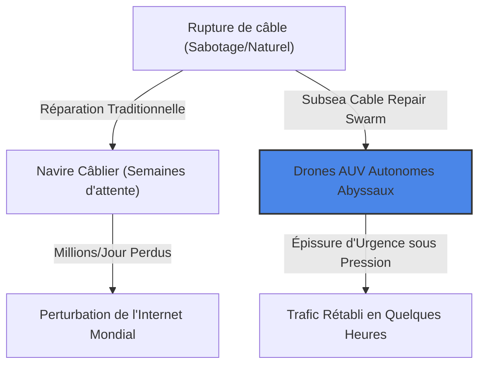
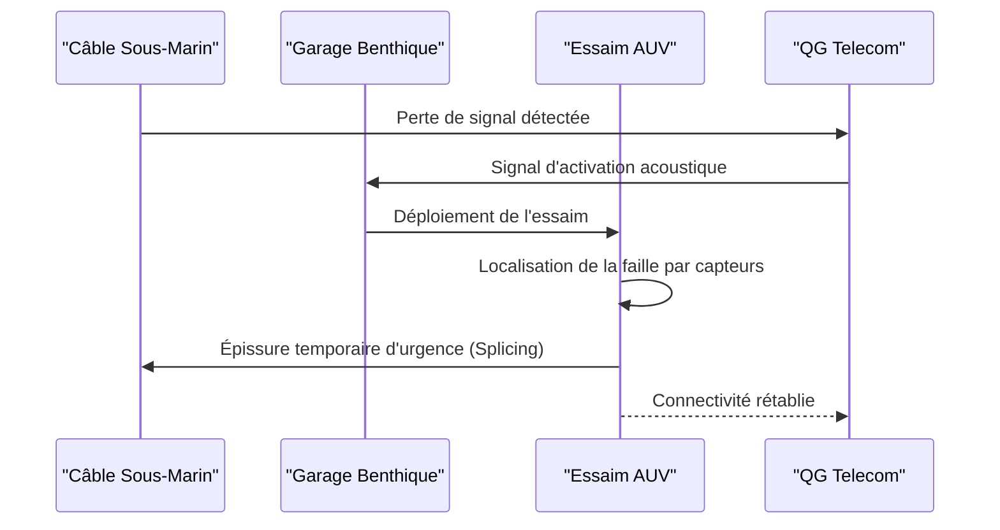

<!-- markdownlint-disable MD009 MD010 MD013 MD022 MD028 MD032 MD033 MD034 MD036 MD037 MD039 MD041 MD058 MD060 -->

[ 🇬🇧 English Version ](./README.md)

# Subsea Cable Repair Swarm

> **Résumé exécutif :** Un essaim de drones sous-marins autonomes (AUV) pré-positionnés qui se déploie pour localiser et réparer en urgence les câbles sous-marins sectionnés, éliminant des semaines de temps d'arrêt et des coûts colossaux.

---

## 1. Aperçu visuel & Effet Wahou

## 2. La thèse contrariante (Peter Thiel Style)

**La croyance populaire :** La réparation des câbles sous-marins nécessitera toujours de gigantesques navires de surface spécialisés et des robots téléopérés (ROV) reliés par des câbles.
**La vérité cachée :** Les opérations en eaux profondes peuvent être entièrement décentralisées. Le pré-positionnement d'essaims robotiques autonomes dans des "garages" au fond de l'océan près des zones à risque permet une intervention immédiate, sans attendre le transit d'un navire depuis l'autre bout du monde.

## 3. Le problème & La cible

**Modèle économique :** B2B
**Cible précise :** Les consortiums de télécommunications (Google, Meta, Orange) et les États qui dépendent des câbles sous-marins pour 99% du trafic internet mondial.
**La douleur urgente :** Une coupure de câble sous-marin prend des semaines à être réparée. Elle nécessite le déploiement d'un navire spécialisé massif, coûtant des millions de dollars par jour d'immobilisation, avec un délai de transit énorme et un impact stratégique majeur.

## 4. Architecture technique & Plomberie

## 5. Modèle économique & Viabilité financière

| Métrique                        | Valeur                                                         |
| :------------------------------ | :------------------------------------------------------------- |
| **Structure de prix**           | Abonnement annuel par zone à risque + Frais de déploiement     |
| **Objectif 12 mois**            | 1 contrat de déploiement de zone pilote                        |
| **Calcul du CA (Target 100k€)** | 1 contrat \* 200k€ = 200k€ ARR                                 |
| **Marge brute estimée**         | 50% (Capex élevé pour la robotique et les garages sous-marins) |

## 6. Moteur de distribution & Fossé défensif (Moat)

**Stratégie d'acquisition :** Ventes B2B directes aux grands consortiums télécoms et aux agences gouvernementales d'infrastructure, en s'appuyant sur l'impératif stratégique de résilience d'Internet.
**Moat (Barrière à l'entrée) :** Défi physique extrême impliquant la robotique sous-marine profonde (résistance à la pression, absence de GPS/RF, perception acoustique), l'autonomie distribuée et la manipulation ultra-précise de fibre optique dans un environnement hostile.

## 7. Grille d'évaluation détaillée

| Critère                               | Score VC (/100) | Score Terrain (/100) |
| :------------------------------------ | :-------------- | :------------------- |
| **Thèse & Monopole / Urgence**        | -- / 25         | -- / 25              |
| **Moat / Résistance aux LLM natifs**  | -- / 25         | -- / 25              |
| **Scalabilité / Friction d'adoption** | -- / 25         | -- / 25              |
| **Unit Economics / ROI direct**       | -- / 25         | -- / 25              |
| **TOTAL**                             | **-- / 100**    | **-- / 100**         |

> **Verdict VC :** En attente d'évaluation.

> **Verdict Terrain :** En attente d'évaluation.
