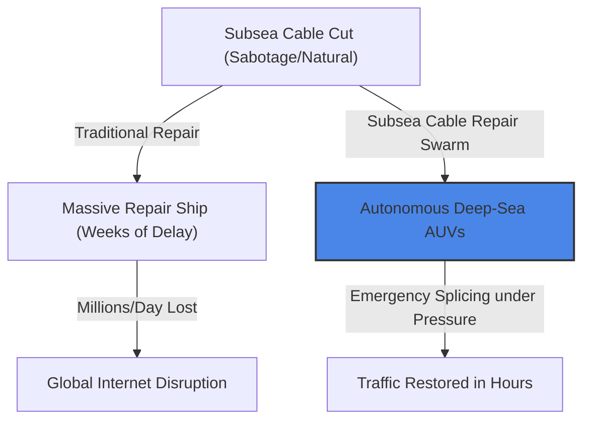
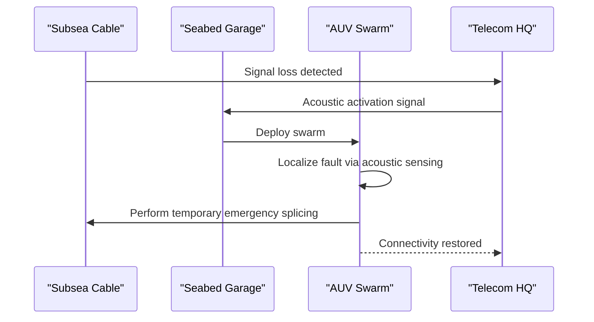

<!-- markdownlint-disable MD009 MD010 MD013 MD022 MD028 MD032 MD033 MD034 MD036 MD037 MD039 MD041 MD058 MD060 -->

[ 🇫🇷 Version Française ](./README.fr.md)

# Subsea Cable Repair Swarm

> **Executive Summary:** A pre-positioned swarm of autonomous underwater vehicles (AUVs) that autonomously deploys to locate and perform emergency splicing on severed subsea cables, eliminating weeks of downtime and massive repair costs.

---

## 1. Visual Overview & Wow Effect

## 2. Contrarian Thesis (Peter Thiel Style)

**Popular Belief:** Repairing deep-sea cables inherently requires massive, specialized surface ships and human divers or remotely operated vehicles (ROVs) connected by tethers.
**Hidden Truth:** Deep-sea operations can be fully decentralized. Pre-positioning autonomous robotic swarms in ocean-floor "garages" near high-risk zones allows for immediate, tetherless intervention without waiting for surface ships to transit across the globe.

## 3. Problem & Target Market

**Business Model:** B2B
**Target Audience:** Telecommunications consortiums (Google, Meta, Orange) and nation-states that depend on subsea cables for 99% of global internet traffic.
**Urgent Pain Point:** A subsea cable cut takes weeks to repair, requiring the deployment of a specialized cable ship that costs millions of dollars per day of downtime, causing severe economic and strategic disruptions.

## 4. Technical Architecture & Infrastructure

## 5. Business Model & Financial Viability

| Metric                     | Value                                                       |
| :------------------------- | :---------------------------------------------------------- |
| **Pricing Structure**      | Annual subscription per high-risk zone + Deployment fee     |
| **12-Month Target**        | 1 pilot zone deployment contract                            |
| **Revenue Formula**        | 1 contract \* €200k = €200k ARR                             |
| **Estimated Gross Margin** | 50% (High Capex for underwater robotics and seabed garages) |

## 6. Distribution Engine & Moat

**Acquisition Strategy:** Direct B2B sales to major telecom consortiums and government defense/infrastructure agencies, leveraging the strategic necessity of internet resilience.
**Moat (Defensibility):** Extreme physical challenge involving deep-sea robotics (pressure resistance, GPS/RF-denied environments, acoustic perception), distributed autonomy, and precise fiber-optic manipulation in a hostile environment.

## 7. Detailed Evaluation Grid

| Criterion                       | VC Score (/100) | Market Score (/100) |
| :------------------------------ | :-------------- | :------------------ |
| **Thesis & Monopoly / Urgency** | -- / 25         | 23 / 25             |
| **Moat / LLM Immunity**         | -- / 25         | 25 / 25             |
| **Scalability / UX Friction**   | -- / 25         | 12 / 25             |
| **Unit Economics / ROI**        | -- / 25         | 23 / 25             |
| **TOTAL**                       | **-- / 100**    | **83 / 100**        |

> **VC Verdict:** Tackles a high-urgency, high-value infrastructure problem where downtime costs millions per hour. The physical moat is incredible, requiring mastery of autonomous deep-sea robotics and fiber splicing. The capital expenditure limits hyper-growth scalability, but it secures dominant, unassailable long-term infrastructure contracts.

> **Market Verdict:** Subsea-cable-repair-swarm addresses a massive global vulnerability with a tangible robotic solution. The extreme physical environment completely negates any threat from pure software AI. The high capital cost to deploy is easily justified by the millions lost per hour of cable downtime.
